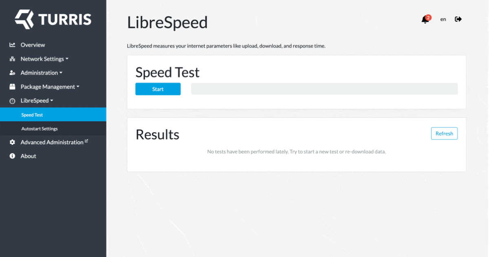
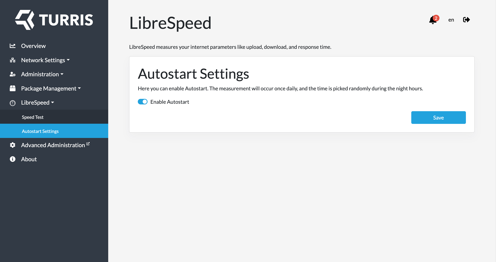

# LibreSpeed

## What is LibreSpeed?

LibreSpeed is an open-source internet speed test tool that allows you to check
your internet connection speed. It is a free and easy-to-use web application
that can run on any device with an internet browser, such as a computer,
smartphone, or tablet.

LibreSpeed is designed to be a more transparent and privacy-focused alternative
to other popular speed test tools. It allows you to test your internet speed
without sharing your data with third-party companies, and it provides detailed
information about your connection, such as latency, jitter, and packet loss.

LibreSpeed is also customizable, and you can host it on your own server or use
one of the public instances available online. The software is released under the
open-source MIT license, which means that anyone can contribute to the project
and use the code for their own purposes.

!!! info
    LibreSpeed is available on Turris Omnia, Turris MOX, and Turris Shield. It
    is not supported on Turris 1.x, because LibreSpeed is using Go as the
    programming language, which is unfortunately not supported for PowerPC,
    that is used on Turris 1.x routers.

## Installation & first run

To use LibreSpeed on a Turris device proceed in these steps:

1. Go to _Package management → Packages_ tab in the
   reForis web interface.
2. Find a _Network monitoring and parental control_ section, check an _Internet
   connection speed measurement_, then click _Save_.
3. Updater should install the LibreSpeed package shortly; a new LibreSpeed tab
   will appear after a successful installation.
4. Go to _LibreSpeed → Speed Test_ and click the _Start_ button to start
   a new test.

After proceeding with the measurement, its results are displayed:

## Configure autostart

You could also set LibreSpeed to start benchmarking your internet connection
automatically once a day. The time of the measurement
is picked randomly during the night hours.

