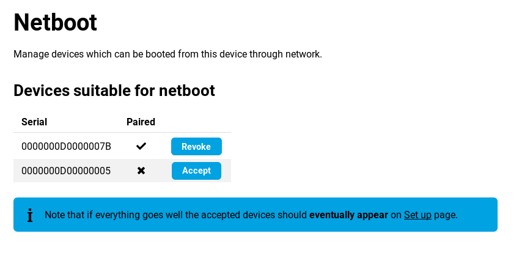

# Network boot of Turris MOX

This article will guide you through setting up your Turris MOX as an AP
attached to another Turris router. In this setup, MOX doesn't have local
filesystem and doesn't have any local settings. Everything is controlled and
setup from scratch on every boot from the controlling device.

!!! warning
    Turris Shield cannot boot from another Turris device and cannot control
    other devices.

## Necessary software

On the controlling router, you need to install _Turris MOX network boot_
package list from the _Updater_ tab. This will provide everything necessary
to boot up your MOX and a new tab in Foris user interface _Managed Devices →
Netboot_ to control them easily.

It will also set up everything needed to boot MOXes over the network – enables
_TFTP_ in _Dnsmasq_, downloads the latest image, generate keys and prepare
everything.

!!! tip
    If you would like to boot Turris MOX from Turris 1.0/1.1,
    you will need to have `srv` mounted by _Storage plugin_ in Foris
    or boot from microSD card.

## Pairing MOX with other Turris router

To pair your MOX with controlling router, connect them directly by Ethernet
cable and make sure that there is no micro SD card in MOX. Power it on and wait
for incoming request to show up in Foris web interface. You might need to
refresh your browser. Once you see a pairing request, verify that the serial number
matches the one on MOX and accept the pairing request. When it is done, MOX will boot
up and save the pairing information. From then on, it will always try to boot
from the network and from the specific controlling Turris router.



When it boots up, it will use a random channel but the same SSID and password
as the controlling router and bridge the WiFi to the local network. If you want
to customize the setup, see the _[Advance configuration](#configuration-file)_
section and _[Under the hood -> Other customization](#other-customization)_
part of this article. Fully booted up MOX will blink with it's led in heartbeat
pattern (two fast blinks followed by a longer pause).

!!! warning
    Make sure you have your region set up correctly on the router you are
    booting from. It affects what region you are in and thus available channels.

### CLI

Apart from using Foris UI, you can also use `netboot-manager` script on
your controlling router. The most important operation is pairing your MOX. When
MOX starts booting, it sends pairing request, you can list the state of pairing
by issuing `netboot-manager list` command and you can accept any of the
_Incoming_ requests by typing `netboot-manager accept $serial`. If
troubleshooting, an interesting command might also be `netboot-manager regen -f`
which recreates all generated files and redownloads latest image.

## Canceling pairing

To use MOX in standalone mode or to pair it with a different router,
simply use factory reset, which will reset U-boot settings.

## Advanced configuration

### Foris

MOX automatically uses the first SSID and password from your WiFi
configuration. It will also integrate into Foris and thus allow you to get
information about the connected routers and change their configuration.

### Configuration file

There is also configuration file `/etc/config/netboot` on the controlling router that can
be used to customize mainly the WiFi settings.

!!! note
	Configuration file has to be readable by `turris-netboot` user. That is the
    user managing the netboot process.

```
# Defaults to be overridden later
config wifi default
         option ssid '@@SSID@@'
         option key '@@KEY@@'

# WiFi specific settings
# 02df_9141 is MOX SDIO WiFi
# 168c_003c is WLE900VX – 5GHz AC PCIe WiFi card in Turris MOX and Turris Omnia

config device 168c_003c
        option channel 'auto5'

config device 02df_9141
        option channel 'auto24'

# AP-WiFi relations
config device 0000000000000007
        option network 'default'

# AP-WiFi specific overrides – format serial_WiFi
config device 0000000000000007_168c_003c
        option channel '40'
        option ssid '@@SSID@@-5'
        option key '@@KEY@@-5'
        option htmode 'VHT40'
```

Let's start by explaining some special values

  * `@@SSID@@` means SSID of your first configured WiFi on the controlling router
  * `@@KEY@@` means key of your first configured WiFi on the controlling router
  * `@@COUNTRY@@` means country you have set for your WiFi on the controlling router
  * `auto24` means random channel on 2.4GHz WiFi
  * `auto5` means random channel on 5GHz WiFi

Now how the configuration file works. You can specify some named networks with some parameters.
For example:

```
config wifi home
         option ssid 'homenet'
         option key 'home_sweet_home'
```

Special name for a defined network is `default`. That one is assigned to every
device unless overridden.

You can reference this network later on and specify that for example device
with the serial number `0000000000000007` should use those settings.

```
# AP-WiFi relations
config device 0000000000000007
        option network 'home'
```

By default, we set random 2.4GHz channel on SDIO WiFi in MOX and random 5GHz
channel on the PCIe card. That is done via the following part:

```
# 02df_9141 is MOX SDIO WiFi
config device 168c_003c
        option channel 'auto5'

# 168c_003c is WLE900VX – 5GHz AC PCIe WiFi card in Turris MOX and Turris Omnia
config device 02df_9141
        option channel 'auto24'
```

But if you have just one WiFi card in Turris MOX and you want to run 5 GHz on it,
you can override the defaults for that specific serial number in the following way

```
# AP-WiFi specific overrides – format serial_WiFi
config device 0000000000000007_168c_003c
        option channel 'auto5'
```

## Under the hood

### How it works

#### Booting and pairing

MOX tries to boot from various sources and the last of them is PXE. Netboot
sets up your controlling router to provide PXE configuration for MOX and
provides it with kernel and ramdisk.

That ramdisk boots up, generates ssh keys and uses the key provided via
kernel boot parameters to send that key over ssh to controlling router. It uses
highly restricted account that can do just that – send a little bit of
information about itself and try to get something back. Nothing more. Then it
waits for pairing to be completed by trying to use it's key to get access to
more advanced API.

On the controlling router, when accepting key you will authorize provided
ssh key to access more advanced functions – like download rootfs and
configuration. Pairing process will also generate more keys, one aes and one
certification authority to be used by Foris.

Once authorized, MOX will download the _aes_ key and save it together with
generated and now authorized _ssh_ key to NOR memory. It will also overwrite
U-Boot environment to enforce network boot by default. Not generic PXE boot,
but booting specific image named after the serial number of the MOX and encrypted
by aes key. On next boot, it will try to download only specific kernel and
boot it only if it will be encrypted using the saved aes key.

When pairing is done, MOX will setup background job that will check the rootfs
and configuration version from the controlling router and reboot the MOX if
version changes or controlling router becomes inaccessible.

The last step is downloading rootfs into RAM and running the system from it. It is
a little bit customized by replacing `rc.local` with setup script mentioned
bellow.

### Other customization

!!! note
	All files mentioned bellow has to be accessible and readable by
    `turris-netboot` user. That is the user managing the netboot process.

#### Overlay

You can add files to your MOX by putting them in
`/srv/turris-netboot/rootfs/overlay` directory in either `common`
subdirectory (this will get included on every MOX) or in a subdirectory named
after serial number of the MOX (those files will be included only on specific
MOX).

#### Setup scripts

You can also customize the behavior of the resulting system by deploying custom
scripts that are run when the system boots up. There are a few scripts that can be
used and all of them resides in `/srv/turris-netboot/rootfs` directory.

##### `setup.sh`

You can use `setup.sh` script to replace our setup script that configures SSID and
password and sets up the network. Only when you really know what you are
doing.

##### `postsetup.sh`

Script `postsetup.sh` gets run on every MOX after network setup is done and can
be used to deploy some custom services.

##### `postsetup-$SERIAL.sh`

If you need to be more specific, `postsetup-$SERIAL.sh` gets run after network
setup but only on MOX with specific serial number.
