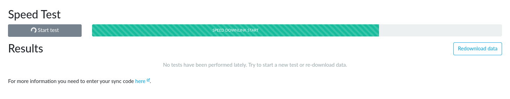
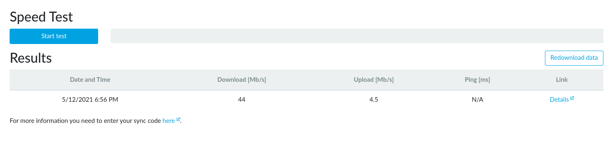
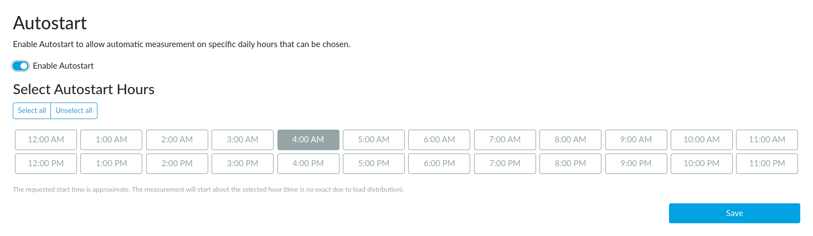

# NetMetr

## What is NetMetr?

NetMetr is a tool for measuring the actual quality of Internet access services,
such as download and upload speed and latency. It allows users to perform
thorough and detailed testing and get comprehensive information not only about
the status of their particular connection, but also analyze previous
measurements and especially measurements of other participants. All data
(excluding personal data) and source codes are released on the Open Source
principle.

!!! warning
    NetMetr has been deprecated and will not be available in the future
    versions of Turris OS. Please use [LibreSpeed](librespeed/index.md) instead.

## Installation & first run

To use NetMetr on a Turris device proceed in these steps:

1. Install the NetMetr package using _Package management → Packages_ tab in
   reForis web interface.
2. After successful installation new NetMetr tabs will appear.
3. Go to _NetMetr → Speed Test_ and click the _Start test_ button to start
   a new test.

After proceeding the measurement, its results are displayed:

## Automated run

NetMetr could be also started automatically to periodically benchmark your
Internet connection. You can use a timetable to choose hours to run it.

When autostarted, NetMetr is not started in the exact times stated above,
instead it uses a few minute random wait to load balance the server.

## Collected data

NetMetr server stores your measurements linked to the device so that you can
view all the past measurements on its [website](https://www.netmetr.cz/en/my.html).
To view your results you have to enter *Sync code* which is displayed at
the NetMetr reForis tab.

All the data are – after proper anonymization – also shared on NetMetr
[map](https://www.netmetr.cz/en/map.html) and as an
[open data](https://www.netmetr.cz/en/open-data.html).

!!! tip
    NetMetr can be used in Foris as well. Its user interface is very similar
    to the one in reForis.
