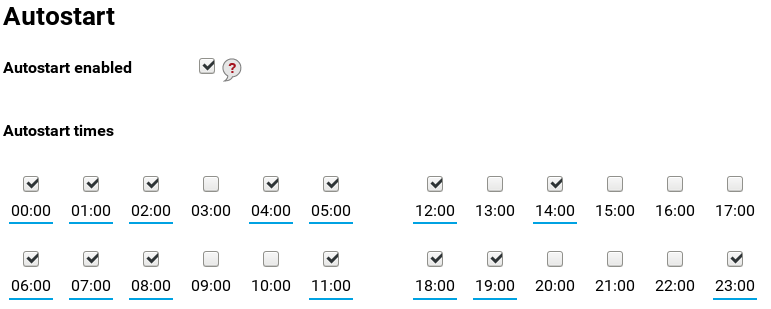

# Netmetr

## What is Netmetr?

Netmetr is a tool for measuring the actual quality of Internet access services,
such as download and upload speed and latency. It allows users to perform
thorough and detailed testing and get
comprehensive information not only about the status of their particular connection,
but also analyze previous measurements and especially measurements of other
participants. All data (excluding personal data) and source codes are released on
the Open Source principle.

## Installation & first run

To use Netmetr on Turris device proceed in these steps:

1. Install Netmetr package using Updater tab in Foris web interface
2. After successful installation new Netmetr tab will appear
3. Click _Start test_ button to start a new test

## Automated run

Netmetr could be also started automatically to periodically benchmark you Internet
connection. You can use a timetable to choose hours to run it.

When autostarted, Netmetr is not started in the exact times stated above, instead
it uses a few minute random wait to load balance the server.

## Collected data

Netmetr server stores your measurements linked to the device so that you can view
all the past measurements on its [website](https://www.netmetr.cz/en/my.html). To
view your results you have to enter *Sync code* which is displayed in Netmetr
Foris tab.

All the data are - after proper anonymization - also shared on Netmetr
[map](https://www.netmetr.cz/en/map.html) and as an
[open data](https://www.netmetr.cz/en/open-data.html).

## Other Netmetr apps

The Netmetr is also available as a [web](https://www.netmetr.cz/en/test.html) and
[mobile](https://play.google.com/store/apps/details?id=cz.nic.netmetr) application.
