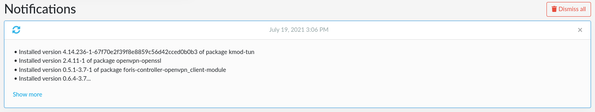
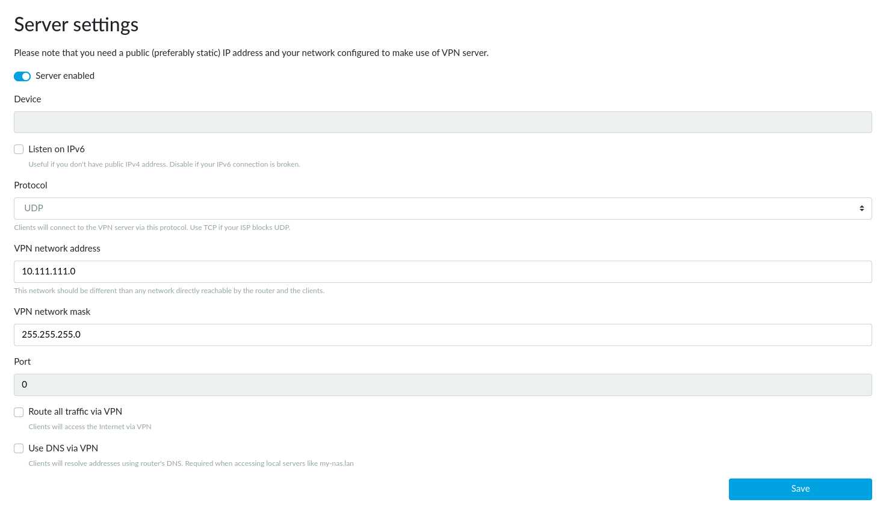
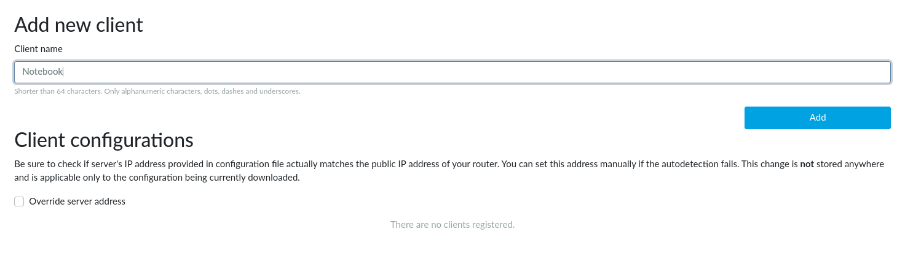
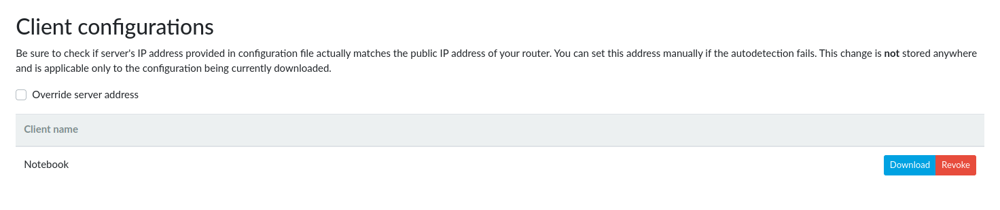

# OpenVPN server on Turris

<!--what-is-openvpn-start-->

## What is OpenVPN?

[OpenVPN](https://en.wikipedia.org/wiki/OpenVPN) is an open technology for
[virtual private networks](https://en.wikipedia.org/wiki/Virtual_private_network).
It works on the client-server principle – multiple clients connect to
an OpenVPN server to get access to a regularly inaccessible network. For
example, you can access computers in your home or office LAN from your laptop
connected to any Internet connection.

The access is [authenticated](https://en.wikipedia.org/wiki/Authentication)
(only permitted clients can connect to the server) and
[encrypted](https://en.wikipedia.org/wiki/Encryption) (nobody can read
the communication between the client and the server). Additionaly, your
Internet traffic can be routed via the OpenVPN connection (this is useful
e.g. if your company's servers may be accessed only from the company's LAN).

!!! important
    You can use your Turris as an OpenVPN server only if it is accessible from
    the Internet (it has a public IP address or at least the OpenVPN port is
    forwarded to it).

<!--what-is-openvpn-end-->

## How to set up OpenVPN server in reForis

This manual describes how to set up OpenVPN in **a few easy steps**
using reForis:

### 1. Install the OpenVPN package

Log into the reForis user interface and go to the _Package Management
→ Packages_ tab. Check the box next to _OpenVPN_. Then press _Save changes_.

### 2. Check that the package was installed

Go to the _Notifications_ tab and refresh the browser, you should see all
the installed packages and some with "openvpn" among them.

### 3. Reboot your router using reForis

Go to the _Administration → Maintenance_ tab and press _Reboot_.

### 4. Generate certification authority

Once the router has rebooted, refresh the page and log back in. There should
now be a new menu subtree: _OpenVPN_. Click to it to expand its items and
then click to _Server Settings_.

Press the _Generate CA_ button now. It might take up to 30 minutes to generate
the certificate authority, but this isn't a process that we can speed up in
any way (it requires to get enough
[entropy](https://en.wikipedia.org/wiki/Entropy_(information_theory))
for good security).

### 5. Enable OpenVPN server

By switching the _Server enabled_ switch on and pressing _Save_ you let
the plugin create a simplified VPN configuration. If you have already
had your configuration (from your use of OpenVPN in the past) it is filled
into the form. Otherwise the plugin creates a default configuration for you.

!!! warning
    After you click _Save_, you can temporarily lose connection to your
    router, you just need to refresh the page or wait a moment.

In most cases you don’t need to change any of the settings. There are these
configuration parameters:

* _Listen on IPv6_ – Leave unchecked only if your IPv6 connection is broken.
* _Protocol_ – Change only if your ISP limits UDP transmission (this practice
  is defective by nature but some ISPs even do so).
* _VPN network address_ – Leave unchanged in all common cases. If your
  local network uses addresses from the range 10.111.111.0-254 (in other
  words, 10.111.111.0/24 or 10.111.111.0/255.255.255.0) you will need to use
  another network address (e.g. 10.99.98.0) for VPN; it must not be used in
  your network. Use only addresses intended for
  [private networks](https://en.wikipedia.org/wiki/IPv4#Private_networks).
  The network mask must correspond to the address range you use. For example,
  the default mask is for addresses ending with .0 to .254. You can find
  more information e.g. on
  [Wikipedia](https://en.wikipedia.org/wiki/Classless_Inter-Domain_Routing#IPv4_CIDR_blocks=).
* _VPN network mask_ – See the information above.
* _Route all traffic via VPN_ – Check only if you want all your traffic to
  the Internet to be routed over your VPN. For example, you need to connect
  to your servers which can be accessed only from the address of your router.
* _Use DNS from VPN_ – Check only if you need to use the DNS on your router.
  For example, your router is connected to a community network which has
  private servers and their domain names are not propagated to the public
  Internet.

!!! important
    _Device_ and _Port_ fields are only informative and cannot be changed.
    Their values will be assigned on the first save (they have no sense
    before).

!!! note
    If something is not working as it should or you would like to extend
    the OpenVPN configuration,
    [please write your suggestions here](https://forum.turris.cz/t/openvpn-server-easy-and-fast/3674).

### 6. Client configuration

For each client you need to generate a separate file, which the user will load
into his OpenVPN client. Here you can just add the name of the client (this
serves as a note to yourself). Go to the _OpenVPN → Client Registration_ tab,
write the name of the client into the _Client name_ field and press
the _Add_ button.

The configuration file is generated within a few minutes. This again is an
encryption process, which cannot be sped up. Reload the current page to see
whether this process has been finished.

Once the file is generated it can be downloaded using the _Download_ button.
Unwanted clients can be removed by pressing the _Revoke_ button. This drops
the client's permission to connect to the OpenVPN server.

If your router has only a private WAN address but is accessible via a public
address (a 1:1 NAT is used or the OpenVPN port is forwarded through the NAT)
please check the _Override server address_ checkbox and fill the _Router's
public IPv4 address_ field. **This must be set before you download the client
configuration files.**

<!--openvpn-client-side-start-->

## Setting up OpenVPN on the client side

At this point you need to select and download a client for your platform, if
you don't already have one. The OpenVPN client is available for all possible
platforms, you just need to find a manual for yours to set it up correctly.

How to set the client side on various platforms:

* [Windows](https://openvpn.net/vpn-server-resources/connecting-to-access-server-with-windows/)
* [Linux (command line)](https://openvpn.net/vpn-server-resources/how-to-connect-to-access-server-from-a-linux-computer/)
* [Ubuntu Linux (NetworkManager)](https://torguard.net/knowledgebase.php?action=displayarticle&id=53)
* [Pritunl Client (multiplatform)](https://client.pritunl.com/)

<!--openvpn-client-side-end-->

!!! tip
    If you want to setup your Turris as an OpenVPN client, please read
    [OpenVPN client](../openvpn-client/openvpn.md).
