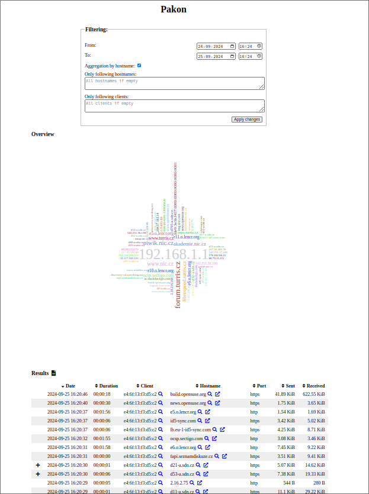
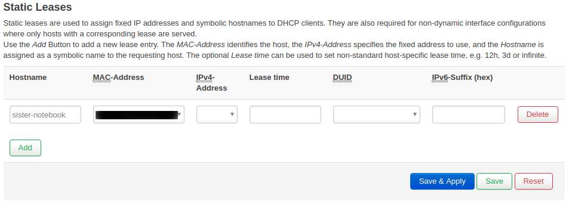

# PaKon - Network monitoring (Parental Control)

## What is Pakon?

PaKon is a tool for monitoring the activity of devices inside a local network.
It collects and stores information about network activity and allows you to
view and filter records.

## Details

PaKon utilizes **[Suricata](https://suricata-ids.org/) - network threat
detection engine**. As part of Suricata, there is **Intrusion Detection System
(IDS)**, which is being used. Suricata does the hard work of analyzing raw
network traffic and **provides processed information** (about flows, DNS
requests and responses, HTTP, TLS details, etc.).

!!! warning
    Suricata could be CPU intensive for analyzing data from traffic.
    If you have a lot of traffic, it may slow down your internet connection.
    Usually it affects connection speed above 500 Mbps.

PaKon collects this data from Suricata, puts different pieces of information
together and stores them in an SQLite database (located at folder `/srv/pakon`).
The primary data contains information about each individual network flow
including human-readable names of destination addresses. This hostname should
correspond to the actual perceived name of that host. The name is obtained by
monitoring DNS queries/responses before starting that flow, or some other
application-level name (TLS SNI, TLS certificate CN or HTTP hostname).

Big service providers (e.g. Google, Youtube, Facebook, and Twitter) use a
number of different hosts and hostnames to serve their content, so **PaKon has
a list of domains to merge these**: `/usr/share/pakon-light/domains_replace/`.
For example, instead of storing the hostname `scontent.fprg2-1.fna.fbcdn.net`
PaKon simply stores `facebook.com`. This means that some detail is lost. On the
other hand this dramatically **improves readability of output and reduces the
amount of stored data**, which is essential for a clear representation of
network traffic.

The data is further reduced in order to store it longer. Most importantly,
individual flows are aggregated. **Aggregation** simply means that instead of
storing many flows of the same host, the flows are merged together for a given
time frame. The total number of received and sent bytes is preserved, but some
detail about duration and start times of individual flows is lost. **The records
are kept for 4 weeks**, but we have plans to adjust this in the future.

## Installation

### Foris

By default, you can find Foris available at IP address <http://192.168.1.1>,
after logging in, go to Updater tab. Check there Pakon, click on button _Save
and update_ and wait a while until all packages are successfully installed.
When they are, you will get a notification about that.

If everything is installed in Foris menu, you will see _Pakon_ tab.



### CLI

Connect to your router via SSH and run these two following commands.
```
opkg update
opkg install pakon foris-pakon-plugin
```

This should perform all necessary steps needed to start collecting data.
Installing two packages `pakon` and `foris-pakon-plugin`, starting Suricata
(on local and guest network) and monitoring daemons. It may take a while before
data is complete enough to be displayed.

#### Usage

The command for displaying PaKon data is called `pakon-show`. When you run the
command, it will produce it will produce an output similar to the following:
```
$ pakon-show
|datetime            | dur   | src MAC           | hostname                                    | dst port  | proto | sent   | recvd |
|                    |       |                   |                                             |           |       |        |       |
|2019-09-04 03:37:42 | 81s   | 00:01:02:03:04:05 | google.com                                  | 443/udp   | ?     |  35KiB | 419KiB|
|2019-09-04 03:38:13 | 73s   | 00:01:02:03:04:05 | facebook.com                                | https     | tls   |  10KiB | 148KiB|
|2019-09-04 03:38:48 | 1264s | 00:01:02:03:04:05 | twitter.com                                 | https     |       |  33KiB | 726KiB|
|2019-09-04 03:52:59 | 1079s | 00:01:02:03:04:05 | data.mistat.xiaomi.com                      | http      | http  |  72KiB |  16KiB|
|2019-09-04 03:53:04 | 61s   | 00:01:02:03:04:05 | ...v boss/emailAddress=mitv_boss@xiaomi.com | https     | tls   |   1KiB |   7KiB|
|2019-09-04 05:17:52 | 241s  | 00:01:02:03:04:05 | docs.docker.com                             | https     | tls   |  11KiB | 310KiB|
```

The output gives the user an idea about the **visited hosts** with the **times
of visit** and **size of the sent or received files** in bytes.

**Individual indicators**:

* _datetime_ = date and time the hostname was accessed
* _dur_ = duration for which the given hostname was accessed
* _src MAC_ = source MAC address or the MAC address of the device, which was
used to access the hostname
* _dst port_ = destination port (for well-known services this is shown as
service name)
* _proto_ = application level protocol as detected by Suricata
* _sent_ = size of data sent
* _recvd_ = size of data received

There are some options how to filter the output. To see them, use the `-h`
option:
```
$ pakon-show -h
```
You can filter the data by _time_, by _MAC address_ and by _hostname_. You can
also display results aggregated by domain instead of displaying timeline data.

Some domains are hidden in output by default - for example, advertisements,
tracking, CDNs, OCSPs, browser service domains, which makes the output hard to read. You can show all records using the option `–no-filter`. The lists of filtered domains is in `/usr/share/pakon-light/domains_ignore/`. If there is a new CDN or you want to group multiple hostnames from the same domain to one, and you would like to share it with others and include it in a new Turris OS release, you can contribute it in [pakon-light-lists](https://gitlab.nic.cz/turris/pakon-light-lists) repository.

## A few sidenotes
- In some cases, application level protocol is unknown - `?`.
It can happen in case of failed connection or unrecognized protocol. In those
cases, you can still get some idea about it from the destination port.
- Web pages commonly include content from multiple domains, which means that
visiting one web page results in many flows to different domains.
- Web pages often include content from Google, Facebook, and other such sites.
If you see Facebook in the PaKon output, it doesn't necessarily mean that you
visited Facebook, you might have just visited a page that includes Facebook
content.
- Duration of flows might be misleading, this is the duration of the connection
(time between opening the connection and closing it). That doesn't mean that
the connection was active the whole time. We observed that browsers typically
keeps the connection open for few minutes, even though we just made one HTTP
request in the first few seconds.

## FAQ

### Where is the data stored?
The most recent data is stored in the RAM and backed up in compressed form to
persistent storage before restart or every few hours. Data older than 24 hours
is aggregated and moved to a persistent archive database.

### Where does PaKon get the hostname?
PaKon monitors DNS answers and **pairs names with IP addresses**. When it later
sees a flow to a paired IP address, it uses the name that the IP address was
paired with.

Even if the DNS query was not performed (eg. when name/IP mapping is hardcoded
in the hosts file), Suricata is often able to determine the name from
application protocol - in case of HTTP and TLS. HTTP sends hostname as its
header. TLS is encrypted, but when the connection is opened (during TLS
handshake), client sends the name of server (TLS SNI) and server sends it's
certificate. These are both sent unencrypted, so Suricata can read it even
though the data flow is later encrypted.

In case of other protocols, the detection relies just on DNS names. Also
**note that tunneling protocols (VPNs, SSH, proxies, Tor) can hide the activity
entirely** - you will only see the flow to the proxy/gateway and not the actual
traffic underneath. There is nothing that can be done about that.

### Is it possible to have client names instead of their MAC addresses?
Yes, you need to do it in the advanced administration interface LuCI. From the
menu in _Network_ and choose _DHCP and DNS_, scroll a little bit down and you
should see _DHCP Static Leases_ section.

You don't have to set a proper static lease to see names in PaKon - just fill
in the name and select MAC address. If you fill in also the IP address, you
create a static lease - meaning that the device will always get the same IP
address. For more details about static leases click
[here](../luci/static_dhcp/static_dhcp.md).



### Can I configure the list of monitor networks for PaKon?
Yes, you can change the list of monitor networks in configuration file
`/etc/config/pakon`. By default, the list includes two interfaces `br-lan` and
the guest wifi `br-guest_turris`. Add or edit the interfaces, which you want to
monitor and then restart these two services by using the following commands:
```
/etc/init.d/suricata-pakon restart
/etc/init.d/pakon-monitor restart
```

### Can I clear collected data?
There is a way how to do it in the command-line interface.
You need to connect to your via SSH and run these following commands, which will
stop process pakon-monitor, remove two databases - temporary one and persistent
and then it will create a temporary database from scratch.
```
/etc/init.d/pakon-monitor stop
rm /var/lib/pakon.db
rm /srv/pakon/*
/etc/init.d/pakon-monitor start
```
