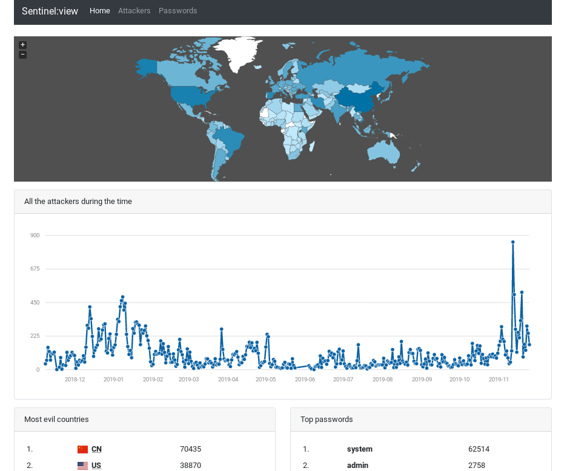
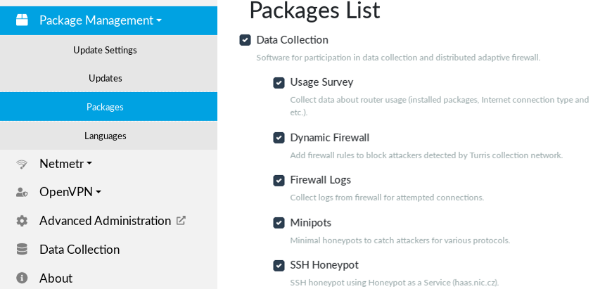

# Data Collection

## Why enable Data Collection?

One of the initial motives that led to the development of the Turris router was
to set up a secure home router that is capable of responding to current threats
in almost real time. However a large amount of data is needed to identify an
attacker and distinguish it from the usual traffic.

The data collection system [Sentinel](../apps/sentinel.md) is a key source of such a data. We use this
data to build
and distribute a dynamic firewall which afterwards helps to keep your router secure.
Enabling data collection thus helps to protect your own router (and home) as well
as to protect the rest of the world.

## What data do we collect?

There are multiple source of data we collect. Depending on the source used, the
type of data varies. On you router you can notably enable *Firewall monitoring*,
deploy *Minipots* or use *HaaS*.

### Firewall monitoring

Firewall data is one of the key data sources for [Sentinel](../apps/sentinel.md).
Using firewall data we can determine which attackers tries to exploit potential
vulnerabilities on a particular port. We collect attacker's IP address and local
port number.

### Minipot

The word "Minipot" is a combination of the words "mini" and "Honeypot", where
Honeypot, also called a fake server, is a way to mimic some kind of service,
usually attractive to a potential attacker.

Turris Minipot is a lightweight Honeypot which emulates only minimal subset of
each protocol, answering "bad password" to each attempt to log in. We currently
operate [Telnet](https://en.wikipedia.org/wiki/Telnet),
[HTTP](https://en.wikipedia.org/wiki/Hypertext_Transfer_Protocol),
[FTP](https://en.wikipedia.org/wiki/File_Transfer_Protocol) and
[SMTP](https://en.wikipedia.org/wiki/Simple_Mail_Transfer_Protocol)
Minipots. The entered user/password combination along with the attacker's IP
address is collected by the software.

### HaaS - Honeypot as a Service

By using HaaS and installing the HaaS proxy application you router becomes able
to forward traffic incoming from WAN port 22 (commonly used for SSH) to the HaaS
server located in our headquarters. The HaaS server, powered by Cowrie, is a
full-fledged honeypot able not only to record the user/password combination
(like Minipots do) but to simulate a real device and record the executed
commands.

Big advantage is that your router stays safe all the time because all the
communication is redirected to our server and nothing is done on the router
itself.

### Turris survey

Since even our team has only a limited manpower we try to primary focus
on subjects that really matter. Turris survey collects information about
installed packages, used languages and system version. Based on this we are
able to identify widely used packages and features and give them special care.

## Can I see the data?

You can browse the aggregated data we have collected through the Sentinel
network on our web called [Sentinel View](https://view.sentinel.turris.cz/).
You can browse there detected attackers, their favorite passwords, country of
origin and such.



The HaaS attackers who tried to attack your own router and their commands
could be seen on [HaaS project website](https://haas.nic.cz).


Sadly, there is currently no way to visualize what your own router collects from
Firewall monitoring and Minipots - a feature we are working hard on now.

## How to set up data collection?

The whole functionality is nowadays provided by [Sentinel](../apps/sentinel.md).
You just need to enable _Data Collection_ package list in _Package Management_
tab and agree with our [EULA](https://gitlab.nic.cz/turris/sentinel/eula/-/blob/master/eulas/1.txt) via _Data Collection_ tab in reForis. This will install and enable
dynamic firewall and other selected data collection components.




You can also install the data collection manually using command line (SSH):
```
opkg update
opkg install turris-survey sentinel-dynfw-client sentinel-nikola sentinel-minipot haas-proxy
uci set sentinel.main.agreed_with_eula_version=1 && uci commit
```

In both cases, few extra steps are needed to activate HaaS:

1. Register on our website - [HaaS.nic.cz](https://haas.nic.cz).
2. There, in section _My Honeypot_ click on _Add new device_. After
naming it, you will get a **token**

3. Add your token to the router using command line (SSH):
```
uci set haas.settings.token="YOUR_TOKEN"
uci commit
/etc/init.d/haas-proxy start
```
