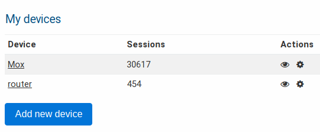
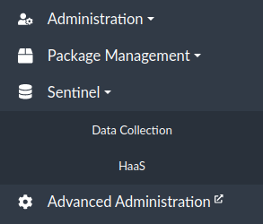
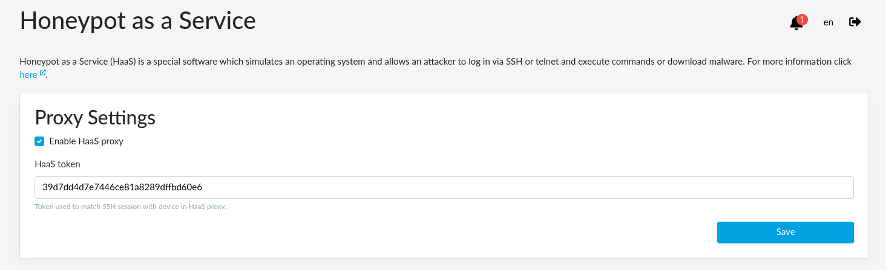

# HaaS – Honeypot as a Service

Honeypot is a special software which simulates an operating system and allows an
attacker to log in via SSH or telnet and execute commands or download malware.
Commands are recorded and used to analyze the behavior. Malware can be analyzed
as well.

HaaS allows usage of moderately interactive SSH honeypot in a way that the
attacker would be kept logged in as long as possible, knowing that he attacks
the real device, not the honeypot.

## How it works

Using HaaS and installing the
[HaaS proxy application](https://haas.nic.cz/proxy/), your router becomes able
to forward traffic incoming from WAN port 22 (commonly used for SSH) to the HaaS
server (owned by CZ.NIC association) located in one of our datacenters.

The HaaS server, powered by Cowrie, is a full-fledged honeypot. As well, it is
able to record the user/password combination (like
[Minipots](collect.md#minipot) do) and in addition it is able to simulate a real
device and record the executed commands.

A big advantage is that your router stays safe all the time because all
communications are redirected to our server and nothing is done on the router
itself.

Available facts gained by using HaaS are:

- From which IP address the attacker logged in
- Credentials he used to log in
- The attacker's behavior
- The scripts which the attacker ran in the honeypot

## How to set up HaaS

To activate HaaS, you need a PC or server with Linux and public IPv4 address.
You may have to redirect port 22 from your router to your PC if you use the
router and NAT.

Then, you can proceed with the following steps.

If you already have a token, you can skip to the step 3.

1. Register on [HaaS website](https://haas.nic.cz/).

   

2. There, in the section _My Honeypot_ click on _Add new device_. After naming
   it, you will get a token.

   

   

   

3. Go to reForis web interface and enable the [Data Collection](collect.md)
   package list in the _Package Management_ → _Packages_ tab and also enable
   "SSH Honeypot" option. This will install Data Collection and HaaS which will
   occur under the Sentinel menu item.

   

   

4. Go to the HaaS tab and check _Enable HaaS Proxy_ option. Then copy your
   token into _HaaS token_ input and click on _Save_ button.

   

   After this, HaaS is activated.

## Move the SSH server to a port for remote administration

If you use SSH for remote access to your router, you need to redirect the port
22 to a different port, otherwise you will be connected to the honeypot.
Changing the SSH port can be simple protection against intrusion attempts.
Don't forget to use a strong password or use a public key for logging in.

You just need to add a port forwarding with the following settings:

- **Name**: SSH redirect
- **External port**: number from 1 to 65535
- **Internal port**: 22

For the obvious reasons, choose those port numbers, which are not being used.

!!! warning
    If you don't fill out the port of your SSH connection, the default port
    (which is 22) will be used and you will be connected to the honeypot,
    which could record your password! For this reason it is better to log in
    with a public key.
