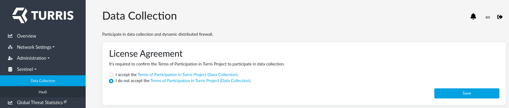
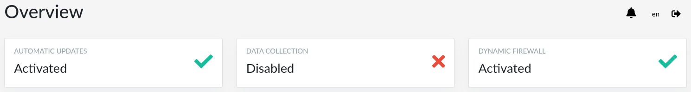
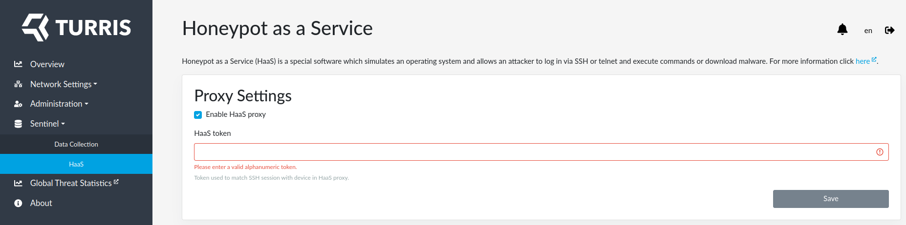

## How to set up data collection on Shield?

!!! important
    This guide is only for Turris Shield. If you want to set up another
    Turris device (Omnia, MOX or Turris 1.x) please use
    the [appropriate guide](setup.md).

Data collection is enabled by default. We strongly encourage to keep it
enabled because it helps to protect all Sentinel users against security
threats. But if you don't want use it for some reason you can disable it.

The only thing you have to do is to disagree with our EULA. You can find
it at the _Sentinel -> Data Collection_ tab in reForis. Switch the radio
button to _I do not accept..._ and press _Save_.

When done, you can see at the _Overview_ page that data collection is disabled.

### HaaS

[HaaS](collect.md#haas-honeypot-as-a-service) is not operational by default
because it requires a few steps:

1. Register on our website – [HaaS.nic.cz](https://haas.nic.cz).
2. There, in section _My Honeypot_ click on _Add new device_. After naming it,
you will get a **token**.

3. Insert the token into the _HaaS token_ field at the _Sentinel -> HaaS_ page.
Ensure that the _Enable HaaS proxy_ checkbox is checked and press _Save_.


