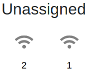

# Frequently asked questions

## Turris OS and updates

### What is Turris OS?

Turris OS is a Linux distribution based on top of
[OpenWrt](https://openwrt.org/). It means that we provide patches with some
modifications together with our own feed Turris OS packages. It includes
reForis, Updater-ng, and more packages to be user-friendly, ensure
full-featured packages. Turris OS provides continuous updates for OpenWrt, easy
to use web interface reForis, and integration with
[Turris Sentinel](apps/sentinel.md). Feel free to check out our
[website](https://www.turris.com/turris-os/).

### What versions of Turris OS are supported?

The history of the supported list can be found on [our website](../basics/tos-versions.md),
where you can see when each major version was released and when it is
end-of-life. It means that we will not provide any support for it anymore.

You should have your router up-to-date as soon as possible. We are testing and
suggesting updates from the previous version to the recent version. We can not
ensure that updates over two or more versions will be smooth and user-friendly.

### How can I join testing of upcoming versions?

Each configuration of the router could be unique. If you would like to help us
to improve the Turris OS releases or even use the Turris OS development
versions, which are using development versions of OpenWrt, you can. Still,
there can be some issues with which you need to deal with from time to time.
For example, a missing package or router does not work as it should. That
depends on the selected branch.

Take a look at our dedicated article for [Early testing](../geek/testing.md).

### User interface (reForis, LuCI)

In Turris routers except one device [Turris Shield](../hw/shield/shield.md),
you can find two interfaces.

#### reForis

The user interface [reForis](../basics/reforis/intro.md) is developed in-house
and it is simplified to provide safe defaults and the most common features.
Among other things, it contains notifications about updates. Configurations
done in reForis are heavily tested and fully supported.

#### LuCI

OpenWrt's administration interface LuCI is developed and available on every
OpenWrt router. Users are able to configure what they desire and even
complicated configurations, but keep in mind that we do not support most
changes done here. It is advised to be used only by experienced users because
LuCI does not verify any values if they are correct. It is possible that some
services do not start because of misconfigurations.

This one is not available on [Turris Shield](../hw/shield/shield.md).

### How do the automatic updates work?

Turris routers check our servers for possible availability of a new update
every two hours (with some variability to spread the load of the update
servers and speed-up the update process). If a new Turris OS version
- newer than the currently used one - is available, the router will download
and install it.

After that, an automatic restart of the router will be planned according to
the settings (usually at night after three days). You can restart the router
earlier at a moment when you do not mind a current Internet connection loss.

Updates may be delayed or manually approved. If you use delayed updates or
approvals, we suggest configuring sending notifications to your e-mail to be
in the loop about updates.

### What are the _staging updates_?

Releases of Turris OS starting from 7.0 are using a staging updates mechanism.
Although we do automatic updates, we can distribute those over a longer period
of time. When the update will be actually installed on the router is decided
randomly during each release.

If you are one of the routers held back, you will see the following message
when running `pkgupdate` from CLI.

```
There is a newer version available, but update is scheduled after another XYZ
hours. If you want the latest and greatest all the time, switch to one of the
development branches.
```

How many roll-outs are there and which routers will be part of which batch is
determined during the release. But individual routers are assigned to batches
randomly, so if you are in the last batch of people to receive the particular
update, there is a high chance, that the next time, you will get update sooner.

On top of default behaviour, Turris can also decide not to stage any particular
update (for example in case of severe security issue), or update just the
release that people are updating into while keeping the routers waiting for the
update on the same version (just in case new release needs fixup before
everybody hits the problem).

### What I want to re-flash my router with the latest version?

If you somehow end up that the router is not working after some configuration,
you can use snapshots and rollback to the previous state by using schnapps tool.

If you want to start over or simply use re-flash your router by using USB flash
drive, take a look at specific articles for

- [Turris 1.x](../geek/btrfs_turris1x.md#how-to-perform-factory-reset-medkit)
- [Turris Omnia](../hw/omnia/rescue-modes.md#re-flash-router)
- [Turris MOX](../hw/mox/rescue-modes.md#re-flash-router)

### Can I use plain OpenWrt without Turris additions?

In principle, yes, because we send the modifications to the Linux kernel and
other OpenWrt components needed for Turris back to the OpenWrt project. However,
we cannot guarantee the right function or provide any support.

### Open-source

All software available within Turris OS and the OpenWrt itself are open-source.
This means that all [the source code](https://gitlab.nic.cz/turris/os/build) is
available. We are based on [OpenWrt](https://openwrt.org/), but for using Wi-Fi
cards and specially ath10k, there are a few blobs required.

About hardware, we release schematics and pinouts. Once, we would not
manufacture any new PCBs, we will release the complete HW documentation like we
do it for [Turris 1.x routers](../hw/turris-1x/turris-1x.md#various-documentation-files).

## Software available within Turris OS

### Updater-ng

One of the objectives of the Turris router is to increase the security of
routers by using regular firmware. That is managed by
[Updater-ng](https://gitlab.nic.cz/turris/updater/updater).

### Schnapps

Turris routers use the Btrfs file system to utilize the advantages of snapshots.
This lets you take all files to the state they were at when the snapshot was
created. It enables the user to simply return to a functional configuration or
to temporarily return to an earlier version of the system.

[Schnapps](../geek/schnapps/schnapps.md) is available in reForis or in CLI.

### Knot Resolver

[Knot Resolver](https://www.knot-resolver.cz/) is the default DNS resolver for
Turris Omnia, Turris MOX and Turris Shield. It is developed by CZ.NIC,
the `.cz` domain registry and many provides are using it.

### Syslog-ng

[Syslog-ng](https://www.syslog-ng.com/products/open-source-log-management/) is
a system log management tool.

### Honeypot as a Service

[Honeypot as a Service](https://haas.nic.cz/) is a public service, which can be
used on any device with a public IPv4 address. It uses the SSH protocol to catch
attackers  and provide you details, what credentials they used and what they
were trying to do. To be able to use it, you need to register on their website
and then fill a token in reForis. For more details, take a look at
[dedicated article](../basics/sentinel/haas.md) for this feature.

This is created and maintained by CZ.NIC.

### LibreSpeed

[LibreSpeed](apps/librespeed/index.md) is a too to measure Internet
connection speed. It automatically selects the best available
measurement server worldwide. We provide our own server located
in the Czech Republic (where another server is available too; it
is managed by [CESNET][https://www.cesnet.cz/]).

!!! notice
    LibreSpeed is currently not available for Turris 1.x devices.

### OpenVPN

In reForis and also in LuCI, you can configure [VPN server](../basics/apps/openvpn-server/openvpn.md)
and [VPN client](../basics/apps/openvpn-client/openvpn.md) by using OpenVPN.

### LXC Containers

Many of our users are using some virtualization via LXC or Docker.
This feature is completely untested and not supported by us. We can not
troubleshoot all GNU/Linux distributions for their issues and help to fix them.
It requires knowledge to configure it on an external device to avoid unnecessary
writes to the internal storage to prevent it to be worn out. Also, you need to
be familiar with using SSH.

### NetMetr

[NetMetr](https://www.netmetr.cz/) was another tool to measure connection
speed. It has been discontinued and superseded by LibreSpeed.


## Turris Sentinel

### What it is?

It is a threat detection and cyberattack prevention system.

### How does it work?

First we collect data about suspicious and malicious network traffic on routers.
The data is sent to our servers and analyzed. Each recorded IP address is ranked
with a score based on the analyzes. If the score reaches the given threshold it
is considered as malicious. The list of malicious IP addresses is then supplied
back to routers which update their firewall rules accordingly to block all
network traffic from the malicious IP addresses. This process is happening
completely automatically in real time so we are always up to date with the
newest threats. Beside of that we also do some interesting statistics on the
collected data.

### Which data on router do we collect?

We collect only data incoming from Internet utilizing our minipots and by
parsing firewall logs about rejected and dropped packets.
In general no outgoing data originated from a user is disclosed.

### How can I join the malicious traffic detection / data collection?

To send us data about malicious traffic you have to first agree with our EULA.
It can be then turned on and off any time from our web administration interface
reForis in the Sentinel Sentinel. However for maximal protection we recommend
to leave it on all the time.

### What are the minipots

Minipot is an abbreviation for a minimal honeypot. A honeypot is a decoy system
intended to mimic likely targets of cyberattacks. Its purpose is to collect
information about malicious activities made by cybercriminals. Usually it is a
complex system but this is not our case. Our minipots are lightweight emulations
of well known services running on the application layer (HTTP, FTP, SMTP,
Telnet) and collecting data about connections and login attempts made to them.

### Where I can see any statistics?

You can find all the statistics and also regular daily snapshots of the list of
detected malicious IP addresses at our web interface
[view.sentinel.turris.cz](https://view.sentinel.turris.cz/).

## Documentation and community

### What is our user forum for?

The user forum is primarily used for communication between users of Turris
devices. Users can share their experiences, recommend appropriate solutions
to certain situations, consult on device integration into different
environments, etc.

Sometimes members of the Turris team are involved in communication (especially
they announce new versions of Turris OS and other news in the project). But
the forum is not designed for user support. Please contact us by e-mail:
[tech.support@turris.cz](mailto:tech.support@turris.cz).

## Hardware

### Supported devices

#### SFP

All of those, which fulfill the
[SFP standard](https://www.snia.org/technology-communities/sff/specifications),
work on 100Mbps / 1Gbps / 2.5Gbps / SGMII. Some others work, too,
despite not fulfilling the standard, if supported and worked by the Linux
kernel.

We manufacture our own
[Turris SFP+ Copper module (RJ45)](https://www.discomp.cz/turris-sfp-2-5gbps-rj45-modul_d113354.html)
supported under Turris OS.

It is needed to ask the producer for information about the standard fulfilling
or the Linux kernel support. Although they often respond that it works only
on their own devices. On our
[community forum](https://forum.turris.cz),
there are messages from our users who test different SFP modules on Turris
Omnia or MOX. There is a community-maintained list of compatible SFP modules,
which can be found in our [community documentation](https://wiki.turris.cz/doc/en/public/sfp).
Anyone can register there and log in and then add their own SFP module, which
they tried.

#### miniPCIe Wi-Fi cards

You can find many mini PCIe Wi-FI cards, which you can use in Turris routers,
but they need to be supported in OpenWrt and Linux kernel. We tested the
following mini PCIe Wi-Fi cards, which we support.

- WNC DNXA-H1 (Wi-Fi 4 works at 2.4 GHz or 5 GHz)
- DNXA-97-H (Wi-Fi 4 only 2.4 GHz)
- Compex WLE200N2 (Wi-Fi 4 only 2.4 GHz)
- Compex WLE900VX (Wi-Fi 5 Wave 1)
- AsiaRF AW7615-NP1 (Wi-Fi 5 Wave 2, MU-MIMO)
- AsiaRF AW7915-NP1 4x4 (Wi-Fi 6) since Turris OS 6.0
- AsiaRF AW7915-NPD 2x2 (Wi-Fi 6, DBDC) since Turris OS 6.0
- AsiaRF AW7916-NPD (Wi-Fi 6E, DBDC) requires LTS kernel 5.15

#### Cellular network (LTE/5G)

We support LTE components, which we were selling as an LTE pack. We have
a good experience with LTE model Quectel EP06. The whole pack including
antennas, heatsink and so on can be found on
[Discomp.cz](https://www.discomp.cz/turris-omnia-lte-kit-lte-modem-cables-antenas-heatsink_d113352.html)

The configuration for the LTE connection needs to be done in the advanced
administration LuCI.

We are investigating and testing 5G modems, and if there is anything new,
we will let you know through our social media.

#### Replacement parts

There is a possibility that you lost the power supply or somehow there was
managed that the power supply was damaged. We sell replacement parts like
antennas, diplexers, Wi-Fi cards through our distributors.

The full list of available replacement parts can be found on
[our community forum](https://forum.turris.cz/t/where-to-buy-replacements-power-supply-antennas-etc/15428/).
If you did not find anything, don't forget to reach our
[Technical support department](../basics/support.md)

## Troubleshooting

### Weak wireless signal

If you moved the position of wireless cards in Turris Omnia, we suggest double
checking if you connected pigtails correctly to diplexers (those small green
boards). There are two connectors. One is for 2.4 GHz and the second one is
for 5.6 GHz.

It is also possible that you experience connection drops by using 2.4 GHz
frequency, this one shares the frequency with Bluetooth, and that is
simply overcrowded these days in urban areas. You can try to use different
bands or even Wi-Fi analyzer. We suggest looking at a dedicated article to
improve [Wi-Fi coverage](../hw/wifi.md) and if it is possible to use 5 GHz
frequency on devices that support it.

### Something does not work

We tried to describe on a dedicated page [Common scenarios](../basics/common-errors.md),
which users might experience and what was reported to us. For example, you can
check it if you are not able to connect to the router or if it is not able
to reach the Internet, but there are also more detailed issues like reForis
incompatibility with Safari, or why the Turris MOX does not boot over
the network.

We should not forget about issues while updating the router to a new version.
Before we release new versions, we invite users to join public testing
when releasing RC versions into the testing branch as each router
configuration can be unique. That is why there is possible that something
does not work as expected.

In that case, please follow [Creating issues article](../geek/contributing/issues.md),
but keep in mind that we support only changes done in reForis.

### I do not receive e-mail notifications

Please check whether your e-mail address has been entered correctly.
Do not use an address that is forwarded (or redirected) to another address;
use the target address directly instead. We use antispam technologies like
[SPF](https://en.wikipedia.org/wiki/Sender_Policy_Framework),
[DKIM](https://en.wikipedia.org/wiki/DomainKeys_Identified_Mail), and
[DMARC](https://en.wikipedia.org/wiki/DMARC). These technologies are
incompatible with simple e-mail forwarding. Mailing lists are usually
safe but it depends on specific implementation and/or configuration.

## Known bugs

### Turris MOX / Turris Shield is not capable to route more than 450 Mbps

Between LAN and WAN ports, it is possible that the speed is lower than it should
be. There were many improvements in the Linux kernel available since version
5.8.

| OpenWrt version                               | Turris OS version | LTS OpenWrt kernel | LTS Turris kernel |
|-----------------------------------------------|:-----------------:|-------------------:|-------------------|
| OpenWrt 21.02                                 |   Turris OS 6.x   |                5.4 | 5.15              |
| OpenWrt 22.03                                 |   Turris OS 7.x   |               5.10 | 5.15              |
| Daily snapshots (upcoming, not announced yet) |   Turris OS 8.x   |               5.15 | 5.15              |

### Wi-Fi cards are reported as unassigned on the Interfaces page in reForis

_Present since: Turris OS 6.0_

Even when Wi-Fi interfaces are properly configured on the _Network Settings_ → _Wi-Fi_
page, they are displayed in the "Unassigned" group on the _Interfaces_ page in reForis.

Although this discrepancy between the displayed state of the Wi-Fi interfaces on
different reForis pages is confusing, this is just a visual representation bug
on the _Interfaces_ page. Properly configured Wi-Fi interfaces should work fine
regardless of it.



## Erratum

### Turris MOX / Turris Shield: reboot issue

In rare cases, Turris MOX and Turris Shield are not correctly rebooted.
We are investigating this issue. We are in touch with Marvell, the processor
manufacturer, to solve it. We prepared
[some workarounds](https://gitlab.nic.cz/turris/mox-boot-builder/-/releases/v2021.09.07),
which could improve the reboot behavior.

### Limitation of the SDIO card on Turris MOX

The provided firmware from NXP for chipset 88W8997 has limitation that it is
possible to create only 4 SSIDs and have a maximum of 8 concurrent clients
connected to them. It does not support WPA3 mode.
