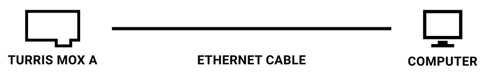
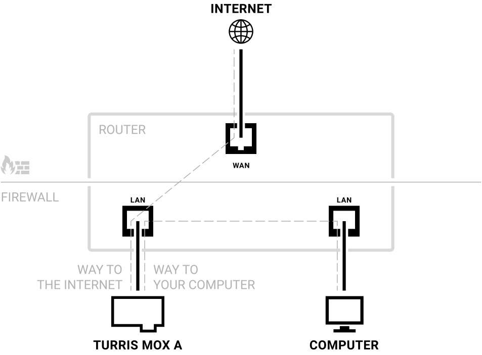

# First setup of Turris MOX (CPU Only)

This page is written for users who would like to configure their MOX device with
only one Ethernet port. It means you have no SFP module (MOX D) and no Ethernet
module (MOX C or E). You may or may not have other modules (MOX B, F or G).

Why is there a special page? Your device has only one network port and you have
to decide if you would like to configure it like WAN or LAN and how to manage a
connection to the internet.

Because we want to make the first setup smooth, Ethernet port will be set
to LAN at the beginning of the first setup. **You shouldn't connect your MOX
directly to the internet**. Configure it somewhere in safe environment – like
your local network or directly connected to your computer. Later on, you can
change the purpose of your only Ethernet port.

## Cable setup for configuration

You shouldn't connect your MOX A directly to the internet.

You can connect your MOX A directly to your computer, but your MOX A wouldn't be
able to connect to the internet during the first setup and download any
updates, which is not recommended. Some steps in the configuration guide (like
checking the internet connection) could fail because of that, but it should be
usually OK.

If you have a working local network with dhcp behind a firewall and you can
somehow list IP addresses of newly connected devices, it is recommended to use
it for MOX A configuration. In this setup, your MOX A will be able to connect
to your computer as well as connect to the internet.

!!! important
    Make sure you use a proper Gigabit Ethernet cable, i.e., a
    [Cat 5e](https://en.wikipedia.org/wiki/Category_5_cable) or
    [Cat 6](https://en.wikipedia.org/wiki/Category_6_cable) straight unshielded
    twisted pair cable with 8 wires (8P8C).

## Installation steps

### Before you start

{! include-markdown 'basics/first-setup/mox-first-setup-warning.md' !}

### Setup

Firstly connect your computer to a MOX A either directly via Ethernet cable or
indirectly by connecting both MOX A and your computer to the same local network.
Then connect the power supply.

Wait for your MOX to boot up. During boot LED will shine red and
once booted up, it will start blinking in heartbeat pattern
(blink-blink-pause).

**First boot can take a while**. During that, MOX detects hardware and decides
what configuration it is in. It also tries to detect running DHCP server and if
it finds one, it will switch itself into DHCP client mode. If it doesn't find
one, it will configure itself as DHCP server.

If it is connected directly to your computer, you will end up with running DHCP
server on your MOX. If connected to a local network, probably there is already
running DHCP server, in that case MOX, will be its client.

!!! tip
	If you have a working zero-conf on your conputer, you can access your
    router via <http://turris.local> address.

When booted, you can access the first-run wizard by using a web browser and
entering as URL address of your router. In case of your MOX running as DHCP
server, web interface will be at <http://192.168.1.1>. If it ends up being DHCP
client, you either have to use administrative UI on your DHCP server (your main
router in most cases) and figure out IP address of your MOX, or you can use
zero-conf address <http://turris.local> if your computer is configured
correctly to use those.

If you want to change the purpose of your only Ethernet port from LAN to WAN
you can do so in an administrative interface after finishing the guide and
after setting up a way to access your router.
