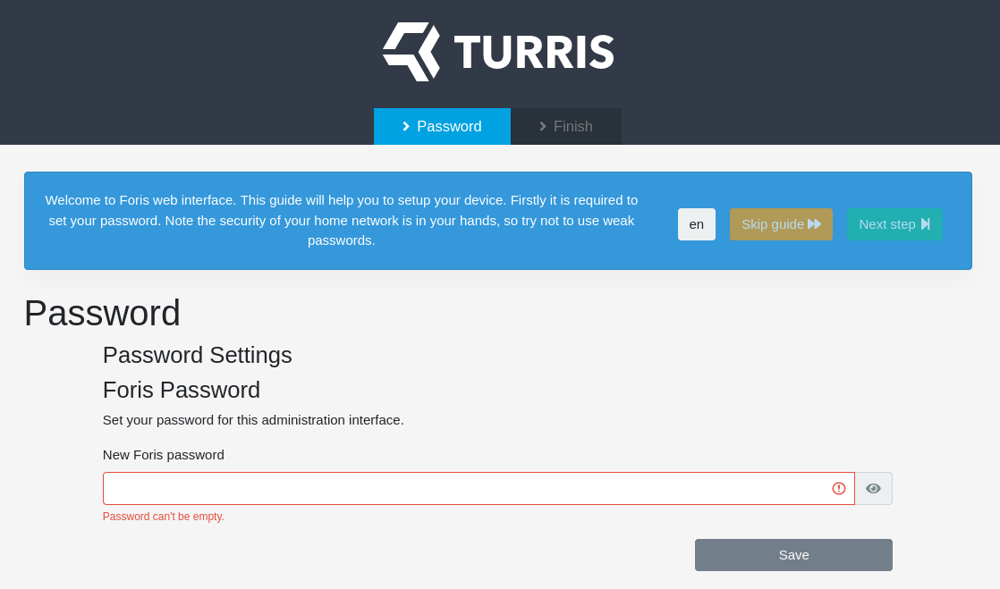
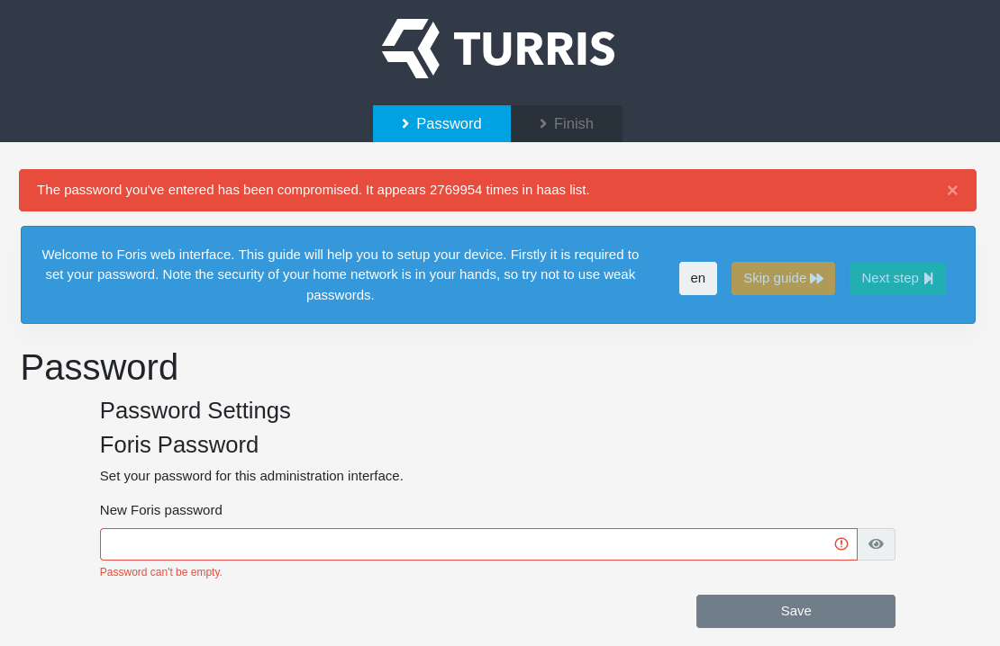

# First setup of Turris Shield

## Connecting cables

Turris shield has Ethernet ports split into two groups — WAN (Wide Area Network
aka Internet) and LAN (Local Area Network aka your private network to be secured).

There is only one WAN port — the grey one, but you have four LAN ports
available — the ones framed in blue.

You should connect the cable from your ISP to your WAN port. Your ISP might
have provided you with some kind of modem (DSL, Cable TV, ...), so connect your
Shield directly into it.

If four ports for your secure home network are not enough, you can extend it
using either switches or using Wi-Fi APs. But be aware, there is no password
during initial setup, so we highly recommend to set up Shield before connecting
other computers.

## Entering guide

Once you have all cables connected, you can power up your Shield by connecting the
power supply. Wait for your Shield to boot up. During boot LED will shine red and
once booted up, it will start blinking in heartbeat pattern
(blink-blink-pause).

When booted, you can access the first-run wizard by using a web browser and
entering as URL address of your router. Your router should be accessible on
<http://turris.local>. In case zeroconf setup is broken on your PC, you can use
IP address <http://192.168.1.1> directly.

## Guide walk-through

As Turris Shield is trying to be as simple as possible without compromising the
security, it will not allow you to access the Internet without setting up the
password. That is the only mandatory step in the initial Guide.

### Step one — password settings 

As mentioned previously, you are asked to enter password that will protect your
administration interface. Pick something that is not easy to guess and long
enough.

#### Step one A — Insecure password used 

While setting the password, password is checked offline against set of well-known
passwords that we captured in our honeypots. If you see the error above, the
password you picked is definitely not secure and you should pick something else.

#### Step one B — Password set

Once you choose non-blacklisted password that is long enough, it is set, and
you may proceed to the next step via _Next step_ button.

## Step two — guide finished

Second step is farewell message from the guide. Click on _Continue_ button and
you are done. Your internet should start working and you should land on the
administrative interface. You can take a look at the
[screenshots](../../hw/shield/screenshots.md), to see what is available.
