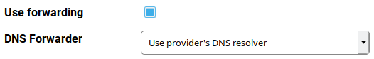

DNS settings in Foris
=====================

What is DNS
-----------

The [Domain Name System](https://en.wikipedia.org/wiki/Domain_Name_System) (DNS) is a system which translates name
addresses (such as `www.turris.cz`) to [IP addresses](https://en.wikipedia.org/wiki/IP_address) (e.g. `217.31.192.69`
for [IPv4](https://en.wikipedia.org/wiki/IPv4) or `2001:1488:ac15:ff80::69` for
[IPv6](https://en.wikipedia.org/wiki/IPv6)) and vice versa. It is one of the key parts of the Internet.

For example, if you want to visit a webpage in your browser your computer sends a DNS request to the "nearest" DNS
server. This server responds directly (if it has already acquired the address) or it recursively queries other
DNS servers (the ISP's ones or the autoritative ones which maintain the DNS records) and then sends the address to
your computer.

In most cases, your computer sends DNS queries to your router (ie. Turris) which must have be configured properly.
This documentation page explains how to set it.

What is DNSSEC
--------------

Plain DNS responds have a big problem. Their data is transmitted without any measure for their integrity. It means
if it is changed during the transfer you can't detect it any way. Some "bad guy" sitting on the wire can send you
his own DNS record instead the true one and you have no chance to disclose it. This attack is denoted as
[DNS spoofing](https://en.wikipedia.org/wiki/DNS_spoofing).

For example, you requests the IP address(es) for `www.turris.cz` and you should currently get that it is an alias for
turris.cz and it has the addresses `217.31.192.69` and `2001:1488:ac15:ff80::69`. But somebody (e.g. a dissatisfied
employee at your ISP) can change it to something else and your browser displays another page than you want.

The solution of this problem is [DNSSEC](https://en.wikipedia.org/wiki/Domain_Name_System_Security_Extensions).
It is based on [electronic signatures](https://en.wikipedia.org/wiki/Electronic_signature) and allows to verify
whether a DNS response:

* is based on authoritative data, and
* is unchanged (has its original form).

DNSSEC works properly only if the whole DNS record chain (from the
[root zone](https://en.wikipedia.org/wiki/DNS_root_zone) to the records you are requesting)
is consistently signed and all DNS servers are correctly configured. The root zone keys are signed by complicated and
secure procedures called [Root KSK Ceremonies](https://www.iana.org/dnssec/ceremonies). The root zone signs
the lower level zones (for [TLDs](https://en.wikipedia.org/wiki/Top-level_domain)) and so on.

To make DNSSEC work properly is also necessary to support it by all DNS servers/resolvers in the chain between
you and the authoritative DNS servers. This usually include your router and your ISP's DNS servers (if used). Read
bellow how to set your Turris to work with DNSSEC.

DNS in Foris
------------

Turris uses its own DNS resolver with DNSSEC support. It is capable of working independently or it can forward your
DNS queries to your ISP's DNS resolver. Usually, it is better to use the ISP's resolver in
networks where it works properly. If it does not work for some reason, it is necessary to use direct resolving
without forwarding.

### DNS forwarding

DNS forwarding is enabled by default. It means all DNS queries are sent to your ISP's DNS forwarding servers (or other
DNS forwarders if set so - see bellow). This is the very recommended setting and should be left unchanged unless
there is a very good reason to change it.

*What may be such reason? For example, DNSSEC on your ISP's DNS servers is broken and DoT (see bellow) port is blocked.*

### DNS Forwarder

The default setting is that all DNS queries are forwarded to your ISP's DNS servers (see the **WAN** section). It is
recommended to keep this setting unless there is a reason to do anything else. The other options currently are:

* CZ.NIC (TLS)
* Cloudflare (TLS)
* Google
* Quad9 (TLS)

The options containing TLS uses a special technology named [DNS over TLS](https://en.wikipedia.org/wiki/DNS_over_TLS)
(DoT). Regular DNS queries and responses (including the DNSSEC ones) are transfered in plain format and can be
intercepted by anybody who has access to the lines and nodes (including your ISP of course). If you want to keep your
DNS communicaton in secret you can use DoT/TLS instead.

[CZ.NIC](https://www.nic.cz/) is the Czech national domain registry operator (and the creator of your Turris).
[Cloudflare](https://en.wikipedia.org/wiki/Cloudflare) is a world-wide cloud service provider which has its servers
in many countries. Quad9 is a non-profit organization dedicated to secure DNS services and it also has servers in
many countries. You can also use [Google](https://en.wikipedia.org/wiki/Google_Public_DNS)'s notoriosly known
public DNS servers (but currently not with DoT). 

*DNS over TLS keeps DNS traffic in secret but is a bit slower than the standard DNS communication.*

### Disabling DNSSEC

Disabling DNSSEC is highly discouraged. It should be done only temporarily in these cases:

1. Your ISP's DNS servers are broken and you can't use any other forwarding options nor to disable forwarding
	   at all (typically your ISP blocks the ports used for DNS and DoT communication with "foreign" servers).
	   In such case request your ISP to fix its DNS servers or consider to migrate to another ISP. 

2. You experience strange behavior where you browse the web or use other Internet services and you suspect it may
	   be caused by broken DNSSEC. If disabling DNSSEC fix these problems it converts to (1). Otherwise you should
	   reenable DNSSEC and investigate elsewhere.

*If you try to check the Disable DNSSEC checkbox you will have to confirm that you would really like to do that.*

### DHCP clients in DNS

You can enabled DHCP client names in the local DNS. This is disabled by default. If you enable this you will able to
resolve IP addresses for local host names. It can be useful if computers provide various services to each other
(e.g. file sharing, DLNA media services...).

When a computer requests its IP address via DHCP it sends its host name (this is the name you can see at the **LAN**
page in the **DHCP clients** list). Remember each computer in your LAN must have an unique name to work properly.
Ambiguous names will lead to unpredictable results. 

Connection test
---------------

After you have set the DNS settings you can test the connectivity. Remember to press the **Save** button before
you start the test. Note that sometimes it takes a while before the connection is fully initialized. So it might be
useful to wait for a while before running this test.

What particular results mean:

* **DNS** - your router can successfully execute DNS queries and get responses
* **DNSSEC** - your router can successfully execute DNSSEC queries and get correct (trustfully signed and intact)
	  responses

