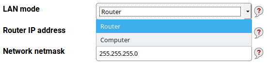
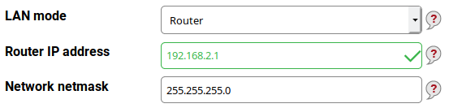
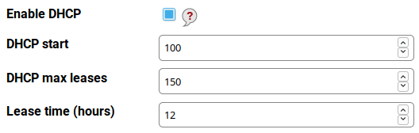
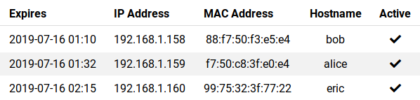
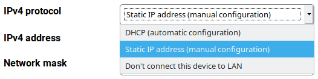
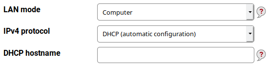
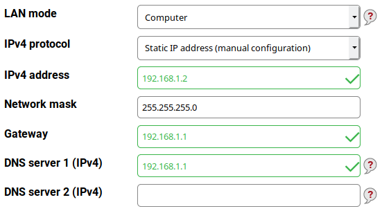

LAN settings in Foris
=====================

This section contains settings for the local network (LAN). The provided defaults are suitable for most networks.

*Note: If you change the router IP address, all computers in LAN, probably including the one you are using now, will
need to obtain a new IP address which does not happen immediately. It is recommended to disconnect and reconnect all
LAN cables after submitting your changes to force the update. The next page will not load until you obtain a new IP
from DHCP (if DHCP enabled) and you might need to refresh the page in your browser.*

Basically, your Turris can act as a router or as a computer. The **router** means it interconnects the LAN with
the other networks (or the Internet) and usually manages the LAN. The **computer** means it acts as a normal computer
in the LAN. You should prefer the latter role if you want to use your Turris only as a NAS, DVB tuner, print server
and so on.

Turris as a router
------------------

The default inner (LAN) address is 192.168.1.1. This is suitable for most networks but you may have a reason to
change it (for example if your ISP uses addresses in the 192.168.1.0 network for itself although it is a very bad
practice). Unless you have got assigned a block of public IPv4 addresses (which is currently very rare) you can
choose one of private address ranges:

* 192.168.0.0 – 192.168.255.255
* 172.16.0.0 – 172.31.255.255
* 10.0.0.0 – 10.255.255.255

For example, you have chosen 192.168.2.0 with a 24-bit netmask (255.255.255.0; it means IP addresses from
192.168.2.0 up to 192.168.2.255, but both the first and the last one are left unused because of their special meaning)
for your LAN. Then your router can have 192.168.2.1 as its LAN address. Fill it into the **Router IP address** text
field. The field **Network netmask** should contain 255.255.255.0 as written above.

### DHCP server

Unless you want to use static addresses in the whole LAN you need to have the DHCP server enabled. This is the
default option. The DHCP server has three parameters:

* **DHCP start** - the first address inside the address space which may be leased (assigned) via DHCP. For example,
  if it is 100 and your network is 192.168.2.0 your DHCP leases addresses beginning 192.168.2.100. The default
  value 100 usually need not to be changed. 
* **DHCP max leases** - the maximum addresses to be leased to computers. It effectively means if you have this
  value set to 150 (the default) and the first leased address is 192.168.2.100 the last one is 192.168.2.249.
* **Lease time (hours)** - this is how long an address is leased to a computer (the default is 12 hours and
  is suitable for most cases). If this value is too high and the computers in the LAN "rotate" very often
  (e.g. in an Internet café) the address space may be exhausted and new device will not get their addresses.
  Too low values may lead to frequent address changes and some networking problems.

### List of DHCP clients 

The LAN section in Foris contains also the list of the current DHCP clients. It can be very useful for LAN
administration and for tuning the DHCP server settings. You can see here which computers have leased which IP addresses,
which hostnames they have and when those leases expire.

Turris as a computer
--------------------

In this role, the LAN interface acts similarly to the WAN one. The main difference is that it opens ports for
management interface and some other services. There are three modes of operation:

* **DHCP (automatic configuration)**
* **Static IP address (manual configuration)**
* **Don't connect this device to LAN**

### DHCP configuration

The IP address (including the network mask), the default gateway and the
[DNS servers](https://en.wikipedia.org/wiki/Domain_Name_System) are acquired via DHCP.

In some cases, useage of a specific hostname may be required. Write it into the **DHCP hostname** field.

### Static IP address

This mode is the default because your Turris should have a fixed address to be easily accessed (this can be
accomplished by some DHCP servers too but it is more complex).

* **IP address** (mandatory) - it's something like 192.168.5.122.
* **Network mask** (mandatory) - something like 255.255.255.0.
* **Gateway** (mandatory) - something like 192.168.5.1.
* **DNS server 1 (IPv4)** (optional) - may be left empty because there is a built-in DNS resolver capable to
  work without it. But some ISPs require customers to use specific DNS servers. In such case fill in the first
  of the addresses (or the only one) of your DNS servers/resolvers.
* **DNS server 2 (IPv4)** (optional) - if you have more than one server/resolver use the second one here.

