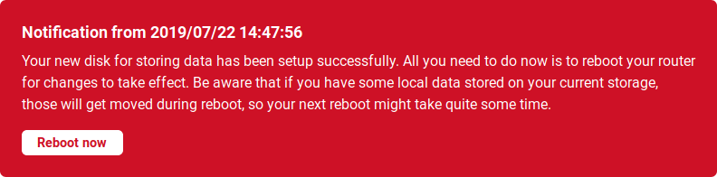
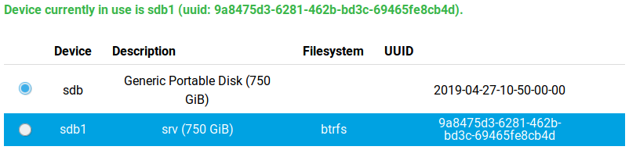

Storage plugin
==============

Turris contains an eMMC flash memory card which is used as the system storage. It holds both the Turris OS itself
and the created data. But if you want to use applications which need to save larger amounts of data you can use
an external storage device.

!!! tip
    If you want to use [Nextcloud](../../../geek/nextcloud/nextcloud.md),
    [LXC](../../../geek/lxc/lxc.md) or other I/O intensive applications, don't put them on the internal flash,
    always use external storage! Also please make sure that your data will fit on the new drive before switching.

The storage plugin allows you to easily move your `/srv` to an external drive. It both allows getting more space
and lengthen the lifespan of the internal eMMC flash storage. The `/srv` directory is used for storing
site-specific data as defined in the [FHS specification](https://en.wikipedia.org/wiki/Filesystem_Hierarchy_Standard).
The storage plugin can't move other parts of the file system. But it doesn't matter because all data-intensive
applications save their data into `/srv`.
    
How to set up an external storage
---------------------------------

Pick an external storage device, which you want to move your persistent data to. This can be for example a simple USB
flash drive but it is strongly encouraged to use a regular HDD or SSD to get both higher speed and better durability.
**Make sure that the storage device has no important data on it because it will be formatted!**

In case of an USB drive, insert it into the USB slot on your router. If you are using a different type of storage,
make sure that it is properly inserted or connected to the router.

Once the external storage is inserted, inside the tab Storage in Foris, select where your persistent
data should be stored and press the **Format & Set** button.

You will be asked if you are ready to continue. If you are ready, press **OK**. Now, for applying the changes, you need to reboot your system.  

You can do this by going to the
**Notifications** tab and pressing **Reboot**.

The reboot might take a long time because it involves the movement of your data to the new storage.

Once the process is finished, you have rebooted your router and logged back into Foris, the selected storage will be
highlighted blue. This means that the operation was successful and your data will from now on be written to
the external disk.

