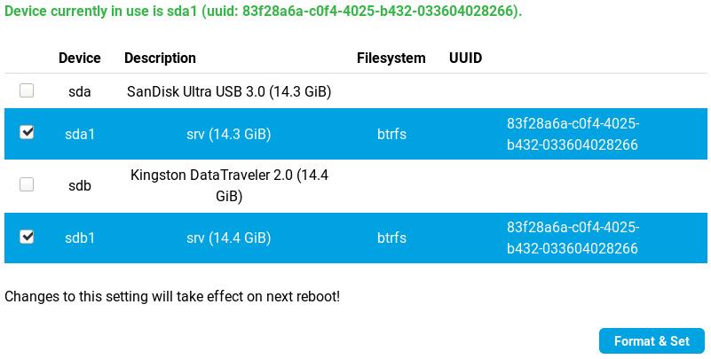

# Storage plugin



## First setup



Once the external storage is inserted, inside the tab Storage in Foris, select where your persistent
data should be stored and press the _Format & Set_ button.


You will be asked if you are ready to continue. If you are ready, press _OK_. Now, for applying the changes, you need to reboot your system.

You can do this by going to the _Notifications_ tab and pressing _Reboot_.


The reboot might take a long time because it involves the movement of your data to the new storage.


Once the process is finished, you have rebooted your router and logged back into Foris, the selected storage will be
highlighted blue. This means that the operation was successful and your data will from now on be written to
the external disk.


## Multiple drives

You can add additional drives anytime you need more space or redundancy. Simply
select additional drive in the web interface.

**Data on the newly selected drive will be deleted.** Data on old drives will
be spread across all enabled drives.



If you have more drives and want to remove/replace some of them, do so by
unchecking them in in the Web UI and hitting _Format & Set_ button. Removing
drive takes a long time as data need to be moved out of it first and

!!! tip
    No additional reboot is needed to extend/shrink your storage. Actually
    quite opposite – everything happens at runtime, so avoid reboot till you
    get notification that everything successfully finished.


## Data redundancy

By default, adding more drives will increase the capacity available in `/srv`.
If you are using your router to store important data, you might want to set
redundancy for your drives. This can be currently done only in CLI by calling
the following commands:

```
uci set storage.srv.raid=raid1
uci commit storage
```

Then after hitting _Format & Set_ button without changing any drives, raid
level will be set and data rearranged.

Valid options are the following:

* `raid1` – every piece of data is kept on two different drives (no matter how many drives you have), so if one drive fails, you can still get to your data
* `single` – there is only one copy of data – more space, but not redundancy
* `custom` – raid level is unchanged and only rebalance is done after adding/removing drive
