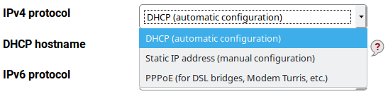
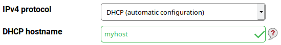
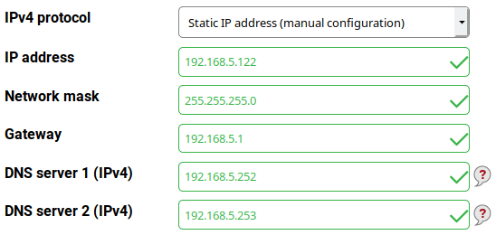
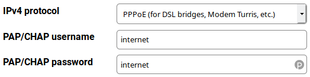
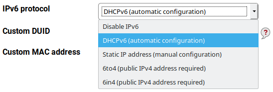
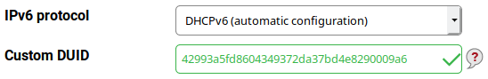
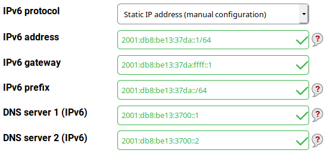
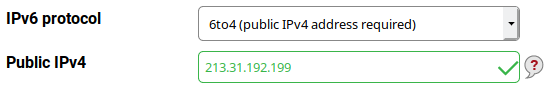
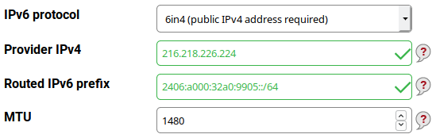
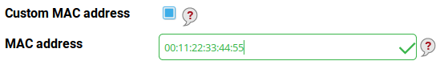

WAN settings in Foris 
=====================

Here you specify your WAN port settings. Usually, you can leave this options untouched unless instructed otherwise by
your [internet service provider](https://en.wikipedia.org/wiki/Internet_service_provider). Also, in case there is
a cable or DSL modem connecting your router to the network, it is usually not necessary to change this setting.

In some case you need to use specific settings. Read bellow how to set up WAN networking properly.

IPv4 settings
-------------

Three modes are supported for [IPv4](https://en.wikipedia.org/wiki/IPv4) (can be chosen in the **IPv4 protocol**
drop-down list):

* [DHCP](https://en.wikipedia.org/wiki/Dynamic_Host_Configuration_Protocol) (automatic configuration)
* Static IP address (manual configuration)
* [PPPoE](https://en.wikipedia.org/wiki/Point-to-Point_Protocol_over_Ethernet) (for DSL bridges, modems etc.)

### DHCP configuration

This mode is the default and should be used unless your ISP instructs you to do anything else. The IP address (including
the network mask), the default gateway and the [DNS](https://en.wikipedia.org/wiki/Domain_Name_System) servers are
acquired via DHCP.

In some cases may be required to use a specific hostname. If your ISP provides you such name (or instructs you how
to select it) write it into the **DHCP hostname** field.

### Static IP address

After switching to this mode, several text fields are displayed. Write in the values you have acquired from your ISP.

* **IP address** (mandatory) - it's something like 192.168.5.122.
* **Network mask** (mandatory) - something like 255.255.255.0.
* **Gateway** (mandatory) - something like 192.168.5.1.
* **DNS server 1 (IPv4)** (optional) - may be left empty because there is a built-in DNS resolver capable to
  work without it. But some ISPs require customers to use specific DNS servers. If your ISP provided you
  such DNS server adress(es) write it in here (for more addresses, use the first one).
* **DNS server 2 (IPv4)** (optional) - if your ISP provided you more than one DNS server address write in the
  second one.

	  
### PPPoE configuration

In this mode, your IPv4 settings are obtained automatically. Your ISP should provide you your authentication
data (username and password) which you write into the fields (**PAP/CHAP username**, **PAP/CHAP password**
respectively).

IPv6 settings
-------------

Five modes are supported for [IPv6](https://en.wikipedia.org/wiki/IPv6) (can be chosen in the **IPv6 protocol**
drop-down list):

* Disable IPv6
* [DHCPv6](https://en.wikipedia.org/wiki/DHCPv6) (automatic configuration)
* Static IP address (manual configuration)
* [6to4](https://en.wikipedia.org/wiki/6to4) (public IPv4 address required)
* [6in4](https://en.wikipedia.org/wiki/6in4) (public IPv4 address required)

### Disable IPv6

This mode disables IPv6 at all. Choose it if you don't want to use IPv6 networking.

### DHCPv6 configuration

This mode is the default and should be used if your ISP provides native IPv6 networking. In some cases may be
required to use a specific DUID. If your ISP provides you this value (or instructs you how to select it) write it
into the **Custom DUID** field.

### Static IP address

This mode of native IPv6 is similar to its equivalent in the IPv4 world.  Write in the values you have acquired from
your ISP.

* **IPv6 address** (mandatory) - it's something like 2001:db8:be13:37da::1/64 (this address includes the prefix
  length).
* **IPv6 gateway** (mandatory) - something like 2001:db8:be13:37da:ffff::1.
* **IPv6 prefix** (mandatory) - something like 2001:db8:be13:37da::/64.
* **DNS server 1 (IPv6)** (optional) - see above (but an IPv6 address is used here).
* **DNS server 2 (IPv6)** (optional) - see above.

	
### 6to4 configuration

6to4 is a transition mechanism for migrating from IPv4 to IPv6. It allows IPv6 packets to be transmitted over an IPv4
network without the need to configure explicit tunnels. IPv6 packets are encapsulated into IPv4 packets for
transmission over the IPv4 network. 6to4 assigns a block of IPv6 addresses to each IPv4 address.

6to4 can be used only if you have a public IPv4 address. If you use this address directly on your Turris it can be
autodetected and no specific settings are needed. But if you use a private address mapped to a public address you
may have to set it manually into the **Public IPv4** field.

*Use 6to4 only if you can't use native IPv6 networking (DHCPv6 or static settings) because it has a couple
of drawbacks.*

### 6in4 configuration

6in4 is another transition mechanism, similar to 6to4 but using a different mechanism. It encapsulates IPv6 packets
on specially configured IPv4 links. 6in4 doesn't require a static public IPv4 address on your side but you need to have
a tunnel broker which provides you the values to write into the text fields.

* **Provider IPv4** - the tunnel broker's IPv4 address to be used as the endpoint.
* **Routed IPv6 prefix** - the IPv6 prefix to be routed to your network.
* **MTU** - the maximum transmission unit; often may be left the default value (1480)
* **Dynamic IPv4 handling** - check in if you have a dynamic public IPv4 address (this information should be
  obtained from your ISP) or if your tunnel broker requires to use your credentials (see bellow) instead of
  your static IPv4 address.
* **Tunnel ID** - obtain it from your tunnel broker
* **Username** - obtain it from your tunnel broker
* **Key** - obtain it from your tunnel broker

	  
*Use 6in4 only if you can't use native IPv6 networking (DHCPv6 or static settings) because it has a couple
of drawbacks. 6in4 is more reliable than 6to4 and easier to troubleshoot but requires a contract (often free of
charge) with a tunnel broker.*

Custom MAC address
------------------

Some ISP require to use specific [MAC addresses](https://en.wikipedia.org/wiki/MAC_address). You can check the
**Custom MAC address** checkbox and write the given MAC address into the **MAC address** field. Use hexadecimal
format of numbers separated by colons (e.g. 00:11:22:33:44:55).

Connection test
---------------

After you have set the WAN settings you can test the connectivity. Remember to press the **Save** button before
you start the test. Note that sometimes it takes a while before the connection is fully initialized. So it might be
useful to wait for a while before running this test.

What particular results mean:

* **IPv4 connectivity** - your router has a working IPv4 address and can access machines inside the current network.
* **IPv4 gateway connectivity**	- your router has a working gateway IPv4 address and can access IPv4 machines on the
  Internet.
* **IPv6 connectivity** - your router has a working IPv6 address and can access machines inside the current network.
* **IPv6 gateway connectivity**	- your router has a working gateway IPv6 address and can access IPv6 machines on the
  Internet.

This test does *NOT* include DNS checking. It can be tested on the DNS page. 
