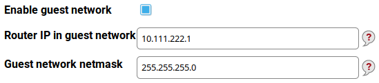
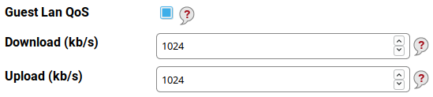
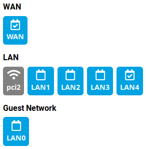

Guest network
=============

There are some situations when you want to allow Internet access to some other people (your guests, visitors,
customers, vendors...). But herewith you don't want to give them access to your local network. Turris offers
a solution for such situations: the *guest network*.

It is a separate network which allows to access the Internet but doesn't allow to access computers in your LAN.
The administration interface is inaccessible from the guest network too. This network is typically used for
the guest Wi-Fi but you can also dedicate one or more Ethernet ports to it.

Guest network in Foris
----------------------

The guest network is disabled by default. You can enable it by checking **Enable guest network**.

This network has its own IP address range which can be set here. The default values should be sufficient in almost all
cases. You may set your own IP address and netmask but remember the address range must be different to other
networks configured on your router.

### DHCP server

Unless you want to use static addresses in the whole guest network (it's probably very rare) you need to have
the DHCP server enabled. This is the default option. The DHCP server has three parametres:

* **DHCP start** - the first address inside the address space which may be leased (assigned) via DHCP. For example,
     if it is 100 and your network is 10.111.222.0 your DHCP leases addresses beginning 10.111.222.100. The default
      value 100 usually need not to be changed.
* **DHCP max leases** - the maximum addresses to be leased to computers. It effectively means if you have this
      value set to 150 (the default) and the first leased address is 10.111.222.100, the last one is 10.111.222.249.
* **Lease time (hours)** - this is how long an address is leased to a computer (the default is 1 hour and
      is suitable for most cases). If this value is too high and the computers in the LAN "rotate" very often
      (e.g. in an Internet café) the address space may be exhausted and new device will not get their addresses.
      Too low values may lead to frequent address changes and some networking problems.

### Quality of service

Especially if you have a slower Internet connection, you can want to shape (or limit) each of the connected
computers in its network speed. Simply check the **Guest Lan QoS** checkbox to enable it.

You can limit download and upload speeds separately. Both values are set to 1000 kilobits per second by default.
For example, if you have a connection with 20/2 Mbps (download/upload) you can set 5000 kbps for download and
500 kbps for upload.

### Guest Wi-Fi

Enabling the guest network is only a half of the task. You need to set up the guest Wi-Fi too. Click to the
**guest Wi-Fi** link at the **Guest network** page or go to the **Wi-Fi** page. If no devices are in the guest
network you can see a warning banner.

*Before configuring the guest Wi-Fi you need to configure the Wi-Fi itself.*

The guest Wi-Fi is disabled by default although the guest network itself is maybe enabled. Fill a separate SSID
into the **SSID for guests** field and a password into **Password for guests** (its minimum length is 8 characters).
These values you will tell to your guest, customers etc. You can enable and configure one guest Wi-Fi per one
standard Wi-Fi.

### Guest LAN ports

All LAN Ethernet ports are by default bridged for use in the standard LAN (Turris acts as a network switch).
But it is possible to use one or more ports for the guest network. Open the **Network interfaces** page, click to
the interface you want to move (e.g. **LAN0**) and then click to the **Guest network** button.

Don't forget to save the new interface layout. The given interface is now a part of the guest network and your guest
will have access to the Internet but not to your LAN.

