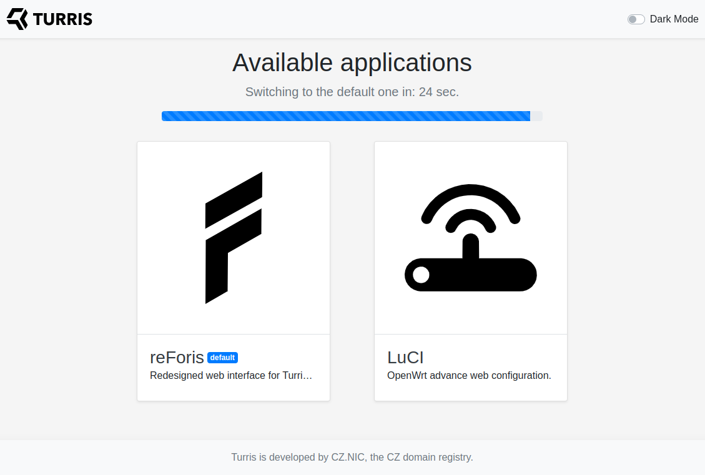

# Web interface landing page

If you open the URL of your router ([http://192.168.1.1/](http://192.168.1.1/)
by default) in a web browser it displays the landing page. It contains multiple
large buttons ("tiles") representing application which you can access.

!!! important
    The landing page doesn't appear before the router is configured. The
    configuration guide is started instead.

You can click to one of the buttons to open the given application or to wait
until the time limit expires and the default application is opened
automatically.

!!! info
    In Turris OS 5.2, the default application is reForis.

There are currently three applications always present:

* Foris – the legacy simple configuration interface
* [ReForis](reforis/intro.md) – the redesigned simple configuration interface
* [LuCI](luci/luci.md) – the OpenWrt advanced configuration interface

In dependence on installed packages, other applications can be available too
(such as [Nextcloud](../geek/nextcloud/nextcloud.md) or
[Netdata](../geek/netdata/netdata.md)).

!!! tip
    If you prefer dark theme of the web interface over the default light one
    you can enable it using the _Dark Mode_ switch in the top-right corner.
