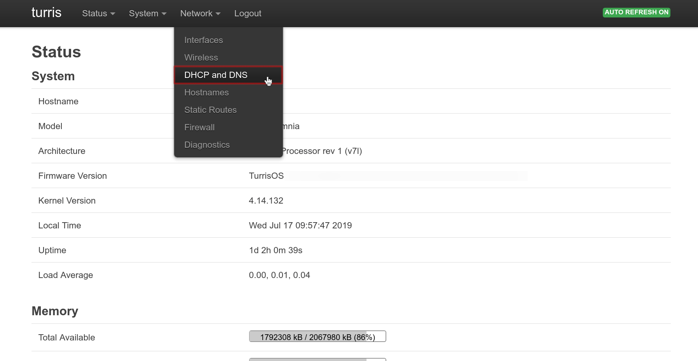
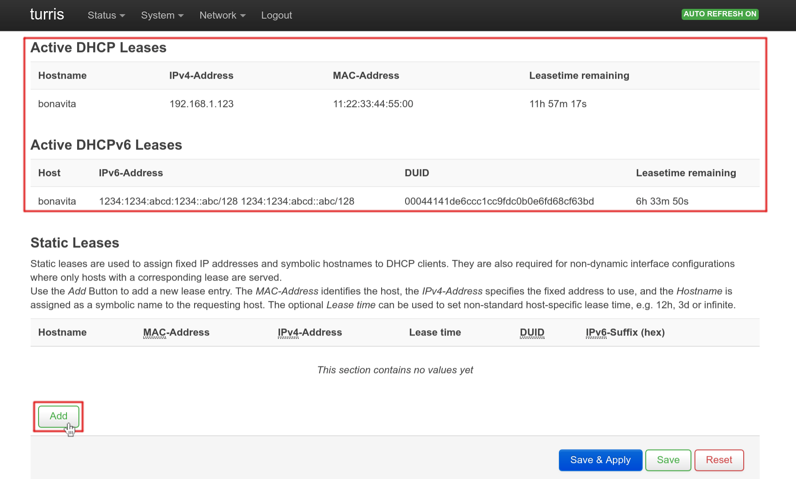
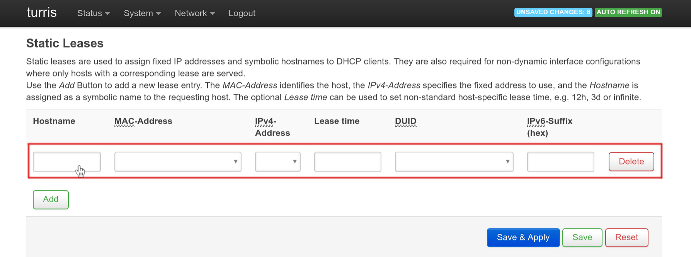

# Static IP addresses assignment

Static DHCP server addresses assignment is useful when it's required that devices, connected to your network, will get
permanent IP address.

Log in to [LuCI](../luci.md), then choose _DHCP and DNS_ in top navigation menu.

You can see the list of the currently connected devices, which had assigned IP addresses from DHCP server, on the bottom
of the page. Then click the _Add_ button under that list.

Fill the new row with:

 * _Hostname_ – any name you want to identify the device.
 * _MAC-Address_ – Hardware identification number. It can be select from the list of list MAC addresses of connected
devices or filled manually by selecting the *\-\-custom\-\-* option.
 * _IPv4-Address_ – An IP address to be permanently assigned to a device identified by MAC address. It can be select
from the list of last used IP addresses or filled manually by selecting the *\-\-custom\-\-* option.

You can add more devices by clicking _Add_ button. If you are done, please don't forget to press _Save & Apply_ button.

!!! warning
    IP address changes will not take effect immediately. If the computer has an IP address, it waits until it expires
    and then asks for a new one. If you need the address change to take effect immediately, and you can't do it on your
    device operating system, then disconnect the device from the network and reconnect it again.
