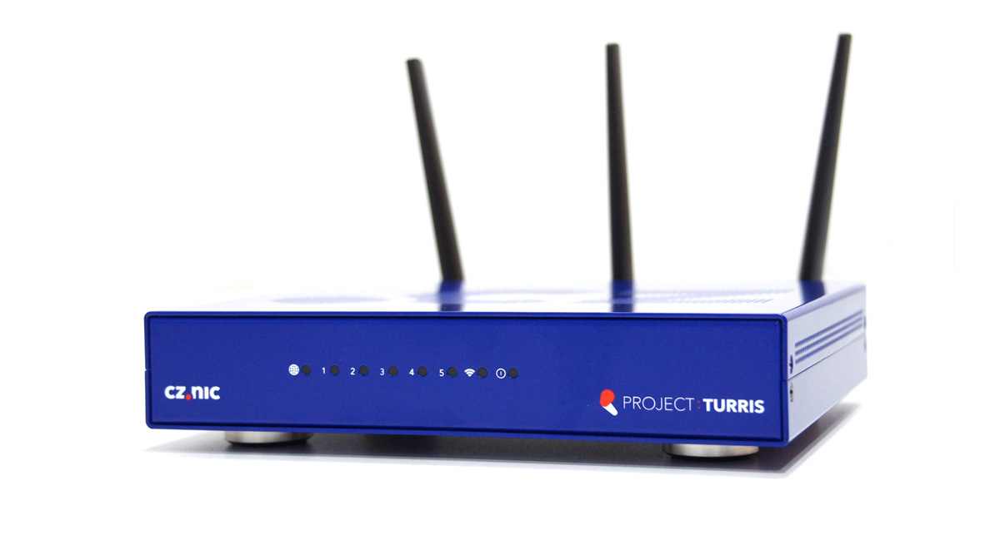
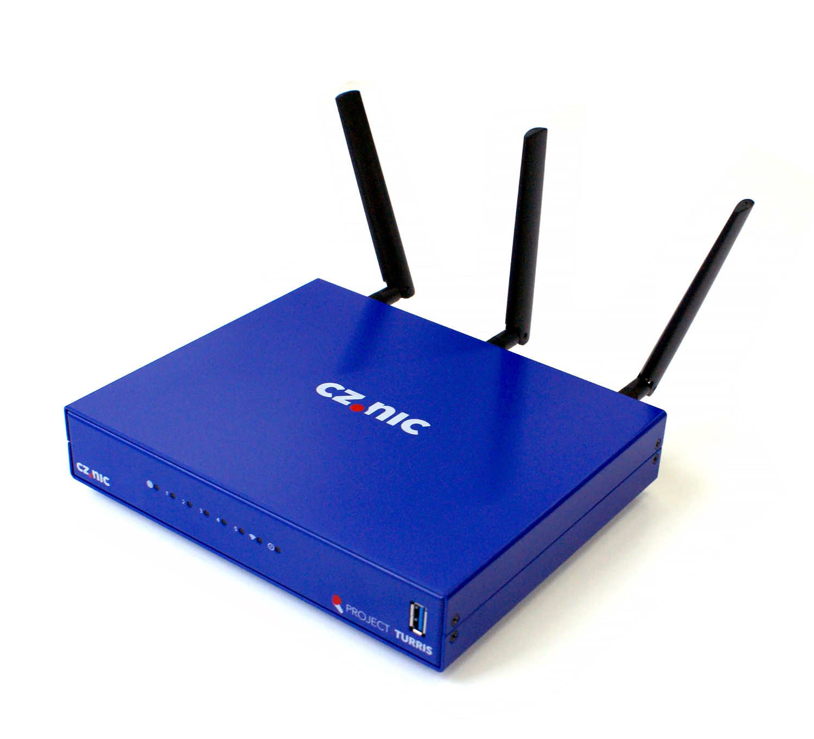
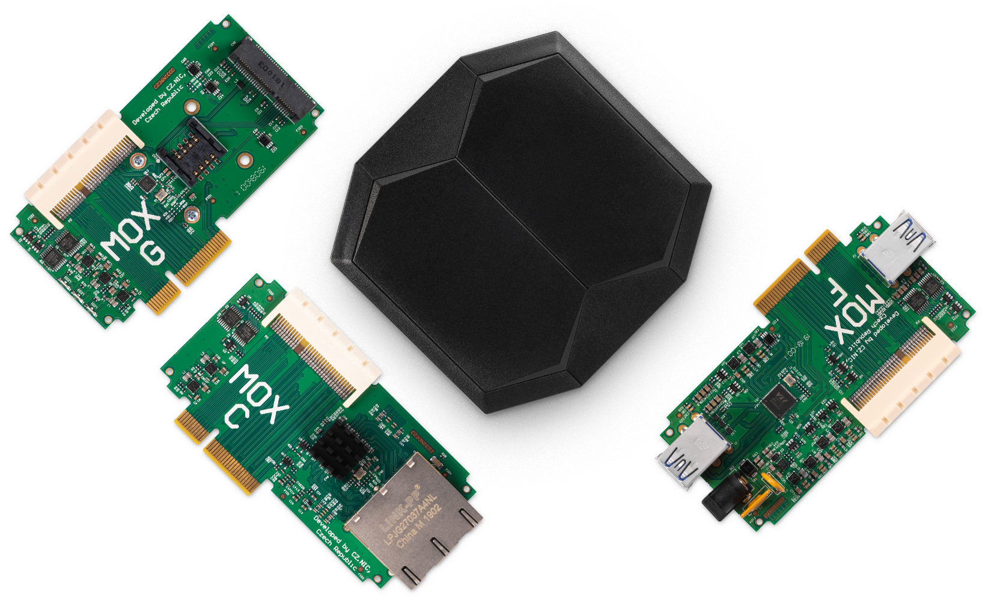

# Turris routers

There are several Turris routers. This page lists them in order as they were
produced.

## Turris 1.X

### Turris 1.0
First-ever produced Turris router, part of the original security research,
given away in the Czech Republic for a symbolic price of 1 CZK.
Started with dual-core processor Freescale P2020, 1.2 GHz with 2 GB DDR3 RAM.
Specific details can be found on the [separate page](../hw/turris-1x/turris-1x.md).

### Turris 1.1
Next revision of the same router featured one USB 3.0 port on the front panel
and two internally. There is also SIM card slot on the board and a stronger
power supply (12 V).

It was still part of the same program research project. More details are
available to read [here](../hw/turris-1x/turris-1x.md).

## Turris Omnia

The first commercial Turris router. Originally crowdfunded on
[Indiegogo](https://www.indiegogo.com/projects/turris-omnia-hi-performance-open-source-router#/)
with different case colors. Raised more than $1.2M and shortly after the
campain entered retail sales.

It uses dual-core ARMv7 CPU Marvell Armada 385 at 1.6 GHz with 2 GB RAM.
You can see more details on the [separate page](../hw/omnia/omnia.md).

## Turris MOX

Following the success of Turris Omnia, Turris MOX was also offered on
[Indiegogo](https://www.indiegogo.com/projects/turris-mox-modular-open-source-router#/)
featuring unprecedented modularity.

It uses dual-core ARMv8 CPU Marvell Armada 3720 with 512 MB/1 GB RAM.  You can
read more about Turris MOX on the [separate page](../hw/mox/intro.md).

