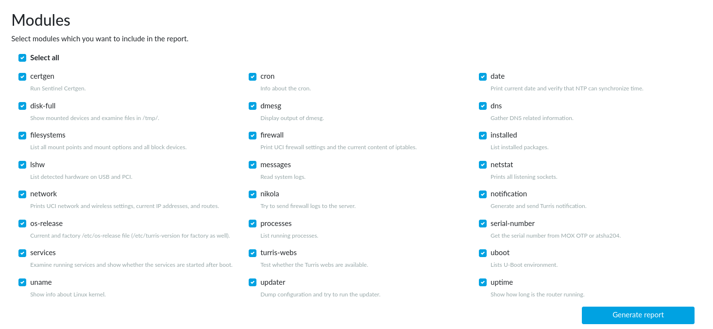

# Diagnostics

The _Administration → Diagnostics_ reForis page is intended to get the system
logs and many other important diagnostics objects that can help us to
investigate and resolve your problems.

!!! important
    If you come across any error and it is possible not to reboot the router,
    please **don’t reboot it** before collecting the logs. All logs are saved in
    the router memory, and they will be erased if you reboot.

If you just rebooted the router, let it gather some data first. Logs from
a freshly rebooted router, which have been downloaded before the occurrence
of the error, usually don’t help us to identify the cause of the error.

## How to get information

Various modules can be included in the generated diagnostics report.
The modules, which are usually the most interesting, are `disk-full`,
`messages`, `dns`, `installed`, and `network`. If the nature of the problem
suggests that other modules could also be useful, you can check them.

Then press the _Generate report_ button. The process may take some time.
When done, you can press _Download_ to download the report. Multiple reports
may be available, but they don’t persist over reboots.

### If you can’t find the diagnostics

In that case, your router is, for some reason, stuck in some old version
of the Turris OS. That is the first problem to solve: make sure you have
updates enabled and your internet connection is working.

!!! tip
    For more information about getting support from us, please visit
    the [Troubleshooting → Support](../../support.md) documentation page.
