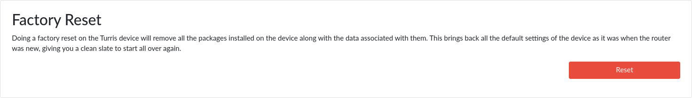
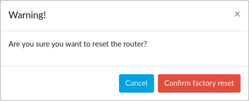

# Factory reset in reForis

If you encounter severe problems with your router, it is possible to restore
its factory state. It can be done via hardware operations
([MOX and Shield](../../../hw/mox/rescue-modes.md),
[Omnia](../../../hw/omnia/rescue-modes.md),
[Turris 1.x](../../../hw/turris-1x/factory-reset.md)) or in reForis.

!!! info
    This way of reset is more comfortable than the hardware one. You can simply
    log into reForis and press the button. But it can't be used if your router
    is inaccessible via reForis (e.g. in case of wrong firewall rules).

!!! notice
    Factory reset via reForis is available in Turris OS 5.2 and newer versions.

## Performing a factory reset

1. Navigate to the reForis web interface.
2. Open the _Administration -> Maintenance_ page.
3. Press the _Reset_ button and confirm the action in the dialog which
   appears then.

Remember that this process will reset the LAN settings. If your computer uses
another IP address than 192.168.1.x you will need to change it in order to
connect to your router. Wi-Fi will not work at all until re-configuration
thus connect your computer via an Ethernet cable.
