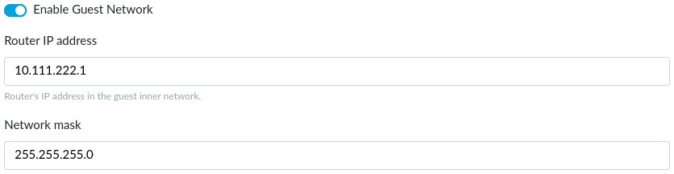
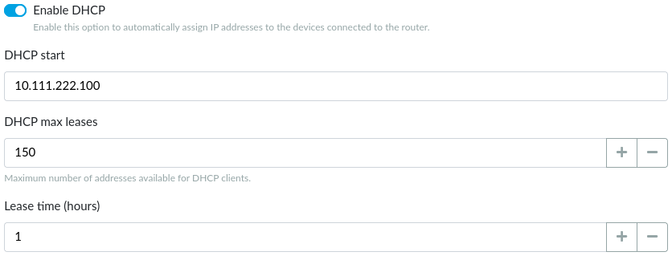

# Guest network

There are some situations when you want to allow Internet access to some
other people (your guests, visitors, customers, vendors...). But herewith
you don't want to give them access to your local network. Turris offers
a solution for such situations: the **guest network**.

It is a separate network which allows to access the Internet but doesn't
allow to access computers in your LAN. The administration interface is
inaccessible from the guest network too. This network is typically used for
the guest Wi-Fi but you can also dedicate one or more Ethernet ports to it.

## Guest network in reForis

The guest network is enabled by default. You can disable it by switching off
the _Enable guest network_ switch.

This network has its own IP address range which can be set here. The default
values should be sufficient in almost all cases. You may set your own IP
address and netmask but remember the address range must be different to other
networks configured on your router.

### DHCP server

Unless you want to use static addresses in the whole guest network (it's
probably very rare) you need to have the DHCP server enabled. This is
the default option. The DHCP server has three parametres:

* _DHCP start_ – the first address inside the address space which may be
  leased (assigned) via DHCP. For example, if it is 100 and your network
  is 10.111.222.0 your DHCP leases addresses beginning 10.111.222.100.
  The default value 100 usually need not to be changed.
* _DHCP max leases_ – the maximum addresses to be leased to computers.
  It effectively means if you have this value set to 150 (the default)
  and the first leased address is 10.111.222.100, the last one is
  10.111.222.249.
* _Lease time (hours)_ – this is how long an address is leased to a computer
  (the default is 1 hour and is suitable for most cases). If this value is
  too high and the computers in the LAN "rotate" very often (e.g. in
  an Internet café) the address space may be exhausted and new device will
  not get their addresses. Too low values may lead to frequent address
  changes and some networking problems.

### Quality of service

Especially if you have a slower Internet connection, you can want to shape
(or limit) each of the connected computers in its network speed. Simply switch
the _Enable QoS_ switch on to enable it.

You can limit download and upload speeds separately. Both values are set to
1000 kilobits per second by default. For example, if you have a connection
with 20/2 Mbps (download/upload) you can set 5000 kbps for download and
500 kbps for upload.

### Guest Wi-Fi

Enabling and configuring the guest network is only a half of the task. You
need to set up the guest Wi-Fi too if you want to use it. Read the
_[Wi-Fi](../wifi/reforis-wifi.md)_ tab documentation for more information.

### Guest Ethernet

All LAN Ethernet ports are by default bridged for use in the standard LAN
(Turris acts as a network switch). But it is possible to use one or more ports
for the guest network. Go to the _Interfaces_ tab and configure it there.
Read the _[Interfaces](../interfaces/interfaces.md)_ for more
information.

### DHCP Client List

This list contains all guest network clients which have requested and leased
their IP addresses via DHCP. See the _[LAN](../lan/reforis-lan.md)_
documentation page for more information.
