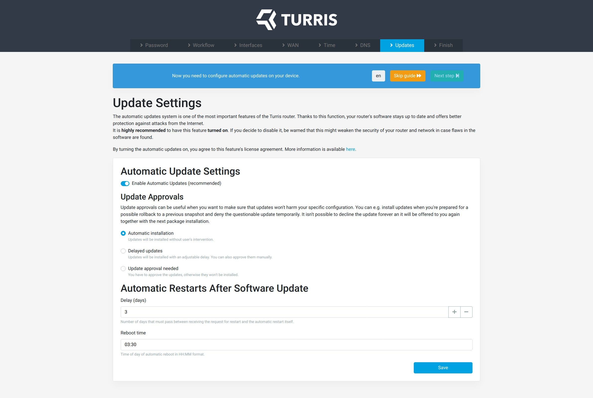

# reForis first steps

You have your new Turris device and have started it for the first time.
Assuming Turris is the gateway to WAN, the default address is `192.168.1.1`.
Open your favorite web browser and type the address `192.168.1.1` into the
search/address field.

!!! tip
    If you cannot see reForis GUI or anything like it on the `192.168.1.1`
    address, look up network settings in your _system_ and focus on the
    `Default gateway` in your wired connection.

## Setting the password

The first step of the guide leads you to set up your router's administrative
password.

It is essential to have your router protected by a password before we connect
you to the outside network. Your Turris router needs you to set up at least
one, even though there are two types of passwords.

## Turris password types

|                          |reForis password       |Advanced Admin password |
|--------------------------|:---------------------:|:----------------------:|
|  reForis (web GUI)       | :material-check-bold: |                        |
|  LuCI (advanced web GUI) |                       |:material-check-bold:   |
|  `root` access (ssh)     |                       |:material-check-bold:   |

!!! tip
    It is considered convenient to have passwords for each GUI separate. You
    are, however, given the option to tick
    __Use the same passwordfor advanced administration__
    and set up only one _secret passphrase_ to any administrative means.

## Guide's workflow selection

The __Workflow__ setting is necessary to pick precisely at this point. After
the password is set up and before all interfaces are adequately set up. You are
recommended to choose Router workflow, although there are three choices.

!!! warning
    Only pick something besides the `Router` option if you know what you are
    doing. The other options are for advanced users.

## Interfaces

The Interfaces pane is where the layout can differ for each hardware
combination. For example, q__Turris Omnia__ will have a different number and
configuration of interfaces than __MOX Start__.

!!! tip
    This screen is a bootstrap overview to check if everything is in order.
    You can always set the interfaces later if you wish.

### Interface group types

| Group                 | Abbreviation       | Description                                                                                     |
|:----------------------|:-------------------|:------------------------------------------------------------------------------------------------|
| WAN                   | Wide Area Network  | typically is the only interface connecting you to the outside world                             |
| LAN                   | Local Area Network | internal (home/office) network has no restrictions regarding connecting to other devices        |
| Guest Network         |                    | internal network that is separate from LAN                                                      |
| Unassigned Interfaces |                    | orphaned interfaces that Turris could not assign to any above groups                            |

## WAN

!!! warning
    Always be sure to check the initial connection instructions with your ISP.

In most cases, with the default settings (automatic DHCP), you will do just
fine for __IPv4__ and __IPv6__. For some corner cases, which your ISP should
determine, you must follow whichever requirement they have. Before you save the
setting, the Connection Test won’t work in this step.

## Region and Time

You can override the default **via the NTP** option, but the default settings
are also acceptable. Turris device determines the region from the network,
and a query to the NTP server will automatically set your router system time.

## DNS

You can configure DNS to use your custom forwarder. In most cases, the default
setting is sufficient enough.

## Update Settings

Regular updates are an essential Turris feature. It is crucial to have all
released updates delivered at the right time. If you keep settings as they
are, nothing happens. The **Delayed updates** option lets you decide whether
to relieve our server from the overload each update is triggered.

!!! tip
    This will no longer be a concern as there is a feature in progress to
    control the delay in updates based on an algorithm.

### Update approval

In case you really like to have control when the router is updated, which you
should, this option is for you.

!!! tip
    In case you set the updates with the `Update approval` option, be sure to
    check the router regularly or set the `notifications`.
    This should help you track whether Turris device requires an update.

## Conclusion

Congratulations, you have your router set up. Now that you are done consider
reviewing packages and installing what you need.

If you have a Shield device, use this
[guide](../../first-setup/shield-first-setup.md) instead.
