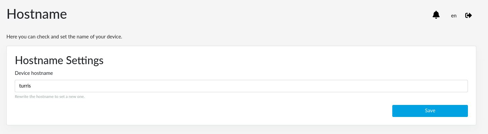

# Device hostname in reForis

There is an option to set the device hostname in reForis. It helps to easily
identify each device in the network.

The default hostname of Turris routers is `turris`.

## Changing a hostname

1. Navigate to the reForis web interface.
2. Go to the _Administration_ → _Hostname_ page.
3. Here you can see the current hostname or set a new one.

