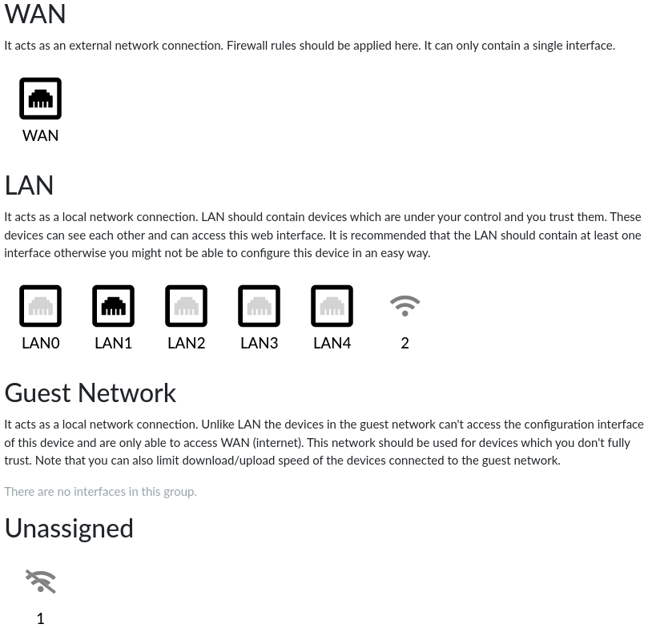
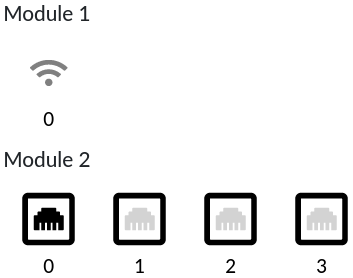
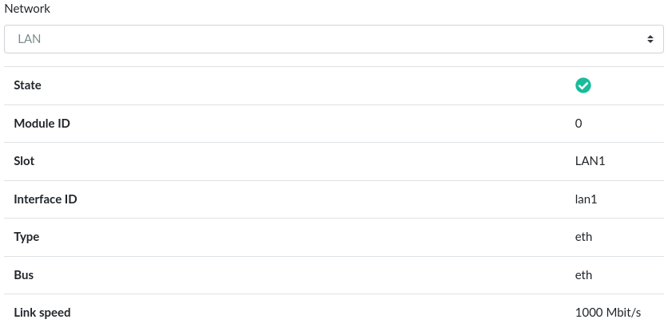

# Network Interfaces

Network interfaces can be assigned to several groups (basically networks
but one of these groups contains unassigned interfaces).

There are four groups:

* _WAN_ – It acts as an external network connection. It can contain at most
  one interface. The interface in this group cannot access reForis nor
  any other services of the device by default.
* _LAN_ – It acts as a local network connection. LAN should contain devices
  which are under your control and you trust them. Interfaces in this group
  can access reForis and other services by default.
* _Guest Network_ – It acts as a local network connection. Interfaces in this
  group can only access the Internet. See
  _[Guest Network](../guest-network/guest-network.md)_ for more information.
* _Unassigned_ – This group contains interfaces not assigned to any other
  group. These interfaces are not used at all.

Each wired interface is a member of exactly one group. Wireless interfaces
may be in two groups at the same time (in the LAN and the guest network
if guest Wi-Fi is enabled on such interface).

Turris MOX can have multiple modules with network interfaces. If interfaces
pertaining to more than one module are assigned to a group they are
sorted by modules as displayed at the following picture:

## Interface information and assignment

Click to an interface. Information about the given interface will be displayed
and you will have possibility to move the interface to another group. There are
the following rows:

* _Network_ – The group which the interface is assigned to. Choose a group
  from the drop-down list and then press _Save_ to change the assignment.
* _State_ – It displays whether the interface is up.
* _Module ID_ – The module where the interface is connected to (in MOX;
  Omnia and Turris 1.x have only one module).
* _Slot_ – The physical slot where the interface is connected to (e.g. 1 or
  LAN2).
* _Interface ID_ – The system identifier of the interface (e.g. eth0 or wlan0).
* _Type_ – The interface type (e.g. eth or wifi).
* _Bus_ – The system bus which is the interface connected to (e.g. eth or pci).
* _Link speed_ – The interface link speed; it is displayed only for connected
  wired interfaces (disconnected and wireless interfaces have N/A here).

!!! important
    Wi-Fi interfaces cannot be assigned using this tab. Please use the _Wi-Fi
    tab_ to configure these interfaces.
