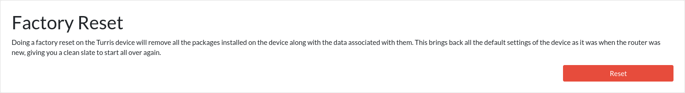
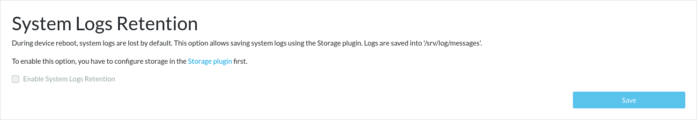

# System maintenance

In case of problems, you can do some maintenance tasks in reForis: reboot
your router, reset it to the factory default state, or enable log retention.

## Reboot

If you encounter some problems with your device, you can try to reboot it.
After installation or updating some packages, it's necessary to reboot the
router too (in this case, you are notified; after the defined number of days,
the device is rebooted automatically).

To reboot your router, go to the _Administration → Maintenance_ page and press
the _Reboot_ button. The reboot process takes about 30 seconds, and you will be
required to log in again.

## Factory reset

The factory reset is the last chance how to "repair" your device if something
in the software goes wrong. In most cases, it's better to roll back to
one of the [available snapshots](../snapshots/snapshots.md). But if it isn't
enough, you can restore the factory state.

This reset will remove any changes made to the devices, including all created
or modified files and settings. After finishing this process, you will start
with the [initial guide](../guide/index.md).

!!! notice
    Factory reset will not wipe any existing snapshots and it will actually
    create a snapshot with the state of the router just before the Factory
    reset. Therefore, once finishing the initial setup, you have an option to
    revert back to the previous state.

!!! important
    If your router is very old, it may be unable to upgrade from the factory
    Turris OS version to the current version. More advanced methods will be
    required in such cases.

To perform the factory reset, press the _Reset_ button in the _Factory Reset_
part of the _Administration → Maintenance_ page.

## Log retention

By default, system logs are not retained over reboots. This is because they
are stored in a RAM disk that is cleared on each reboot. If you want to keep
your logs for investigation of problems, etc., you need to enable their
retention.

To enable this feature, you need to configure the [Storage plugin](../storage-plugin/storage-plugin.md)
first (and save the logs to an external storage).

!!! info
    Logs can't be stored in the system storage because it means excessive
    writes and would lead to significant shortening of the lifetime of the
    internal storage.

If your external storage is ready, you should be able to check the _Enable
System Logs Retention_ checkbox. When done, press the _Save_ button.

