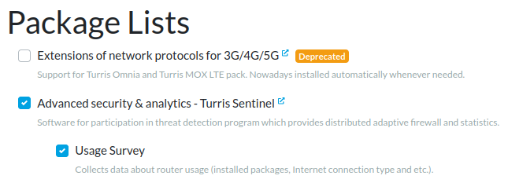
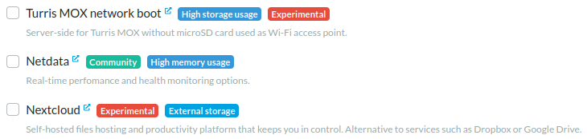
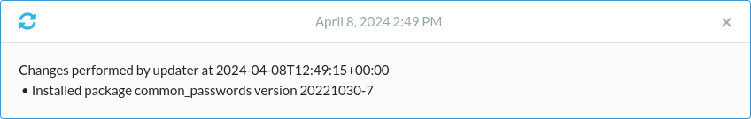

# Software packages

## Briefly about packages

Applications for Turris OS are provided as packages. A package may contain
executable files, libraries, configuration, and other files the application
uses. Each Turris device from the factory has a preinstalled set of such
packages. You can then install (and uninstall) additional packages
that fit your needs.

Packages are grouped into lists. These lists are organized in the list tree.
For example, there is a group for Sentinel containing a group for
specific Sentinel components like Minipots or Dynamic Firewall. If you install
a group with child groups, only the packages from the parent group are
installed unless you choose to install the child packages, too.

## Package lists in reForis

The package lists are displayed in reForis as a tree with checkboxes for
specific lists. If a parent list is unchecked, all child groups have checkboxes
disabled. A checked checkbox means that the given package list should be
installed (and vice versa).

The lists are available on the _Package Management → Packages_ page.

### List labels

Each list may, in addition to its name and description, bear one or more
labels that indicate important properties of the list. These labels include:

  - **Deprecated** – this list contains software that will be no longer
    supported and may be removed in future versions of TOS.
  - **Community** – these packages are maintained by the community, not
    the Turris team.
  - **Advanced users** – this software is intended only for advanced
    users and requires advanced skills.
  - **Experimental** – this software is experimental and may contain serious
    bugs that may break any device function.
  - **External storage** – this software requires external storage (SSD or
    HDD connected via USB or mSATA) because it saves large quantities of
    data (which is too big for internal storage and may lead to fast
    wear of eMMC).
  - **High memory usage** – this software requires large volumes of RAM;
    do not combine multiple lists marked by this label. These might not
    work correctly on devices with 512 or 1024MB RAM.
  - **High storage usage** – it is similar to External storage, but
    the software requires a large volume for its data. The use of storage
    devices with at least hundreds of GBs is recommended.
  - **Network load** – this software generates high network transmissions.
    It is discouraged to use it with slow and/or metered Internet
    connections.

### Installation and uninstallation

Installation and uninstallation of packages are managed by
selecting appropriate packages lists. If a previously unchecked (thus not
installed) list has been checked now, its packages will be installed.
Conversely, if a previously checked (thus installed) list has been
unchecked, its packages will be uninstalled.

!!! note
    Packages in lists with unchanged check state will not be touched.

When ready to install/uninstall the selected packages, press the _Save_
button. After the process is finished, you will be notified at the
top-right corner of the page, and a message about installed packages
is displayed in _Overview_.

If you have set e-mail notifications, you should receive an e-mail
message, too.

!!! tip
    After installation, go to the _Overview_ page and reload it in
    the browser. It ensures that all control and configuration
    components in reForis will be loaded correctly.
