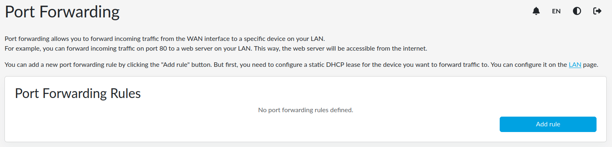
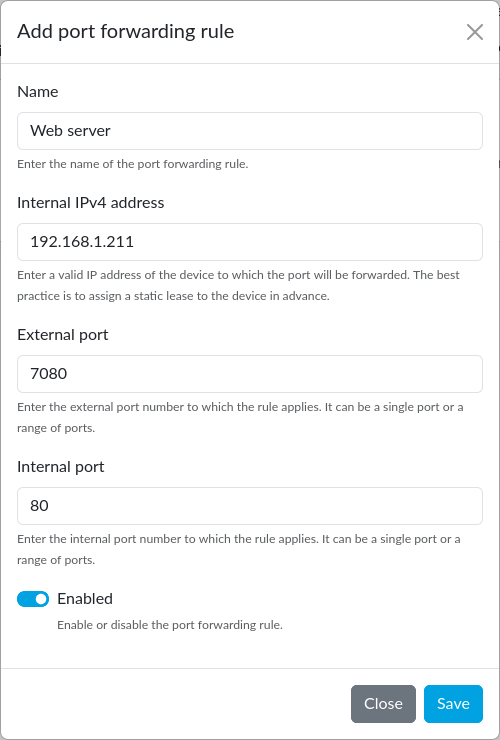
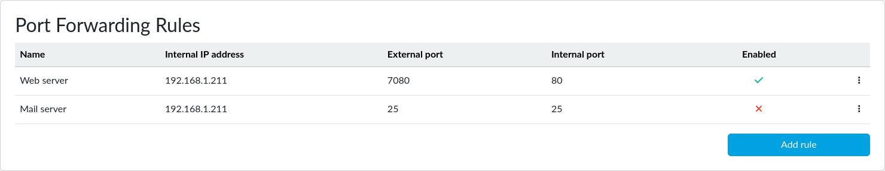
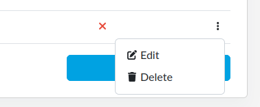

# Port forwarding in reForis

Port forwarding allows you to pass communication via external ports to ports
on devices inside your LAN. An external port (or a range of ports) exposed to
the WAN is linked to a port (or a range of ports) on a computer on another
device on the LAN.

For example, you can forward incoming traffic on port 80 to a web server
on your LAN. This way, the web server will be accessible from the internet.

!!! important
    Port forwarding is available only for IPv4, where the address space
    is very limited, and thus LAN addresses are allocated from reserved
    address spaces, not available on the global internet. IPv6 has
    enough addresses to cover in fact any number of devices in the LAN.

## Before you start to configure port forwarding

It requires a static DHCP lease for the destination device
to be configured. This is important because if the address changed,
the data would flow to a different device or no device at all.

!!! tip
    See the [LAN settings in reForis](../lan/reforis-lan.md#static-dhcp-leases)
    page for more information, how to configure static DHCP leases.

## Forwarding rules

By default, there are no port forwarding rules defined. You can add one
by pressing the _Add rule_ button.

A dialog will appear. Here you can specify the following parameters
(all of them are mandatory):

- _Name_: Any descriptive name for your information
- _Internal IPv4 address_: The address of the device where the port
  should be forwarded to
- _External port_: An external port (or a range of ports) on your
  Turris router
- _Internal port_: An internal port (or a range of ports) on your
  destination device

When done, press the _Save_ button. The rule is only applied if it is
enabled. Use the switch at the bottom of the dialog. If you leave it
disabled, the rule is only saved but has no effect until enabled.

After adding the rule, it is displayed in the list. You can add more rules,
and edit or delete the existing ones. Editing a rule is very similar to
adding a new one. Click on the vertical ellipsis on the right side of
the rule you want to edit or delete, then choose _Edit_ or _Delete_.

!!! warning
    If you choose _Delete_, the given rule is deleted immediately, without
    any confirmation question.
