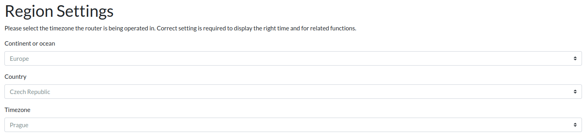
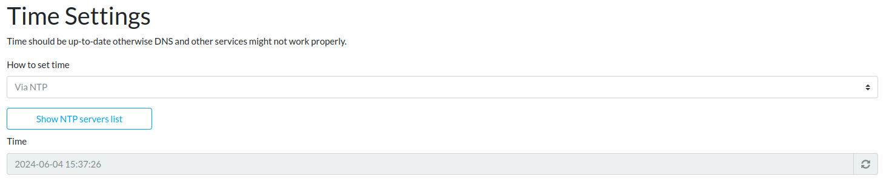

# Region and Time

It's necessary to set your region and time correctly. The region (i.e.,
continent/ocean and country) is used for time settings and Wi-Fi
regulations. The time is used for security purposes like the validation
of certificates.

!!! important
    Incorrect settings may result to security risks, system malfunction,
    and violation of legal Wi-Fi regulations (and thus potential penalties).

## Region settings

1. Go to the _Administration → Region & Time_ page in reForis.
2. Select your continent or ocean zone in the _Continent or ocean_ pull-down
   list.
3. Select your country in the _Country_ pull-down list.
4. Select your timezone in the _Timezone_ pull-down list (it's usually
   represented by the capital city of the given country or another important
   city).

!!! tip
    If you are unsure which timezone/city to choose, you can
    [check the maps](https://en.wikipedia.org/wiki/Time_zone).

## Time settings

There are two ways how to set the system time:

1. **Automatic via NTP**: This is the preferred method. Your time is
   continuously adjusted according to very precise time servers.
2. **Manual**: Use it only if the automatic way doesn't work. You will need to
   adjust the time occasionally through manual interventions.

The time servers for NTP adjustment are currently hard-coded. You can see
them via the _Show NTP servers list_, but there is no way to change
the predefined set.

If you want to set your time manually, change the value in _How to set time_
to _Manually_ and then set the time in the _Time_ field below.

When you are done with all settings in both parts, press the _Save_ button
to save your changes.
