# reForis Screenshots

!!! important
    Screenshots were taken from the development version of Turris OS 5.2.0.
    It includes slightly redesigned reForis, a new Overview tab, and more features.
    Users of Turris Shield can enjoy these features already.

## Router overview

## WiFi configuration

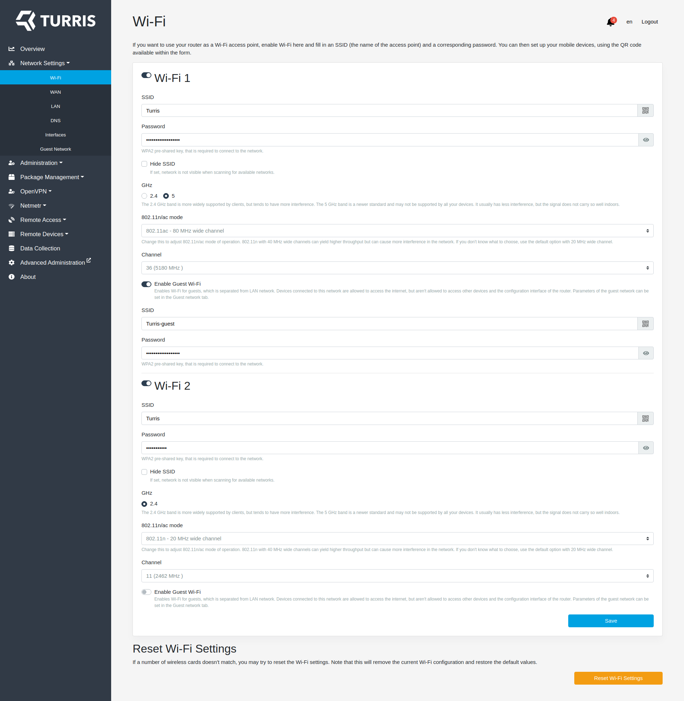

## WAN configuration

## LAN configuration

## DNS configuration

## Interface assignement

## Guest network configuration

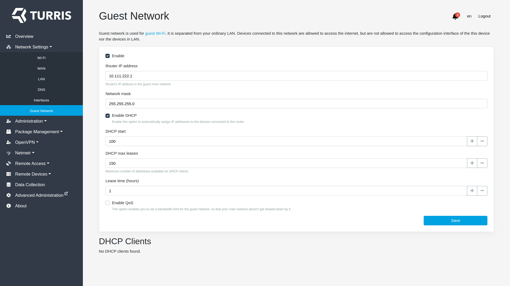

## Password management

## Region and time settings

## Notifications configuration

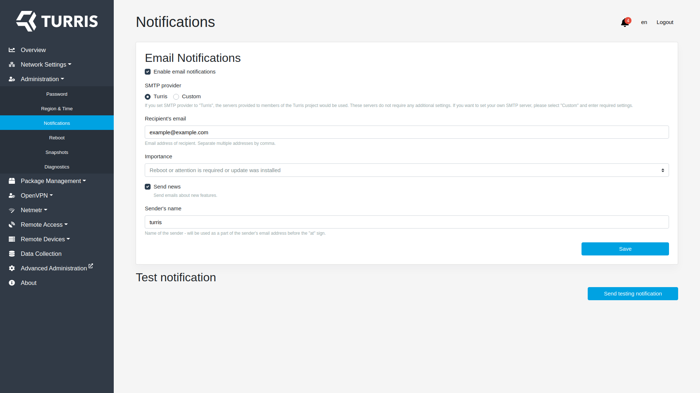

## Reboot button page

## Snapshots management

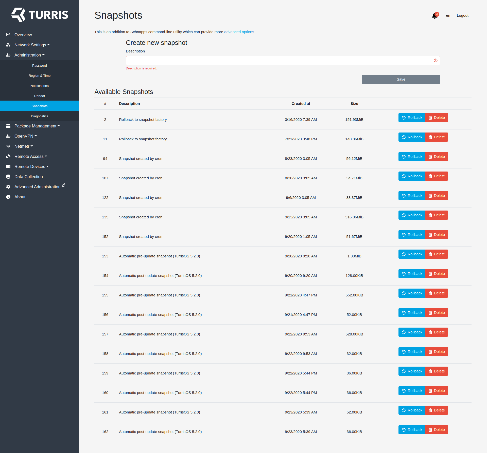

## Diagnostics generator

## Updates configuration

## Manual update trigger

## Packages selection

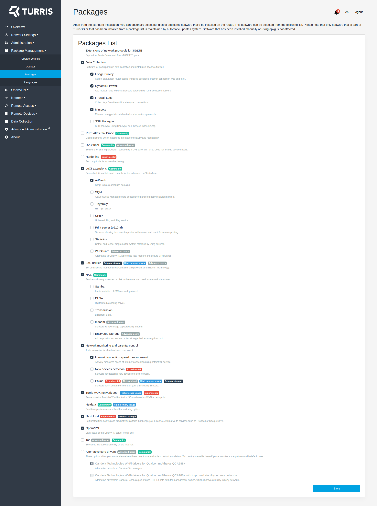

## Language selection

## Speed test results

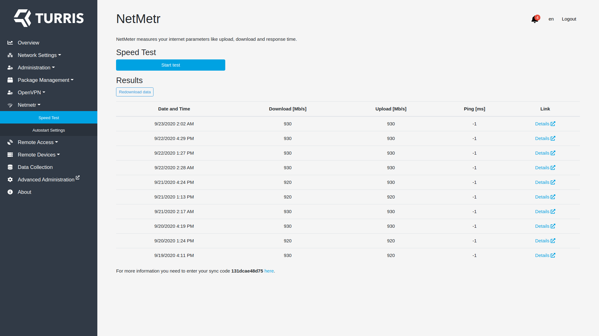

## Speed test configuration

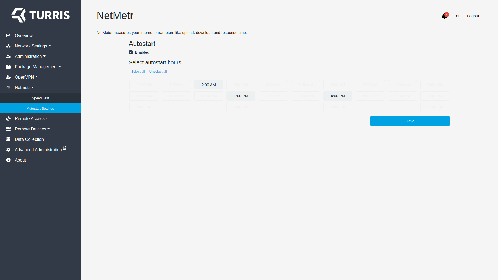

## VPN server configuration

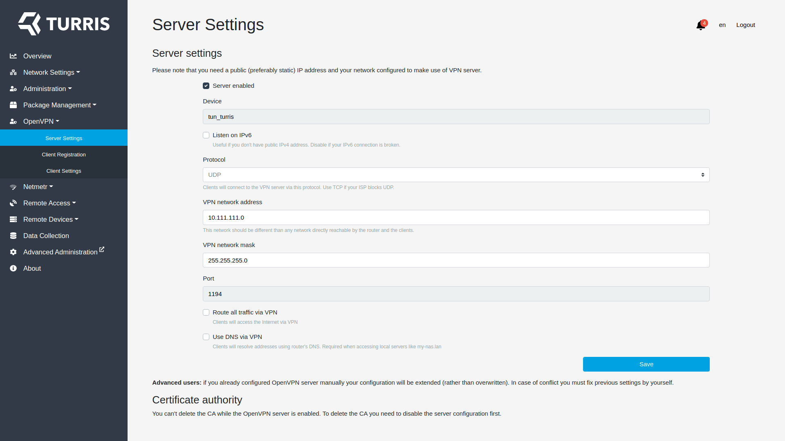

## Management of clients for VPN server

## VPN client configuration

## Remote access configuration

## Management of tokens for remote access

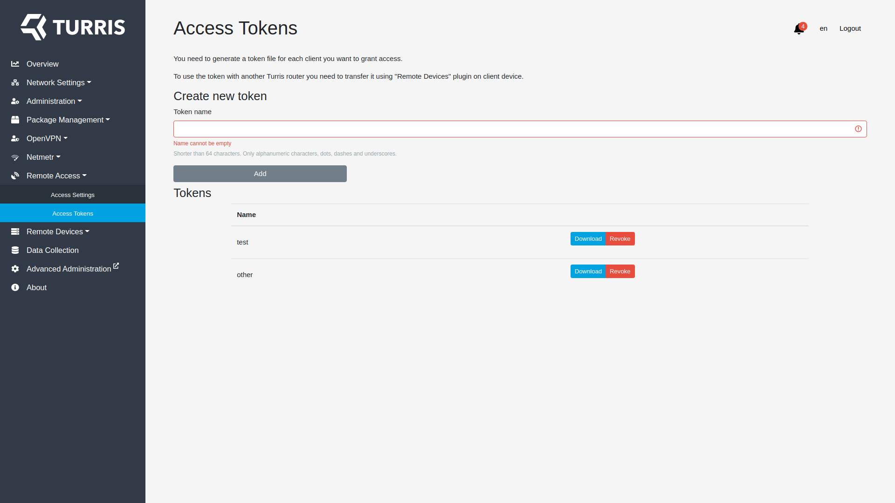

## Management of remotelly managed devices

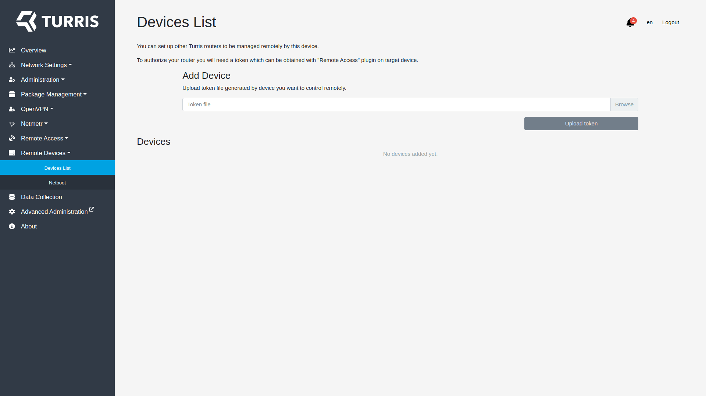

## Netboot configuration

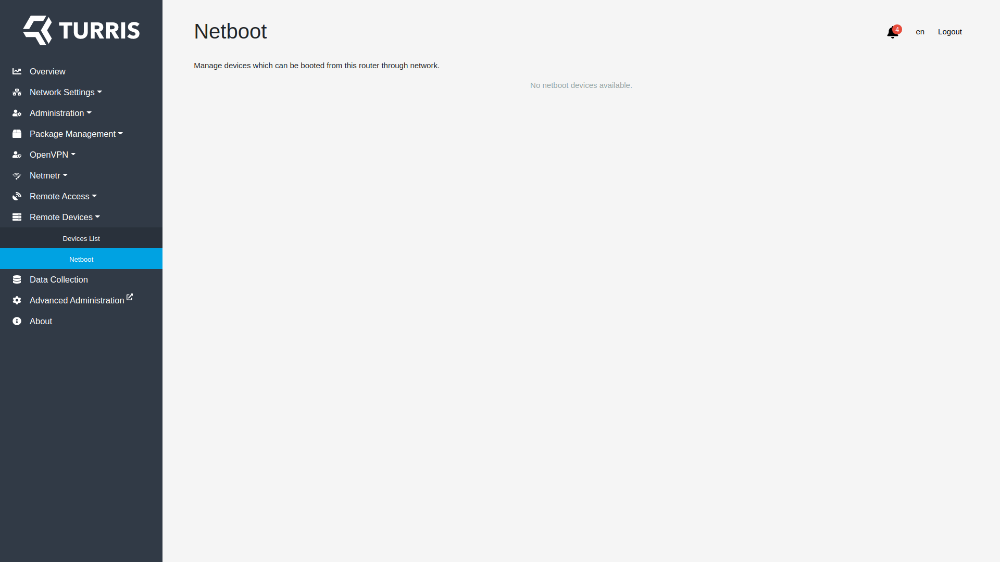

## Data collection settings

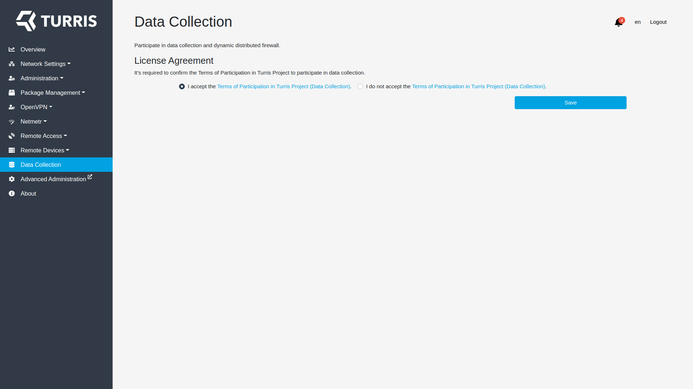

## About page

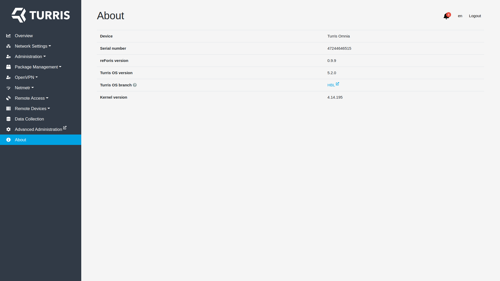
