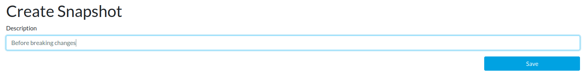
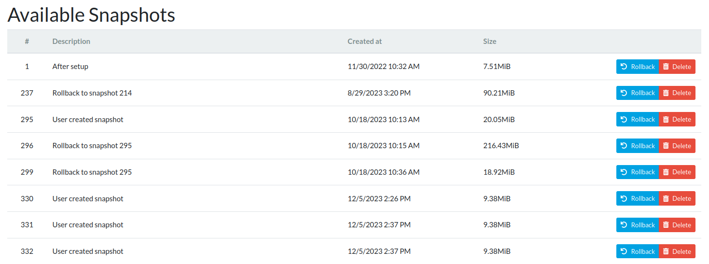

# Snapshots

Snapshots can be helpful if you want to undo some changes or if something
doesn't work as expected. Each snapshot represents a point at the timescale,
and if you do a rollback, your system will be reconstructed to match the state
existing at the given time.

Snapshots are created automatically before and after each upgrade of
the system and on every Sunday. If a snapshot contains no changes
against the previous one, it's kept, but the previous snapshot is deleted.
You can also create snapshots manually, and these ones are always kept.

!!! tip
    This feature in reForis only offers essential features for snapshots.
    If you want to use advanced ones, please [read the page](../../../geek/schnapps/schnapps.md)
    about schnapps.

## Creating a snapshot

1. Navigate to the reForis web interface.
2. Go to the _Administration_ → _Snapshots_ page.
3. Write the name of the new snapshot into the _Description_ text field (use
   only English letters, digits, space, underscores, and hyphens;
   unacceptable characters will be changed to underscores).
4. Press the _Save_ button.

Then, you should be able to see your snapshot in the _Available snapshots_
list (see below).

!!! important
    Each snapshot occupies some space on the storage device. If you
    create a massive number of snapshots, you may encounter problems
    with storage space.

## Rolling back to a snapshot

1. Navigate to the reForis web interface.
2. Go to the _Administration_ → _Snapshots_ page.
3. Press the _Rollback_ button in the line of the snapshot that you
   want to use.
4. Wait until a notification about reboot is displayed.
5. Reboot your device.

After rebooting, your router will be in the state of the given snapshot.

## Deleting a snapshot

You can delete any snapshot at any time.

1. Navigate to the reForis web interface.
2. Go to the _Administration_ → _Snapshots_ page.
3. Press the _Delete_ button in the line of the snapshot that you
   want to delete.

The deleted snapshot disappears from the list.
