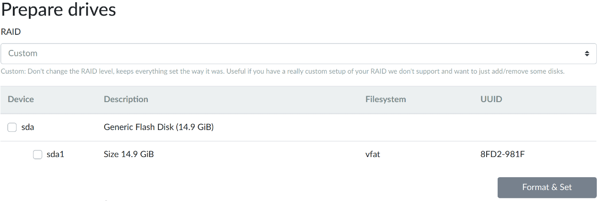
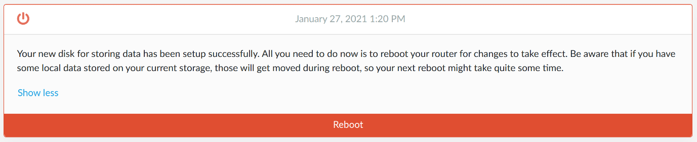
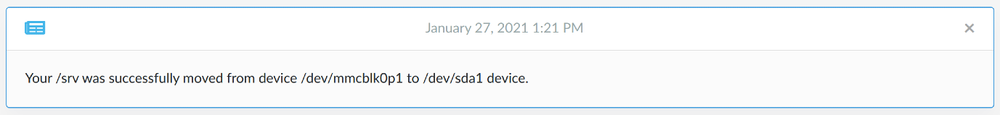
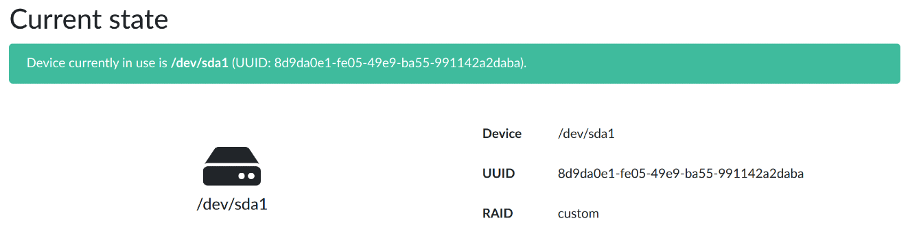
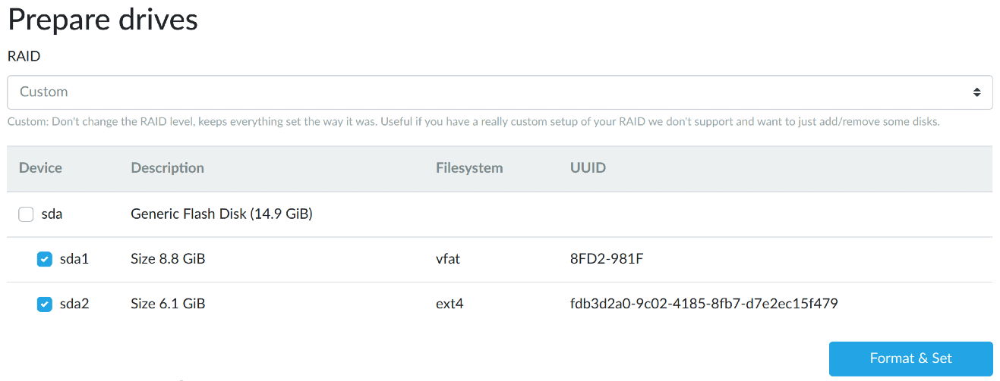
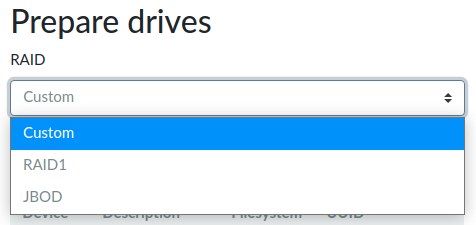

# Storage plugin

Turris Omnia contains a soldered eMMC flash memory chip, which is used as the system storage.
It holds both the Turris OS itself and the created data. But if you want to use
applications that need to save larger amounts of data, you can use an external
storage device.

!!! tip
    If you want to use [Nextcloud](../../../geek/nextcloud/nextcloud.md),
    [LXC](../../../geek/lxc/lxc.md), or other I/O intensive applications, don't
    put them on the internal flash. Always use external storage as internal
    flash could be easily destroyed by I/O intensive applications! You can
    recognize such applications by _External storage_ label, which you can see
    in the _Packages_ tab. Also, please make sure that your data will fit on the
    new drive before switching.

The storage plugin allows you to easily move your `/srv` to an external drive.
It both allows getting more space and lengthen the lifespan of the internal eMMC
flash storage. The `/srv` directory is used for storing site-specific data as
defined in the [FHS
specification](https://en.wikipedia.org/wiki/Filesystem_Hierarchy_Standard). The
storage plugin can't move other parts of the file system. But it doesn't matter
because all data-intensive applications save their data into `/srv`.

## First setup

Pick an external storage device, which you want to move your persistent data to.
It can be, for example, a simple USB flash drive, but it is strongly encouraged
to use a regular HDD or SSD to get both higher speed and better durability.

!!! warning
    Setting up external storage will destroy all data on newly selected
    storage. Make sure that the storage device has no important data on it.

In case of a USB drive, insert it into the USB slot on your router. If you are
using a different type of storage, make sure that it is properly inserted or
connected to the router.

Once the external storage is inserted, inside the _Storage_ tab in reForis in
the _Prepare drives_ section, select where your persistent data should be stored and
press the _Format & Set_ button.



You will be asked if you are ready to continue. Then press _Continue_.
Now, wait until formatting is finished. For applying the changes, you need to
reboot your system.

You can do this by going to the _Notifications_ on the _Overview_ tab or
_Notifications_ dropdown and pressing _Reboot_.



The reboot might take a long time because it involves the transfer of your data
to the new storage.



Once the process is finished, you have rebooted your router and logged back into
reForis, the selected storage will be highlighted blue with a green alert. This
means that the operation was successful and your data will from now on be
written to the external disk.



## Multiple drives

You can add additional drives anytime you need more space or redundancy. Simply
select an additional drive in the web interface.

**Data on the newly selected drive will be deleted.** Data on old drives will be
spread across all enabled drives.



If you have more drives and want to remove/replace some of them, do so by
unchecking them in in the Web UI and hitting the _Format & Set_ button. Removing
drive takes a long time as data need to be moved out of it first and

!!! tip
    No additional reboot is needed to extend/shrink your storage. Actually
    quite opposite - everything happens at runtime, so avoid reboot till you get a
    notification that everything is successfully finished.


## Data redundancy

By default, adding more drives will increase the capacity available in `/srv`. If
you are using your router to store important data, you might want to set
redundancy for your drives. It can be done in two ways: via the web interface or
CLI.

Valid options are the following:

* `raid1` - every piece of data is kept on two different drives (no matter how
  many drives you have), so if one drive fails, you can still get to your data
* `single` - there is only one copy of data - more space, but not redundancy
* `custom` - the RAID level is unchanged and only rebalance is done after
  adding/removing the drive

### Web interface

In the _Prepare drives_ section choose the option you want and the click _Format &
Set_ button.



### CLI

In CLI by calling the following commands:

```bash
uci set storage.srv.raid=raid1
uci commit storage
```

Then after hitting the _Format & Set_ button without changing any drives, the RAID level
will be set and data rearranged.
