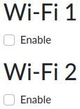
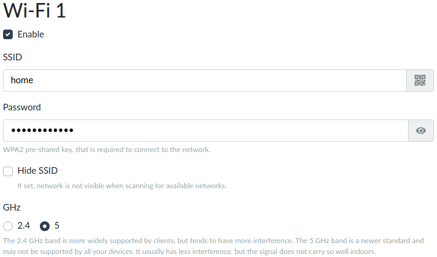
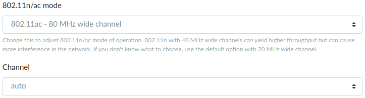
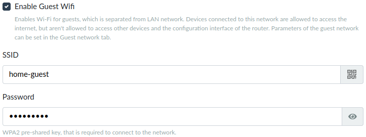
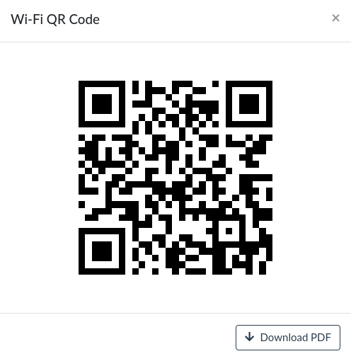

# Wi-Fi settings in reForis

## Wi-Fi in Turris devices

[Turris Omnia](../../../hw/omnia/omnia.md) has two Wi-Fi adapters.
[Turris MOX](../../../hw/mox/intro.md) can contain one
[SDIO Wi-Fi add-on](../../../hw/mox/addons.md) in its
[A module](../../../hw/mox/modules/a.md) and one
[mPCIe add-on](../../../hw/mox/addons.md) in its
[B](../../../hw/mox/modules/b.md) or [G module](../../../hw/mox/modules/g.md).
[Turris 1.x](../../../hw/turris-1x/turris-1x.md) contains one (by default)
or two (with the
[Wi-Fi Upgrade Pack](https://www.turris.com/en/news/news-list/wi-fi-upgrade-pack-turris-1x/))
Wi-Fi adapters.

These adapters can be easily configured in reForis to support up to two
Wi-Fi networks on each adapter. One of the networks is interconnected with
the LAN (Wi-Fi devices can communicate with devices in the LAN) whereas
the other is a "guest" network which can access only the Internet but
not devices in the LAN.

!!! tip
    Configure the host Wi-Fi network and use it for your friends, customers
    and other guests. They will have full access to the Internet but won't
    access to your internal network.

## Wi-Fi configuration in reForis

If you open the _Wi-Fi_ page in reForis for the first time it is unconfigured.
For example, if you have two Wi-Fi adapters you can see something like this:

You can configure one of the adapters or both of them. When you check
the _Enable_ checkbox multiple fields are displayed:

* **SSID** – This is the name of your Wi-Fi access point. Fill in whatever
  you want but please use only English letters, digits and hyphens for the
  sake of compatibility with other devices.

* **Password** – It must be at least 8 characters long but we recommend
  longer passwords for better security. It can contain virtually any of
  available characters but remember that the password will be entered on
  all devices which you will want to connect to this Wi-Fi. So avoid
  uncommon charactes like letters of non-English alphabets or unprintable
  charactes. By contrast, characters like dots ("."), sharps ("#") or
  slashes ("/") are welcome as they improve security and are available
  on all keyboards (both physical and virtual ones).

* **Hide SSID** – It can be advantageous for local networks such as when
  you want to have devices that stay on property. It can help you to
  decrease clutter in Wi-Fi selection (simply users would not see the
  internal network in your shop for example).

* **GHz** – All Wi-Fi adapters in Turris devices support 2.4 GHz and
  some of them support 5 GHz too. You can see here what are the
  practical differences between these frequency bands. If you have
  more than one Wi-Fi adapter you can configure some of them for 2.4 GHz
  and some for 5 GHz.

!!! notice
    Currently, reForis configuration supports only the
    [WPA2 pre-shared key](https://en.wikipedia.org/wiki/IEEE_802.11i-2004)
    authentication and the
    [CCMP (AES)](https://en.wikipedia.org/wiki/CCMP_(cryptography)) cipher.
    If you need to use something different it can be set in
    [LuCI](../../../basics/luci/luci.md).

There are also two fields that can be used for Wi-Fi tuning:

* **802.11n/ac mode** – There are two specifications used for fast Wi-Fi
  networks: "n" (both for 2.4 and 5 GHz) and "ac" (5 GHz only). Each
  of them can use various frequency bandwidths (20 or 40 MHz for "n"
  and 20 up to 80 MHz for "ac"). The "ac" specification gives much higher
  speed but is less compatible (older device don't support it) and is more
  susceptible to interference. Similarly, broader frequency bandwidth means
  higher speed but also higher susceptibility to inferference. Keep the
  default values, test your Wi-Fi network and then you can experiment with
  tuning. If you set _Disabled_ here only the legacy and slow "b/g"
  specifications will be available.

* **Channel** – Wi-Fi network can work on various channels (representing
  defined frequencies). The best approach is usually to use "auto" here.
  If you encounter problems with interference (low speed, lost packets,
  outages etc.) try to set specific channels. You can utilize Wi-Fi
  signal measurement – see our
  [documentation page](../../../hw/wifi.md)
  about Wi-Fi coverage.

{!
  include-markdown "../../../hw/wifi.md"
  start="<!--wheather-radars-start-->"
  end="<!--wheather-radars-end-->"
!}

## Guest Wi-Fi

To keep the guest traffic away from the normal one, you can enable guest
Wi-Fi networks. Each of such network shares the most settings with the given
normal Wi-Fi network but has its own SSID and password. Users connected
to the guest network can't communicate with devices in the LAN nor with
the router itself (ie. can't use reForis, Foris, LuCI nor SSH) but they
can access the Internet.

Simply check the _Enable Guest Wifi_ checkbox to enable the guest Wi-Fi
on the given adapter. Then fill in the fields. _SSID_ must be different
than for the normal network. It's strongly encourage to use a different
password too (otherwise it doesn't have sense to use the guest network).

!!! tip
    The password should be complex enough to not be easily guessed but
    not too complex in order to be easily entered to guests' devices.

## QR codes for mobile devices

Many mobile devices can be configured for Wi-Fi network using QR codes.
Click to the QR code icon in the SSID field (see the images above).
The given access parameters (SSID and password) will appear as a big
QR code which can be directly scanned by mobile devices.

It is also possible to download the QR code as a PDF document containing
the SSID and password too. This feature is especially suitable for
guest networks. You can print the PDF and provide it to your guests
for simple configuration of their devices.

!!! tip
    If you need to configure more Wi-Fi parameters or define them more
    precisely please use [LuCI](../../../basics/luci/luci.md).
