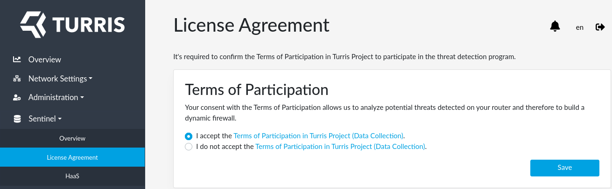
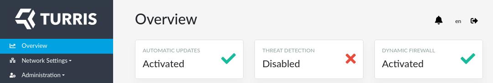

!!! important
    This guide is only for Turris Shield. If you want to set up another
    Turris device (Omnia, MOX or Turris 1.x) please use
    the [appropriate guide](setup.md).

Turris Sentinel is enabled by default on Shield firewalls. We strongly encourage
to keep it enabled because it helps to protect all Sentinel users against
security threats. But if you don't want use it for some reason you can disable
it.

The only thing you have to do is to disagree with our EULA. You can find
it at the _Sentinel -> License Agreement_ tab in reForis. Switch the radio
button to _I do not accept..._ and press _Save_.

When done, you can see at the _Overview_ page that threat detection is disabled.

If you wish to continue using Sentinel, you still have few options to configure.
Notably you can select which threat detection tools you want to use or you can
install HaaS which is **not** configured by default.




