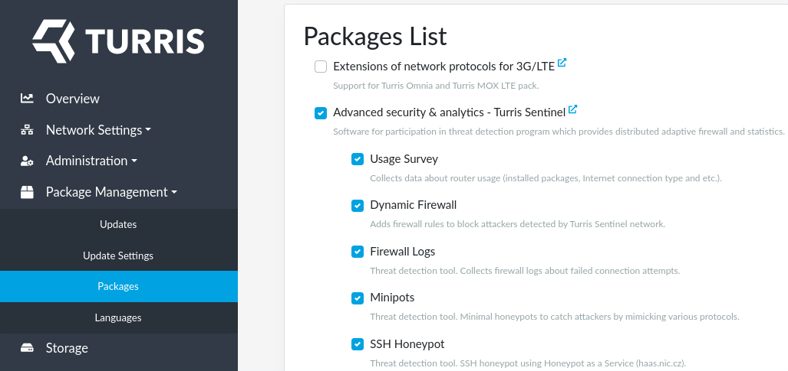
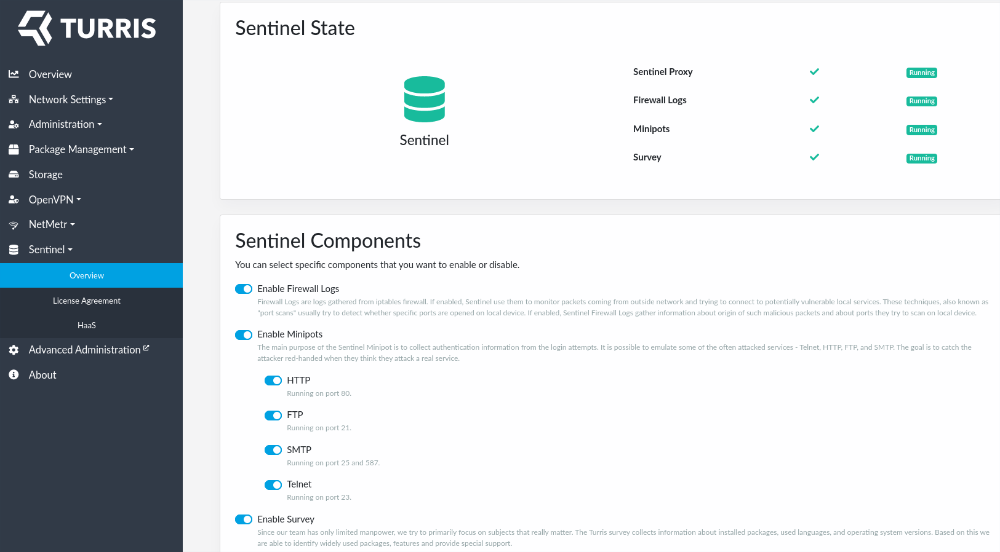
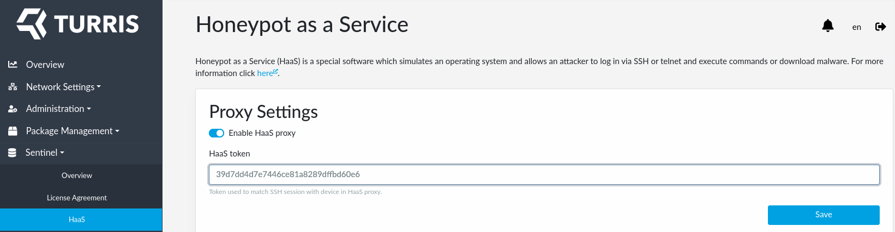

!!! important
    This guide does not cover Turris Shield. Sentinel threat detection and
    dynamic firewall is *enabled* by default on Turris Shield. If you want to
    configure your Shield please use the [appropriate guide](setup-shield.md).

In order to use Sentinel threat detection and dynamic firewall you must install
all the required packages, agree with our
[EULA](https://gitlab.nic.cz/turris/sentinel/eula/-/blob/master/eulas/1.txt)
and select which threat detection tools you want to use.

### Install Sentinel packages

All the packages required to run Sentinel can be installed in single step by
enabling Sentinel package list. You can enable *Sentinel* package list in the
*Package Management* tab in reForis.



!!! cli-alt "Command line alternative"
    The packages could be installed using command line as well:
    ```
    opkg update
    opkg install foris-controller-sentinel-module sentinel-certgen sentinel-dynfw-client sentinel-eula sentinel-firewall sentinel-fwlogs sentinel-minipot sentinel-proxy
    ```

### Enable threat detection

After successful installation of Sentinel packages a *Sentinel tab* will start to
appear in reForis (web browser reload may be needed). Since *Thread detection*
uses data collected from you router you must agree with our
[EULA](https://gitlab.nic.cz/turris/sentinel/eula/-/blob/master/eulas/1.txt)
and therefore
allow us to proceed the data. You can agree with EULA using the newly created
Sentinel tab in reForis.


!!! cli-alt "Command line alternative"
    Or using command line:
    ```
    uci set sentinel.main.agreed_with_eula_version=1 && uci commit
    sentinel-reload
    ```

By agreeing with EULA you also automatically enable Sentinel proxy - a simple
tool which runs on your router and which is responsible for forwarding data
collected by Sentinel via secure channel to our infrastructure. You can control
what data are collected and forwarded by enabling distinct threat detection
tools.

<!--threat-det-reforis-start-->
### Choose which threat detection tools to use

With Sentinel installed and EULA approved your *Sentinel Overview tab* will
shine green.



In *Sentinel overview tab* you can see which locally run Sentinel threat
detection tools are enabled and running. Here, you can also disable or enable
only a subset of them.
<!--threat-det-reforis-end-->

!!! cli-alt "Command line alternative"
    If you wish to use command line instead, you may get ispired by the
    following commands:
    ```
    sentinel-status
    uci set sentinel.minipot.enabled=1
    uci set sentinel.fwlogs.enabled=1
    uci set sentinel.survey.enabled=1
    uci commit
    sentinel-reload
    ```

<!--haas-reforis-start-->
### HaaS

Besides the tools listed in *Sentinel overview tab*, you are also free to use
HaaS. HaaS is not listed there because it's setup requires one more
step which requires registration in a separate website and obtaining a HaaS token
as described in a separate [guide](haas.md#registration). HaaS also do not collect data on
you router and therefore nor EULA approval nor running Sentinel proxy is needed.

Once you have you HaaS token with you, fill it in using *Sentinel HaaS tab* in
reForis:


<!--haas-reforis-end-->

!!! cli-alt "Command line alternative"
    Optionally, use command line instead:
    ```
    uci set haas.settings.token="YOUR_TOKEN"
    uci commit
    /etc/init.d/haas-proxy enable
    /etc/init.d/haas-proxy start
    ```

<!--isp-start-->
## Important note about Internet Service Providers

Some [Internet Service Providers](https://en.wikipedia.org/wiki/Internet_service_provider)
(ISPs) actively detect potentially vulnerable services running by their
customers. If they find such services they send notification or even block
external access to such ports.

!!! info
    The same applies for some community, municipal or other networks as well.

Some parts of Sentinel ([Minipots and HaaS](threat-detection.md)) may be
identified as such vulnerable services because they pretend to be vulnerable so
that they are able to lure potential attackers (with no risk since the attackers
do not enter any real environment).

What to say to your ISP if you receive such warning:

1. Those services are operated intentionally as a part of the Sentinel security
   research project.
2. They are provided by honeypots and not vulnerable software.
3. The results of the project are instantly deployed to routers and improve
   security of the routers and the networks beyond them.
4. You want to keep those ports/service accessible from the Internet.

Please let us to know ([tech.support@turris.cz](mailto:tech.support@turris.cz))
if your ISP sends you such warning or event applies some "protective" measures
on your Internet connection.

!!! warning
    Some ISPs silently block access to some ports (they do not declare that
    they do so). It is useful to ask explicitly which ports are blocked.
<!--isp-end-->
