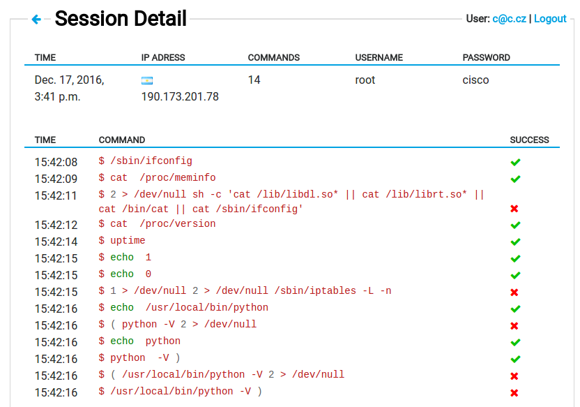

# Threat detection

The Sentinel threat detection subsystem is a key source of data which are used
to build the [dynamic firewall](dynfw.md) (and other analyses)
which then help to keep your router secure. As a result, taking part in
Sentinel threat detection project helps to protect your own router (and home) as
well as to protect the rest of the world.

## What kind of data does Sentinel threat detection need?

There are multiple components in the threat detection subsystem. Depending on
the component used, the type of data which is sent to our servers varies.
On you router you can notably enable *Firewall monitoring*, deploy *Minipots*
or use *HaaS*.

### Firewall monitoring

Firewall logs are one of the key data sources for [Sentinel](../apps/sentinel.md).
Using firewall logs we can determine which attackers tries to exploit potential
vulnerabilities on a particular port. We collect attacker's IP address and number
of port he is trying to attack.

### Minipot

The word "Minipot" is a combination of the words "mini" and "Honeypot".
Honeypot, also called a fake server, is a way to mimick some kind of service or
protocol, usually attractive to a potential attacker.

Turris Minipot is a lightweight Honeypot which emulates only minimal subset of
each protocol, answering an "incorrect password" to each log in attempt. We
currently operate [Telnet](https://en.wikipedia.org/wiki/Telnet),
[HTTP](https://en.wikipedia.org/wiki/Hypertext_Transfer_Protocol),
[FTP](https://en.wikipedia.org/wiki/File_Transfer_Protocol) and
[SMTP](https://en.wikipedia.org/wiki/Simple_Mail_Transfer_Protocol)
Minipots. The entered user/password combination along with the attacker's IP
address is collected by the software.

!!! important
    Turris Minipot may be falsely detected as a vulnerable/insecure service.
    See the [setup page](setup.md#important-note-about-internet-service-providers)
    for details.

### HaaS – Honeypot as a Service

HaaS is a publicly available service which uses SSH Honeypot in order to catch
the pieces of information about the attacker's credentials, behavior and so on.

More information including set up manual is available on the separate
[HaaS page](haas.md).

!!! important
    HaaS may be falsely detected as a vulnerable/insecure service. See the
    [setup page](setup.md#important-note-about-internet-service-providers)
    for details.

### Turris survey

Since our team has only limited manpower we try to primarily focus
on subjects that really matter. The Turris survey collects information about
installed packages, used languages and operating system version. Based on this
we are able to identify widely used packages, features and provide special
support. Turris Survey is not a part of threat detection subsystem but it shares
the same infrastructure and secure communication channel.

## What do we use the data for?

The data collected from routers are used for various security analyses
carried out by Turris team or by
[The National CSIRT of the Czech Republic](https://csirt.cz/en/).

One of the most important analyses is the
[dynamic firewall](dynfw.md). The dynamic firewall
collects information about entities trying to scan or break into your router and
is able to detect the real attackers among them. IP addresses of identified
attackers are then immediately published and reported back to the routers.
Once a day the list of all attackers (A.K.A. greylist) is snapshoted and
published as a CSV file. You can download the latest greylist snapshot
[here](https://view.sentinel.turris.cz/greylist-data/).

## Can I see the data?

You can browse the aggregated data we have collected through the Sentinel
network on our web page called [Sentinel View](https://view.sentinel.turris.cz/).
You can browse there detected attackers, the most commonly used passwords,
country of origin and such.

The HaaS attackers who tried to attack your own router and their commands
could be seen on [HaaS project website](https://haas.nic.cz).

Sadly, there is currently no way to visualize what your own router collects from
Firewall monitoring and Minipots – a feature we are working hard on now.
