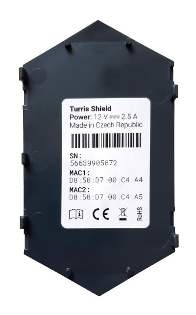
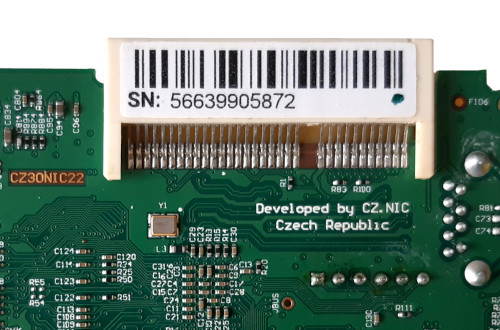

# Getting help

This section will point you to various ways of getting help with your router.

## Formulating your problem

This short manual will take you through the recommended steps, when discussing
problems. Following these instructions should help to resolve your issues much
faster.

 * A suitable subject for e-mail/issue/forum post
    * Good: 5GHz Card not visible | T-Mobile PPPoE won't connect
    * Not so good: Turris Omnia problem | Problem | Omnia died
 * Use one thread per problem. Don't mix many problems into one e-mail/issue/forum post
 * Clearly state what router you have and whether you have made any HW alterations.
 * Don't forget to mention the version of your _Turris OS_! (_reForis → About_)
 * If you have logs, include them. But be aware that those **might contain
   sensitive data**.

### Obtaining the serial number

If you are contacting the official Turris support, always include the serial
number (S/N, SN) of your router. You can obtain it using one of these ways:

1. The _About_ tab in _reForis_.
2. The invoice or receipt issued by your vendor.
3. The label on the paper box used for packaging of your router.
4. Output of the command `crypto-wrapper serial-number` **included in one
   of the diagnostic modules** (not applicable for Shield).
5. The label on the bottom of your router (applicable for Omnia and Turris 1.x).
6. The label on one of the plastic parts of your device (applicable for
   MOX and Shield – see the photo below). It's usually one of the parts on
   the top side of your device.
7. The label on the MOX bus slot of your module A (applicable for MOX and
   Shield – see the photo below).





## Getting logs

!!! warning
    If you come across an error and it is possible not to reboot the router,
    **please don't reboot it** before collecting the logs. All logs are saved in
    the router memory and they will be erased, if you reboot.

If you just rebooted the router, let it gather some data first. Logs from a
freshly rebooted router, which have been downloaded before the occurrence of
the error, usually don't help us to identify the cause of the error.

### Using reForis

If you use the _reForis_ interface to maintain your router, you can use it to
generate logs using _Diagnostics_ page. The modules, which are usually the most
important are `disk_full`, `messages`, `dns`, `installed` and `network`.
If the nature of the problem suggests that other modules could also be useful,
you can check them. The required logs will generated if you click _Generate_
button. At the bottom of the page is list of reports, where new one will be
available in approximately a minute. Then you can download it.

#### If you can't find the diagnostics

In that case your router is for some reason stuck in some old version of the
_Turris OS_. That is the first problem to solve, make sure you have updates
enabled and your internet connection is working.

### Using the console

If you cannot access the web interface, you can connect via SSH and run the
diagnostics script.

!!! info
    If you do not have installed SSH support on your PC, you will need to install
    SSH client. On Linux it is usually `openssh-client` and on Windows it is
    Posh-SSH` or `WinSCP`. But many of Linux distros have OpenSSH client
    preinstalled and also the Windows PowerShell 2.0 has it already integrated.

1. You connect to the router via SSH (using terminal, PowerShell or different
command line tool).

    ```shell
    user@pc:~$ ssh root@192.168.1.1
    ```

2. Run the diagnostic script.

    ```shell
    root@192.168.1.1:~$ turris-diagnostics | gzip > /tmp/diag.gz
    ```

3. Disconnect (using `Ctrl+D`).

4. Copy the diagnostic file to your computer.
    - using SCP
        ```shell
        $ scp root@192.168.1.1:/tmp/diag.gz <your destination>
        ```

    – using SFTP client (like Filezilla)

        In a SFTP client, create new connection with credentials similar to SSH connection:

        – **Host**: _your router IP address/hostname. By default_ `192.168.1.1`
        – **username**: `root`
        – **port**: `22`

!!! info
    We prefer to have these complete diagnostics, but if you are experienced user
    you can always send us only specific output of standalone diagnostics of
    components you have problem with. But we still may insist on sending further
    diagnostic data.

## Support channels

### Documentation

The first obvious way to get help is this documentation. There is a search box in
the upper right corner and you can use that one to find more information about
specific topic.

Apart from official documentation, we also have a [community
wiki](https://wiki.turris.cz/doc/en/public/start) where you can find guides to
some more complex setups that are not necessarily officially supported and
might or might not work.

### Forum

For help with advanced setups, you might want to check our
[forum](https://forum.turris.cz), which is a platform for our users to discuss
among themselves and to help each other even with unsupported scenarios.

### Issue tracker

Turris OS is based on OpenWrt which is Linux distribution. As such it contains
plenty of packages, but most of them are not maintained by Turris team. You can
find list of packages maintained by Turris team in [Turris OS packages
repository](https://gitlab.nic.cz/turris/os/packages) and you can also file
issues against them there, although before that please read [issue submission
guide](../geek/contributing/issues.md).

If you have an issue with a package not maintained by Turris team, you can file an
issue against upstream tracker. Please read [OpenWrt bug reporting
guide](https://openwrt.org/bugs).

### Turris support

There is official Turris support available via e-mail
[tech.support@turris.cz](mailto:tech.support@turris.cz). It is not 24/7 and it
deals with hardware issues and with serious software issues in supported
software. It will not help you design your network nor it will fix any package
available in OpenWrt.

!!! warning
    Whenever you are contacting us via e-mail, be sure that the total size of all
    attachments won't exceed size of 14MB.
