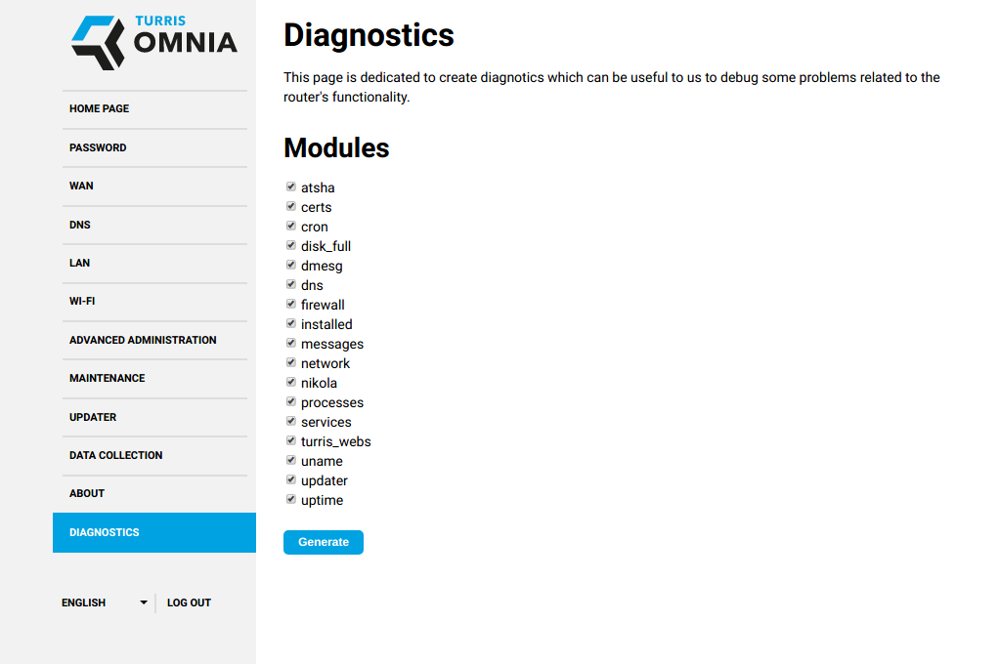

# Getting help

This section will point you to various ways of getting help with your router.

## Formulating your problem

This short manual will take you through the recommended steps, when discussing
problems. Following these instructions should help to resolve your issues much
faster. 

 * A suitable subject for e-mail/issue/forum post
    * Good: 5GHz Card not visible | T-Mobile PPPoE won't connect
    * Not so good: Turris Omnia problem | Problem | Omnia died
 * Use one thread per problem. Don't mix many problems into one e-mail/issue/forum post
 * Clearly state what router you have and whether you have made any HW alterations.
 * Don't forget to mention the version of your _Turris OS_! (_Foris -> About_)
 * If you have logs, include them. But be aware that those **might contain
   sensitive data**.

If you are contacting official Turris support, always include the S/N of your
router - you can see this either on the bottom of your router, _About_ tab in
_Foris_ or as the output of command `crypto-wrapper serial-number`.

## Getting logs

!!! warning
    If you come across an error and it is possible not to reboot the router,
    **please don't reboot it** before collecting the logs. All logs are saved in
    the router memory and they will be erased, if you reboot. 

If you just rebooted the router, let it gather some data first. Logs from a
freshly rebooted router, which have been downloaded before the occurrence of
the error, usually don't help us to identify the cause of the error.

### Using Foris

If you use the Foris interface to maintain your router, you can use it to
generate logs using _Diagnostics_ page. The modules, which are usually the most
interesting are `turris_version`, `dmesg`, `messages`, `dns` and `network`. If the nature of the
problem suggests that other modules could also be useful, you can check them.
The required logs will be downloaded if you click _Generate_ button.

#### If you can't find the diagnostics

In that case your router is for some reason stuck in some old version of the
_Turris OS_. That is the first problem to solve, make sure you have updates
enabled and your internet connection is working.

### Using the console

If you are a more experienced user and you have SSH access, interesting logs
might be the following:

  * The contents of `/var/log/messages`
  * The output of the `dmesg` command
  * A list of the installed packages, that is the output of `opkg list-installed`
  * If your problem concerns the network, content of `/etc/config/network` is also of some interest.

## Support channels

### Documentation

The first obvious way to get help is this documentation. There is a search box in
the upper right corner and you can use that one to find more information about
specific topic.

Apart from official documentation, we also have a [community
wiki](https://wiki.turris.cz/doc/en/public/start) where you can find guides to
some more complex setups that are not necessarily officially supported and
might or might not work.

### Forum

For help with advanced setups, you might want to check our
[forum](https://forum.turris.cz), which is a platform for our users to discuss
among themselves and to help each other even with unsupported scenarios.

### Issue tracker

Turris OS is based on OpenWRT which is Linux distribution. As such it contains
plenty of packages, but most of them are not maintained by Turris team. You can
find list of packages maintained by Turris team in [Turris OS packages
repository](https://gitlab.labs.nic.cz/turris/turris-os-packages) and you can
also file issues against them there.

If you have an issue with a package not maintained by Turris team, you can file an
issue against upstream tracker. Most of the upstream packages are maintained in
[OpenWRT packages repository](https://github.com/openwrt/packages/).

### Turris support

There is official Turris support available via e-mail
[tech.support@turris.cz](mailto:tech.support@turris.cz). It is not 24/7 and it
deals with hardware issues and with serious software issues in supported
software. It will not help you design your network nor it will fix any package
available in OpenWRT.

