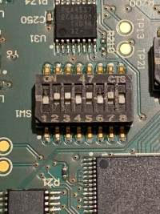

# Btrfs migration on Turris 1.x routers

!!! warning
    This article is for [Turris 1.x routers](../hw/turris-1x/turris-1x.md)
    running on old [Turris OS 3.x](../basics/tos-versions.md) version.
    Its intention is to make it possible to easily use the latest stable
    version of Turris OS.

!!! warning
    By following this migration guide, you will lose your current settings
    and will have to configure everything from scratch.

Btrfs is the default filesystem on Turris Omnia and Turris MOX while Turris 1.x
routers were using JFFS2 and UBIFS later. In the past, we switched to the Btrfs
filesystem, which has various advantages, like providing backups via snapshots
managed by our tool [Schnapps](../geek/schnapps/schnapps.md).

## Requirements

You will need:

* a [Turris 1.0 or Turris 1.1](../hw/turris-1x/turris-1x.md) router,
* a microSD card with at least 8 GB free storage,
* a PH1 screwdriver,
* a microUSB cable,
* a computer with microSD card reader (Linux recommended),
* a connection to the Internet - one ethernet cable.

## Preparation of Turris 1.x routers

To ensure everything works properly, you will need to perform a factory reset
to a working Turris OS version.

Download the [SD card image](http://repo.turris.cz/turris/sdcard-rescue/sdcard.img)
of a working Turris OS 3.x system from our repository to your computer.

Write the image to the microSD card.

On a Linux running machine, execute this command by replacing the `if=` path to the
corresponding path to the SD card image and the `of=` path to the
**correct device** (the microSD card):

!!! danger
    Check the correct path to the microSD card with `lsblk` or `fdisk -l`.
    `dd` is a powerful utility that can wipe out your entire disk if it is not
    used correctly!
    ```bash
    lsblk
    ```
    Or
    ```bash
    fdisk -l
    ```
    The path to the microSD card will either be `/dev/sdx` or `/dev/mmcblkx`,
    depending on your SD card reader.

```bash
sudo dd if=/path/to/sdcard.img of=/dev/path/to/microsdcard bs=4M status=progress && sync
```

On a Windows machine, you can use [BalenaEtcher](https://etcher.balena.io/) or [Raspberry Pi Imager](https://www.raspberrypi.com/software/).

Remove the top cover of the router (4 PH1 screws) and the front panel if you
have Turris 1.0 (3 PH1 screws) to access the microUSB serial port.

Carefully remove the RAM (located between the CPU and LEDs) by releasing the
two latches.


Insert the microSD card in the slot located under the RAM module.


Replace the RAM module.

Locate the `SW1` switch bar on the left side of the CPU if you have the router
facing you with the LEDs.

Set the switches 1 and 3 to the pattern **011 010**.



Connect the microUSB cable to the serial port located in the left corner of the
front panel and connect it to your computer.

Connect to the serial console (115200 baud rate).

```bash
sudo screen /dev/ttyUSB0 115200
```

Plug in the power supply and wait for the automatic installation to complete.
The process will look like this (HOTOVO is printed out if the process is done):

```bash
Erase Flash Bank # 1 
........................................................................... done
Copy to Flash... 9....8....7....6....5....4....3....2....1....done
HOTOVO
```

Now you can unplug the power supply. After unplugging, remove the RAM again,
remove the microSD card, and replace the RAM module again.

Set the switches on the SW1 switch bar to its original state **110 010**.


Perform a Factory reset. Plug in the power supply and hold the reset button
located on the rear panel for more than 10 seconds (or until the blinking LED
becomes solid).

Wait until `Router Turris succesfully started.` is printed out to the serial
console.

Turn off the router, format the microSD card to FAT 32, remove the RAM module,
place the microSD card back into the slot, and replace the RAM module.

## Connecting to the internet

Plug in the power supply to turn on the router and change the network
configuration of WAN to ensure internet connection and the configuration of
the resolver to disable DNSSEC because of expired certificates.

```bash
sed -i "s/proto 'none'/proto 'dhcp'/" /etc/config/network
sed -i "s/ignore_root_key '0'/ignore_root_key '1'/" /etc/config/resolver
```

Restart the network and the resolver.

```bash
/etc/init.d/network restart && /etc/init.d/resolver restart
```

Give the router some time to restart these services, then check if everything
went well:

```bash
ping 8.8.8.8

# You should see periodical replies from the server like these
root@turris:/# ping 8.8.8.8
PING 8.8.8.8 (8.8.8.8) 56(84) bytes of data.
64 bytes from 8.8.8.8: icmp_seq=1 ttl=120 time=0.869 ms
64 bytes from 8.8.8.8: icmp_seq=2 ttl=120 time=0.952 ms
64 bytes from 8.8.8.8: icmp_seq=3 ttl=120 time=1.43 ms
```

This tests if there is a working Internet connection.

```bash
ping turris.cz

# You should se periodical replies from the server like these
root@turris:/# ping turris.cz
PING turris.cz (217.31.192.80): 56 data bytes
64 bytes from 217.31.192.80: seq=0 ttl=61 time=0.884 ms
64 bytes from 217.31.192.80: seq=1 ttl=61 time=0.902 ms
64 bytes from 217.31.192.80: seq=2 ttl=61 time=0.899 ms
```

This tests if the DNS resolution works.

If this worked you are now connected to the Internet.

## Installing current certificates

Now you need to get the latest certificates in order to install the Btrfs
migration script from the repo.

Download the certificates package:
```bash
cd /tmp && curl -k -O https://repo.turris.cz/hbs/turris1x/packages/base/ca-certificates_20250419-r1_all.ipk
```

And install them:
```bash
opkg install ./ca-certificates_20250419-r1_all.ipk
```

## Installing the Btrfs migration script

Before you are able to install any packages, you need to update the package
lists, and then you can install the `turris-btrfs` package.

```bash
opkg update && opkg install turris-btrfs
```

## MicroSD card migration

The next step is to execute the `btrfs_migrate` command, which is a script that
wipes all data on the microSD card, formats the card to Btrfs, copies all the
current content on the NAND (internal storage) to the microSD card, and sets the
U-boot environment to boot from the microSD card.

Run the script:
```bash
btrfs_migrate

# And type in 'yes' to confirm that all data on microSD card is wiped.
```

!!! Notice
    If the script fails with "No microSD card present", turn off the device and
    format the microSD card again to a FAT32 filesystem.

After the script is done, you will get a notification to reboot your router.

You can reboot with this command:
```bash
reboot
```

To check if you are booting from the microSD card, you can run this command:
```bash
mount | grep btrfs 
```

If you see this output, the migration has been succesful:
```bash
/dev/mmcblk0p2 on / type btrfs (rw,noatime,ssd,space_cache,commit=5,subvolid=257,subvol=/@)
```

!!! Important
    By migrating the system to the microSD card, you are still on the
    deprecated Turris OS 3.8.5. The next section describes the final part
    of the migration - updating the factory image and installing the latest
    Turris OS version.

## Installing the latest Turris OS

By running the following commands, you will download the medkit (system image)
from the stable [HBS branch](../geek/testing.md).

```bash
cd /tmp && curl -k -O https://repo.turris.cz/hbs/medkit/turris1x-medkit-latest.tar.gz
```

Import the medkit as the factory snapshot and reset to the newly
imported factory image.

```bash
schnapps import -f turris1x-medkit-latest.tar.gz
schnapps rollback factory
```

Reboot the router:
```bash
reboot
```

!!! note
    The first boot takes some time. The router becomes ready once the
    LEDs turn from white to blue, and finally to blue and green.
    During this period, the reForis web interface may appear
    unresponsive. 

You can check the current version on the router in reForis or by running
this command:

```bash
cat /etc/turris-version
```

!!! warning
    Performing a factory reset using the factory reset button located on the
    back of Turris 1.x will reset the U-boot settings and break the booting
    from the microSD card and you will need to go through this process again.

    **It is best to refrain from using the factory reset button.** 

    To reset the device to factory use [schnapps](https://docs.turris.cz/geek/schnapps/schnapps/):

    ```
    schnapps rollback factory
    ```

    Or perform a factory reset from [reForis](https://docs.turris.cz/basics/reforis/factory-reset/factory-reset/).

## What happens if you remove the microSD card

Turris boots from the NAND (internal storage) in the same state as before
the migration.
