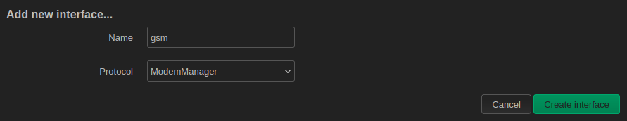
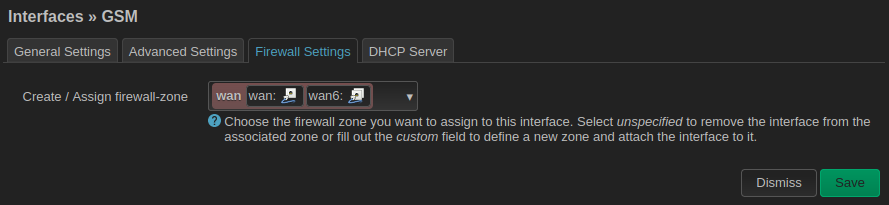
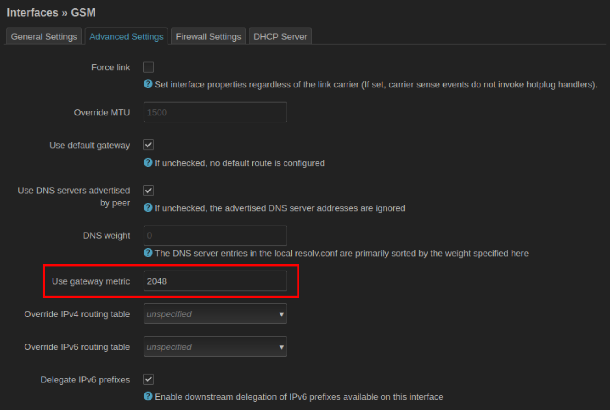
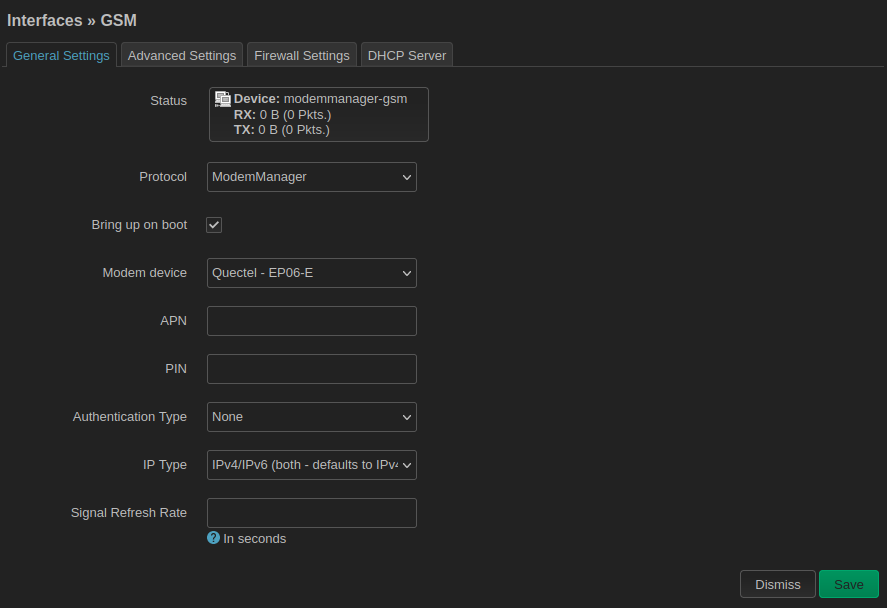

# LTE connection setup

!!! warning
    This manual is intended to be used with the modem we provide in retail as
    a part of the LTE kit or as a part of Omnia 4G. In case you use any other
    modem PCIe card, this might not apply.

## Dependencies

To be able to use the modem, various extra packages are needed. Once you have your
modem in, _updater_ will automatically recognize it, and it will install all
necessary packages in the next update.

## Setup

If your SIM card does not require a PIN, starting with Turris OS 6.4.3, your
modem should be configured automatically. If it requires PIN or if
autodetection fails for some reason, you can configure your modem manually in
LuCI.

### Manual setup

The modem can be configured in section _Network_/_Interfaces_. The autodetection script
should create a `GSM` interface there. You can also create it manually by
clicking on the `Add new interface` button. Name it `gsm`, and as a protocol, select
`ModemManager`.

The next step should be to put it into the `wan` firewall zone. This can be done in
_Firewall Settings_ tab in the following dialog.

To prevent conflicts with wired internet access, it also makes sense to
configure a different `metric`. This can be done in _Advanced Settings_ tab. There,
you need to fill in the _Use gateway metric_ option and set it to something higher
than 1024 (which is a default metric). A reasonable value is, for example, 2048.
Setting it to a higher number means that other interfaces would be preferred if
available.

### SIM and operator settings

You might need to change some configuration even if the automatic setup succeeded.
You can do so in _General Settings_ when configuring the `gsm` interface. If
your SIM card requires a PIN, you have to enter it here manually. Also, automatic
configuration might guess wrong some other settings like _APN_ or
authentication. These settings depend on your mobile network operator and might
even vary based on your plan. You can change all those settings here.

