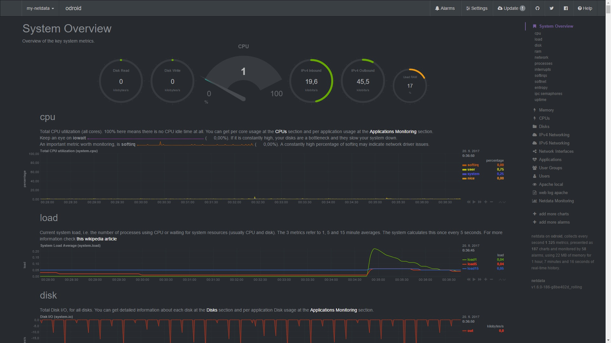
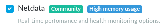

# Netdata

## What is Netdata

**[Netdata](https://www.netdata.cloud/)** is a system for distributed
real-time performance and health monitoring. It provides unparalleled
insights, in real-time, of everything happening on the system it runs
(including applications such as web and database servers), using
modern interactive web dashboards.

!!! warning
    Netdata is not available on Turris Shield.

How it looks:



!!! tip
    Here is also a [live demo](https://london.my-netdata.io/).

## Installation of Netdata

### Installation via reForis

Check the Netdata package at the _Packages_ page and then press _Save_.
Netdata will be installed in the same way as other packages.



### Installation via CLI

In CLI via SSH you can run the following commands. The first of them will update
the list of available packages and the second one will install netdata onto
your router.

```
opkg update
opkg install netdata
```

!!! tip
    Netdata can be also installed via [LuCI](../../basics/luci/luci.md).

## Running netdata

Netdata is enabled to be started automatically on boot. It can be stopped
by this command:

```
/etc/init.d/netdata stop
```

And if you want to start it again you can use this command:

```
/etc/init.d/netdata start
```

## Access control

Due to security reasons, access to Netdata is limited to `localhost`
(the router itself) by default. It means that you need to modify
the configuration file (`/etc/netdata/netdata.conf`) to allow access
from other computers.

Access control in Netdata is managed by the `web` section. The default
values are the following:

```
[web]
    allow connections from = localhost
    allow dashboard from = localhost
```

To enable access to the dashboard, you need to modify it (this example
assumes that your LAN uses 192.168.1.0/24 as its address range):


```
[web]
    allow connections from = 192.168.1.*
    allow dashboard from = 192.168.1.*
```

The first parameter limits general access to Netdata. Only addresses
specified here are allowed to communicate at all. The second parameter
allows access to the dashboard. There are much more configuration parameters
– see the [Netdata documentation](https://learn.netdata.cloud/docs/).

!!! tip
    You can specify more addresses separated by spaces. Both exact addresses and
    wildcards (see the example above) are permitted here.

After all changes in the configuration, Netdata has to be forced to reload
it:

```
/etc/init.d/netdata reload
```

When done, you can see the Netdata dashboard on
[http://192.168.1.1:19999](http://192.168.1.1:19999).

(That's the default local IP address of your router. If you have changed it,
adapt the IP in your URL.)

## Removing Netdata

If you wish to uninstall Netdata, simply uncheck the checkbox which you can
see above and press _Save_. In the command line interface, you can use
the following command:

```
opkg remove netdata
```

Do you know how to improve Netdata? Share your ideas on their
[GitHub](https://github.com/firehol/netdata). They use it also as a forum,
which is very unique on GitHub. If you don't want to create an issue or share
your feedback publicly, you can contact the developer of Netdata
([ktsaou](https://forum.turris.cz/u/ktsaou/summary)) by a private message
on our forum.

Somebody has already created a thread on the forum for sharing thoughts between
users, who owns Turris and use Netdata:
[Monitoring Omnia with Netdata](https://forum.turris.cz/t/monitoring-omnia-with-netdata/3179).
