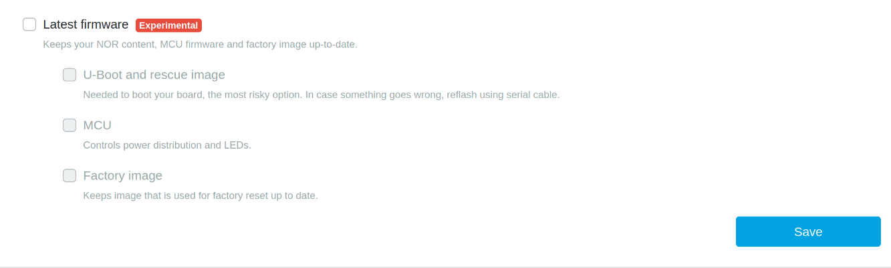
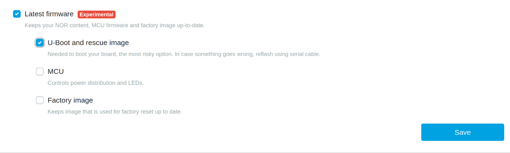

# Firmware update on Turris devices

We offer automatic updates for Turris OS, but what is not automatically
updated is the U-Boot (the bootloader), rescue system, and MCU firmware on our
devices. However, there have been a lot of improvements made to the firmware
since these devices were first released.

Sometimes users experience issues with their devices due to outdated firmware.
This guide is intended to assist users in updating their device's firmware.

## Firmware update

### Through reForis

From Turris OS 6.5, we introduced a way to update the firmware of your Turris
device through reForis.

!!! Warning
    This feature is marked experimental as it is meant for testing at the moment.

Automatic updates can be turned on as a package via
*Package Management* -> *Packages*





### Through CLI

!!! warning
    Ensure your device stays plugged in through out this whole process of
    update. Recovering from failed firmware update is not impossible, but
    it can be very difficult.

1. Install the `turris-nor-update` package.
```
opkg update && opkg install turris-nor-update
```
2. Run the utility
```
nor-update
```

    !!! note
        Utility's expected output reads something like this:
        ```
        Verifying /dev/mtd0 against secure-firmware.bin
        1705eb30f3e7795d0805e97134515d91 - /dev/mtd0
        e12a263c63bd9860cff844763e81e56b - secure-firmware.bin
        Failed
        ```
        In multiple instances. Do not worry about this output.
        The `Failed` in this output means, that you had an outdated
        U-Boot or rescue system and it is going to be updated.

3. Reboot is required after running the firmware update

!!! important
    The update may cause the LEDs to be switched off. In order to
    turn them back on, press the front LED button. If it fails or
    you want a special setup, log into LuCI, go to the *System* →
    *LED Configuration* page, and configure the LEDs there.
