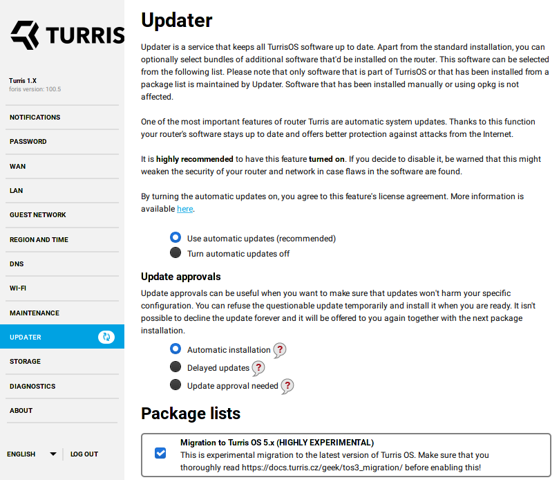

# Migration from Turris OS 3.x
Update from Turris OS 3.x to 5.0 or newer is big leap. There is more than three
years of significant development in OpenWrt. At the same time with this Turris
team also took liberty to clean and rewrite some of theirs software. This means
changes. Be prepared that some packages and features you are used to have might no
longer be there.

!!! warning
    Do not use configuration backups from Turris OS 3.x on newer versions.
    Configuration changed and using backup from Turris OS 3.x can make your
    router unacessible.

## Short list of changes
This is minimal list of changes you can expect with migration and switch away from
Turris OS 3.x.

* API tokens are no longer available and mobile application no longer works.
* Server side backups were dropped. Replacement is not yet provided.
* uCollect was removed and replaced with Sentinel.
* Attack statistics are presented on the [Sentinel:view](https://view.sentinel.turris.cz/)
  portal instead of `project.turris.cz`.
* Automation package list with Domoticz and Home-Assistant is no longer provided.
* Majordomo is no longer available as well as its package list. Use LuCI
  statistics or Pakon instead.
* Netutils package list was dropped and most of the advanced protocols have to be
  now installed manually.
* Print server CUPS was dropped. Print server package list now provides only
  p910nd protocol.
* Sound card package list was dropped. Packages are still available and you have
  to install them manually.
* Thermometer package was dropped. Use `collectd` or sensors as a replacement
* Squid proxy package list was dropped. Install `luci-app-squid` as a replacement.
* Webcam package list was dropped.
* Network switch configuration now uses
  [DSA](https://www.kernel.org/doc/html/latest/networking/dsa/configuration.html).
  See the up to date documentation on how to [configure
  VLANs](../basics/luci/vlan/luci-vlan.md).

##### Turris Omnia specifics
* Turris OS 5.0+ no longer supports switching between SFP and metallic in runtime.
  Switch is performed on boot for that boot-loader update is required. This is not
  yet available and so you have to switch between SFP and metallic manually. To do
  so you can run following command:
  ```
  ln -sf armada-385-turris-omnia-sfp.dtb /boot/dtb
  ```
  To switch to metallic you just have to use `phy` instead of `sfp` in this
  command. Initial switch is performed as part of migration so you have to care
  about this only if you plan to switch between SFP and metallic WAN.

##### Turris 1.x specifics
* Significant change is switch from uClibc to Musl.
* Smrt support was removed.


## Automatic migration
Automatic migration is in progress, but not all routers get it at the same time.
Only a subset of routers gets migrated at a time, so our support can react to any
issues that you might have in time. If your router is not automatically migrated,
you can still trigger it manually. Please continue reading this article.


## Migration considerations
Before you perform migration you should make sure to minimize possibility that it
won't finish.

General considerations:

* Make sure that you have **at least** 400MB of free space on root storage. This
  is just rule of thumb. It depends in reality on amount of installed software you
  have. It is possible that you need more or less than 400MB.
* Make sure that you have **enough free RAM** (memory). At minimum approximately
  100MB. You can stop memory hungry containers and other services if need to be.
* Make sure that you have free time on your hands to let router perform migration.
* **Create backup** of your settings before you start not only to potentially
  recover it but also to provide it to support so Turris team can troubleshoot
  possible problems.
* Configure sending notifications via e-mail as the router is going to be rebooted
  after migration is finished (to restore switch configuration) and reboot wipes
  all notifications from the router.

!!! warning
    Do not attempt to upload backups created on Turris OS 3.x and before to Turris
    OS 4.0 and newer and vice versa. Network configuration changed and you are
    going to most likely cut yourself from access to router!

Considerations for advanced users:

* Backup packages you need from localrepo as they are going to be removed to
  prevent compatibility issues.
* If you have LXC container with more than one network interface then you have to
  do migration of such config on your own. It won't be performed automatically.
  (This setup is not possible from LuCI)

!!! tip
    It is always an option to perform factory reset to recover the router if
    migration fails. In case of Turris Omnia even
    [rollback](../hw/omnia/rescue-modes.md) should be good enough.

## Optional migration
Migration is not yet executed automatically but it can be triggered manually.

!!! warning
    Do not attept to migrate Turris 1.x unless you are running on [Btrfs with SD
    card](../geek/btrfs_turris1x.md). You are going to run out of storage space and
    factory reset would be the only option then.

To start migration you have to have at least Turris OS 3.11.19 installed on your
device. Please be sure about that before you attempt migration. To double check
you can run `pkgupdate` from command line (over SSH). It should not ask you to
confirm any changes.

To initialize migration process you have to navigate to _Updater_ tab in Foris web
interface. There you have to select package list _Migration to Turris OS 5.x_ and
save that by clicking on _Save and update_ button.



Next you have to approve installation of `tos3to4` package if you have approvals
enabled. With approvals you also have to trigger the update again once `tos3to4` is
installed. Just navigate to the updater configuration page and save the configuration
again. Migration starts immediately if you do not have update approvals enabled.

!!! warning
    Migration takes some time. It can take up to hour or more. During that time
    router can become unaccessible. Do not reboot or disconnect router from power
    supply during that time.

!!! note
    Updates approvals are disabled once `tos3to4` package is installed to not halt
    migration in situation when user is unable to approve subsequent continuation.
    Do not enable it manually. The original settings is going to be automatically
    restored during the migration process.

Update is finished once **you receive notification** that migration was finished.
Message in question starts with with sentence: _Migraton from Turris OS 3.x was
completed._.

## Known problems and solutions
You can encounter some problems that are caused by automatic migration. Not all
problems can be automatically removed. These are known problems and solutions for
them.

##### Updater reports error about unavailable package
This happens because you had installed some package that is no longer available
in Turris OS. This is intended as a protection of functionality you set up.

To recover updater functionality you have to decide what to do. You should
remove the problematic package or replace it with an alternative.

If you are an advanced user you can also investigate files in the directory
`/etc/updater/conf.d` and check the content of any file you created as well as
the content of `/etc/updater/conf.d/opkg-auto.lua`. You should remove any
unnecessary `Install` and `Uninstall` lines.

You can verify updater's functionality by checking for updates in reForis or
running `pkgupdate` manually.

##### I received message that Btrfs support was removed
This affects only Turris 1.0 and Turris 1.1 routers.

This happens because name of package for Turris 1.x Btrfs support was changed. It
was originally `turris-btrfs` and now is `turris1x-btrfs`. Old package with
removal sends this message and it is removed because it is replaced by new one.

This is just false warning but just to be sure check that you have
`turris1x-btrfs` package installed in our system before rebooting.

##### Transmission and other services are disabled
Some services, such as transmission, can be disabled during migration and not
re-enabled. There are multiple reasons why this happens, in short it can be due to
package or init script rename.

It is not possible to catch every single service affected by this so only most
important services are covered by migration. Please review enabled services after
migration to ensure that all services you want are going to be started on next
boot.

##### Connected printers don't work
This is a consequence of CUPS removal. You can use
[p910nd](https://man.cx/p910nd) instead. Please follow the
[installation guide](https://openwrt.org/docs/guide-user/services/print_server/p910ndprinterserver)
published on the OpenWrt website.
