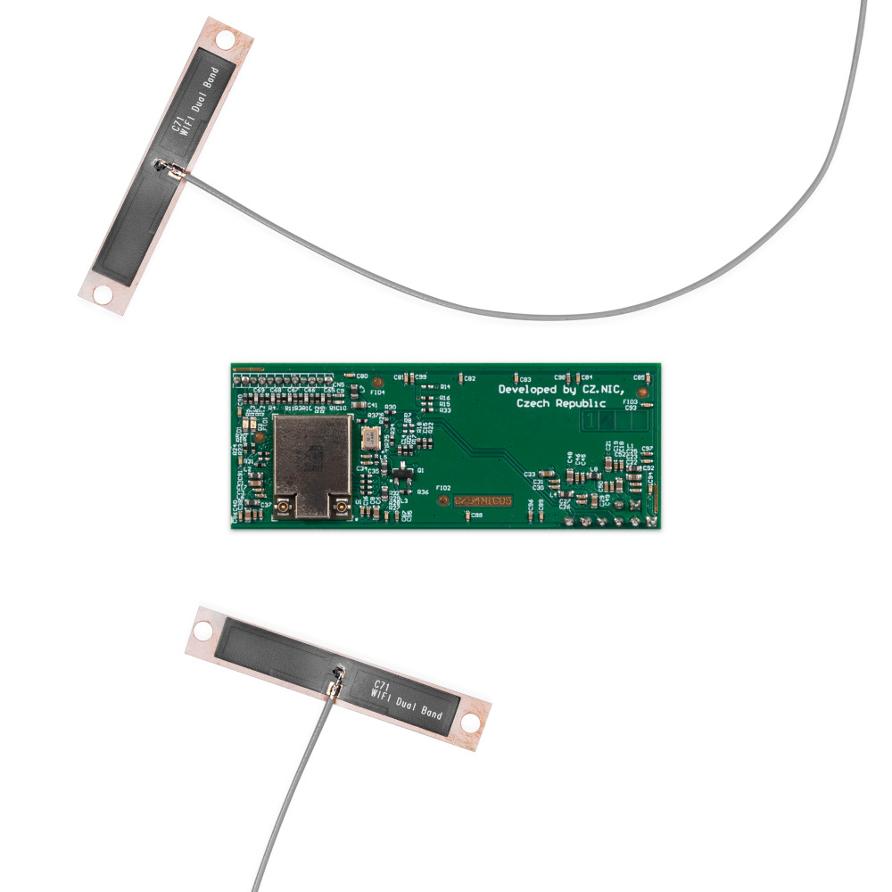
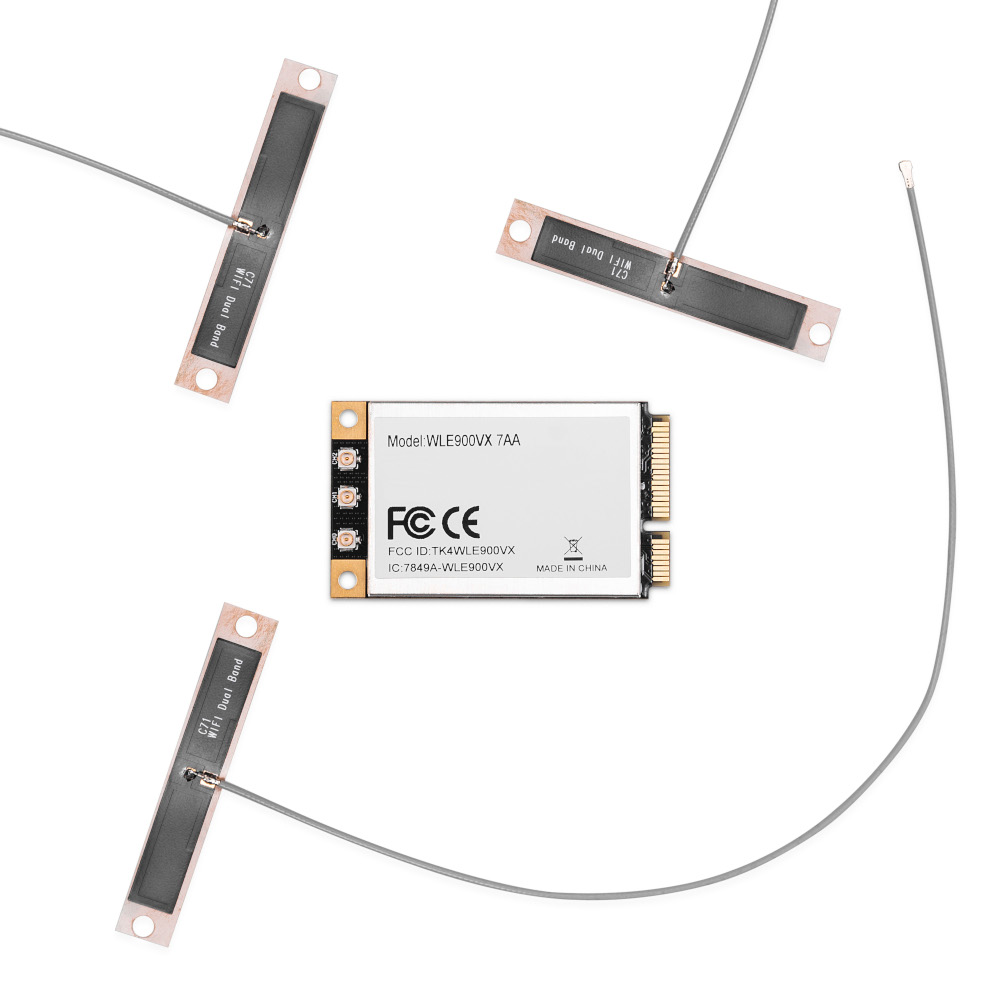
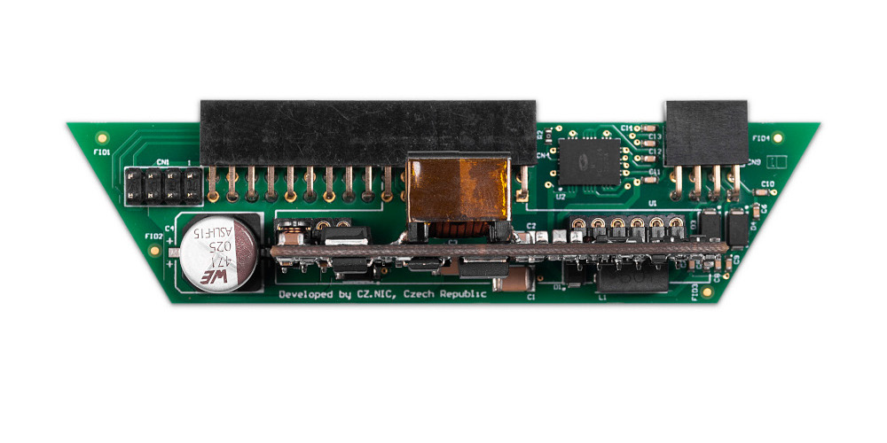

# Add-ons

Add-ons are specific accessory that can extend functionality of Turris MOX but
compared to the modules is not connected via MOXTET bus and doesn't change the
size of the boxed device.

## Wi-Fi (SDIO)

!!! warning
    Due to limitations of firmware, it is possible to create only 4 SSIDs and
    have a maximum of 8 concurrent clients connected to them.

If you add the MOX Wi-Fi add-on (SDIO) to your [MOX Start](sets/start.md) set,
you will get a Wi-Fi router with Bluetooth support.

It contains AzureWave AW-CM276NF, internal FLEX antenna, gain 2 dBi for 2.4 GHz
/ 3 dBi for 5 GHz, chipset Marvell 88W8997, Bluetooth 4.2 with BLE support,
transfer speeds 5 GHz up to 866 Mbps / 2.4 GHz up to 300 Mbps. Currently does
not support 802.1x.

Most suitable to easily cover last few remaining clients that can't do 5 GHz yet.

## Wi-Fi (mPCIe)

The MOX Wi-Fi add-on (mPCIe) is significantly faster than SDIO and is the
recommended Wi-Fi card for modules [B (Extension)](modules/b.md)  and [G (Super
Extension)](modules/g.md). It was tested with the device and is guaranteed to
work correctly.

It contains Compex WLE900VX card, internal FLEX antenna, gain 2 dBi for 2.4 GHz
/ 3 dBi for 5 GHz, chipset QCA 9880, transfer speed 5 GHz up to 1.3 Gbps / 2.4
GHz up to 450 Mbps.

## PoE

The MOX PoE add-on can be used to provide power to the Turris MOX router over
Ethernet without having to use a separate power cable. It connects to the [MOX A
(Basic)](modules/a.md) module which is part of all MOX sets. It is
compliant with IEEE standards 802.3at and 802.3af and recommended maximum load
is 15W.
