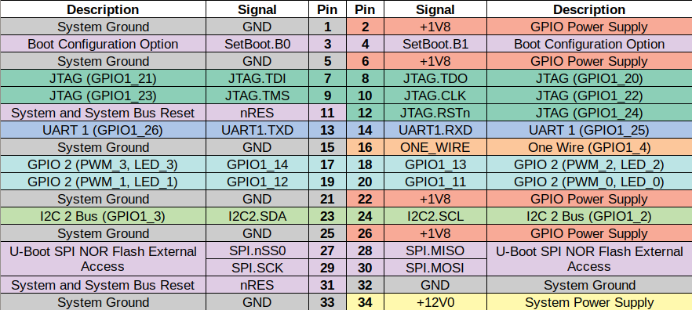
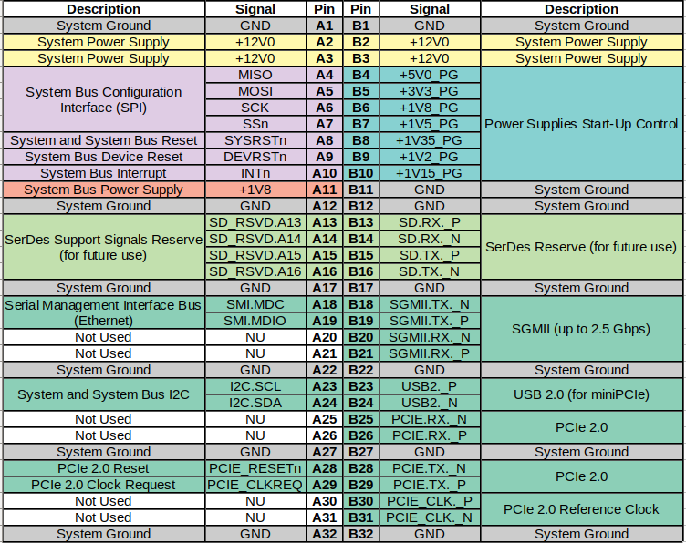

# MOX Hardware details

MOX is an unique network device. It contains usual set of
[pins](#gpio-pin-header) (I2C, GPIO, ...) but also unique [MOXTET](#moxtet)
bus. MOXTET bus allows us to extend MOX with various modules. The MOXTET bus
provides access to faster buses like PCIe or SGMII.

It is based on _Marvell Armada 3720_ dual core _armv8_ CPU clocked at 1GHz. It can contain either 512M or 1G of RAM. Storage-wise it features one micro SD slot and 8MB SPI NOR flash that contains U-Boot and rescue system.

## Network interfaces

CPU in Turris MOX has two network interfaces. First one - _eth0_ - is connected
directly to the gigabit Ethernet port on CPU module. Second one - _eth1_ - is
2,5 GBit and passed thought the MOXTET. If you have [MOX D](modules/d.md), then
your SFP is _eth1_ directly and is able to do up to 2,5 Gbit.

### Multiple switches

[MOX C](modules/c.md) and [MOX D](modules/d.md) are simple examples of which network configurations can be created
and it is probably quite obvious how do they work. Things get a little bit more complicated with [MOX E](modules/e.md).
In that case, 2,5 Gbit link goes from CPU to the first switch which exposes 8
Gigabit ports for generic use, but internally has 10 ports. One of the two
non-exposed ports is connected to your CPU and the other one is connected to
MOXTET for future use by other modules. Both of them are 2,5 Gbit.

That other module on MOXTET can easily be another MOX E that would do the same
thing. On both MOX Es you have 8x 1GBit ports, but the switches are connected to
each other via 2,5 GBit links and only one of them is connected directly to CPU
via 2,5 GBit link. That is something to consider when designing your network.
Devices that exchange a lot of data quite often between each other should be
connected to the same MOX E, while devices that hardly ever talk to each other
can easily be on different switches. You want to minimize the amount of data
that has to pass trough the switch as that could be a bottleneck.

For example, if you connect MOX D and use it as a WAN, then your traffic has to
go through the switch(es) to the CPU, get natted/filtered/routed there and go
through the switch(es) back to the final destination.

## GPIO Pin Header

!!! warning
    Turris MOX uses **1.8V** logic! Connecting to it to common devices with
    higher voltage logic will most likelly destroy your MOX.

You can find 34-pin GPIO connector On [MOX A](modules/a.md). Signals are as
follows:

## PoE Pin header

If you have [PoE add-on](addons.md#poe) attached, you have full GPIO connector
inaccessible, but you can use small one on PoE add-on.

| Description                 | Signal     | Pin   | Pin   | Signal       | Description               |
| :--------------------       | :--------: | :---: | :---: | :----------: | :------------------       |
| System Ground               | GND        | 1     | 2     | +1V8         | GPIO Power Supply         |
| Boot Configuration Option   | SetBoot.B0 | 3     | 4     | SetBoot.B1   | Boot Configuration Option |
| System and System Bus Reset | nRES       | 5     | 6     | JTAG.RSTn    | JTAG (GPIO1_24)           |
| UART1 (GPIO1_26)            | UART1.TXD  | 7     | 8     | UART1.RXD    | UART1 (GPIO1_25)          |

## MOXTET

The Moxtet system bus is used to connect single boards of the MOX modular
router. Bus connections can be used freely, but when using non-original MOX
modules, make sure they maintain signal compatibility and do not damage other
connected boards.

The Moxtet system uses a standard PCIe connector, but with different signals.

