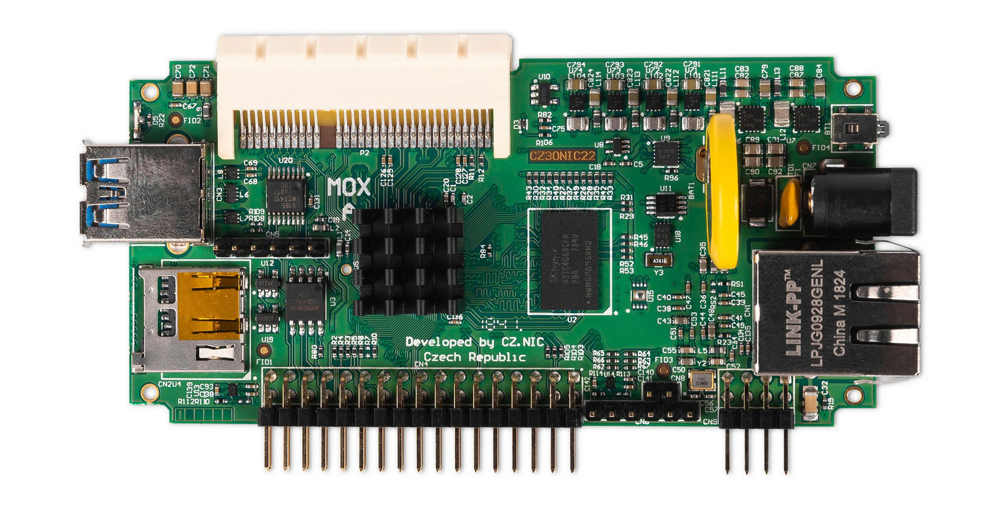

# MOX A (Basic)

## Key features

The MOX A module is a module with a CPU, which needs to be present in every MOX device.

## Specification

* ARMv8 A53 dual-core 1 GHz processor
* 512MB DDR3/1GB DDR3 memory (cannot be increased after purchase)
* 64 pin female connector containing Moxtet system bus to connect other modules
* 34-pin GPIO connector
* SDIO bus for WiFi addon
* 8 pin PoE bracket
* SD slot for microSD cards with a capacity of at least 4GB (max up to 2TB), and write/read speed of up to 104 MB/s
* RJ-45 Ethernet port 1Gbps full duplex, 2 LEDs located on the cage.
* Round power connector with internal diameter 2.1 mm, 12V, max 3.3A (parameters of the supplied source). Minus (negative) is on the outside connector, plus (positive) on the internal connector
* USB 3.0 port
* Fully programmable button, implicitly designed as a reset button.
* Red status LED.
* 2 years warranty
* Size: 110 mm x 58 mm x 27 mm (without case)
* Ambient operating temperature: 0 °C to 40 °C (40 °F to 104 °F)
* Humidity: 10% to 90% RH, Non-condensing

