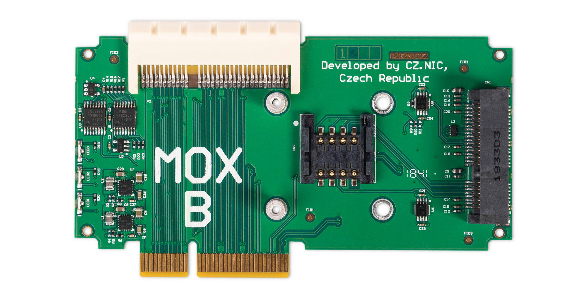

# MOX B (Extension)

## Key features

MOX B allows you to add more hardware to your configuration. It contains a
mPCIe slot for a compatible Wi-Fi card, disk controller or LTE modem. If you
choose to install an LTE modem, the MOX B features a SIM card slot that you can
use.

If you use Wi-Fi networks, we recommend using the original MOX [Wi-Fi add-on
(mPCIe)](../addons.md#wi-fi-mpcie) which can deliver significantly higher
speeds than SDIO Wi-Fi.

## Specification

* 1× SIM card slot
* 1× 64 pin female connector and 1× 64 pin male connector for connection additional modules
* 2 years warranty
* Size: 100 mm × 58 mm × 14 mm (without case)
* Ambient operating temperature: 0 °C to 40 °C (40 °F to 104 °F)
* Humidity: 10% to 90% RH, Non-condensing

## Compatibility

There can be only one MOX B module in the configuration; the PCIe bus is
terminated there. For this reason, the MOX B cannot be combined with MOX F. If
you need a module with the same parameters but with PCIe signal passing
through, choose [MOX G](g.md).

This module can be used **only as an extension in a set**. You will need at
least [MOX Start](../sets/start.md). It is included in the
[MOX Power Wi-Fi](../sets/powerwifi.md) and
[MOX Classic](../sets/classic.md) sets. If you’re combining it with other
modules, make sure they are compatible. You can verify the order of modules and
pass-through of PCIe and SGMII signals in the configurator on
<https://mox-configurator.turris.cz>.

