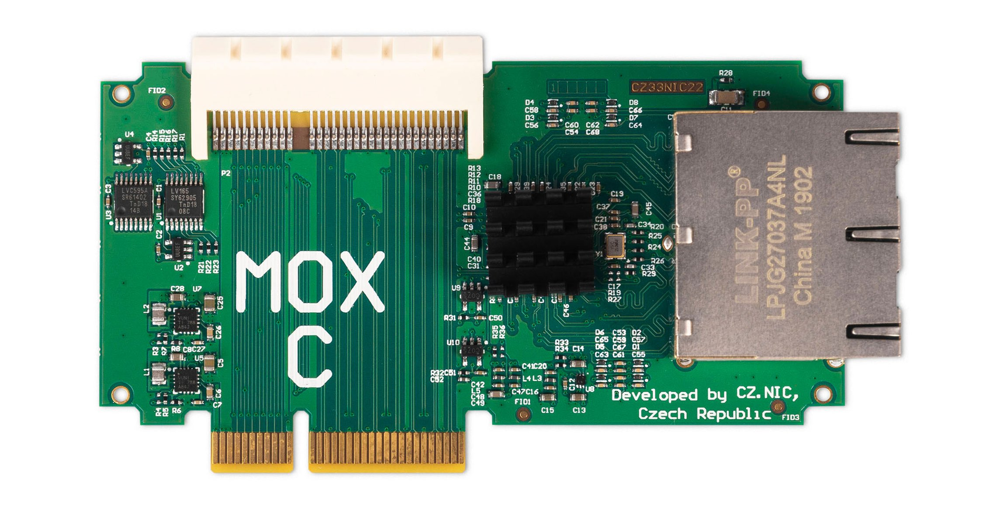

# MOX C (Ethernet)

## Key features

The MOX C module contains a four-port manageable switch for gigabit ethernet.

## Specification

* 1× 64 pin female connector and 1× 64 pin male connector for connection additional modules
* 4× 10/100/1000 Mbps (RJ-45)
* 2 years warranty
* Size: 105 mm × 58 mm × 30 mm (without case)
* Ambient operating temperature: 0 °C to 40 °C (40 °F to 104 °F)
* Humidity: 10% to 90% RH, Non-condensing

## Compatibility

There can be only one MOX C module in the configuration; the SGMII bus is
terminated there. For this reason, the MOX C cannot be combined with MOX D. If
you need to expand your configuration further, choose [MOX
E](g.md).

This module can be used **only as an extension in a set**. You will need at
least [MOX Start](../sets/start.md). It is included in the
[MOX Classic](../sets/classic.md) set. If you’re combining it with other
modules, make sure they are compatible. You can verify the order of modules and
pass-through of PCIe and SGMII signals in the configurator on
<https://mox-configurator.turris.cz>.
